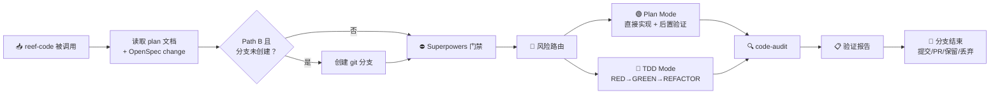

# Reef Code

## 功能概述

reef-code 接收实现计划文档和 OpenSpec change 上下文，执行从门禁检查到分支结束的完整实现流程。



## 输入

reef-code 支持的输入方式：

| 方式 | 说明                                                                           |
| ---- | ------------------------------------------------------------------------------ |
| 默认 | 读取 `openspec/changes/` 下最新 change + `docs/superpowers/plans/` 下对应 plan |
| 参数 | `/reef-code <plan-path>` 指定 plan 文档路径                                    |

### Path A

```bash
CHANGE=$(git branch --show-current)
PLAN_FILE="docs/superpowers/plans/$(date +%Y-%m-%d)-$CHANGE.md"
```

### Path B（首次进入）

```bash
CHANGE=$(ls openspec/changes/ | sort -r | head -1)
```

## 预备步骤：创建分支（Path B 首次）

如果当前变更尚未创建 git 分支（来自 Path B），先创建：

```bash
CHANGE=$(ls openspec/changes/ | sort -r | head -1)
git stash push -m "reef-code-auto-stash" 2>/dev/null || true
git checkout main && git fetch origin main && git reset --hard origin/main
git checkout -b "$CHANGE"
git stash pop 2>/dev/null || true
PLAN_FILE="docs/superpowers/plans/$(date +%Y-%m-%d)-$CHANGE.md"
```

Path A 的分支已在 reef-plan 阶段创建，跳过本步骤。

## ⛔ Superpowers 门禁检查

### 流程

1. **加载适用技能** — 根据 tasks.md 的任务范围：
   - 涉及后端/前端代码改动 → 加载 `reef:reef-style-backend` 或 `reef:reef-style-frontend`
   - 涉及代码行为改动 → 加载 `superpowers:test-driven-development`
   - 其他适用技能

2. **遵循技能指导** — 如有检查清单，通过 TaskCreate 创建 todo

3. **风险路由** — 查阅 `references/risk-routing-card.md` 判断 plan mode 或 tdd mode

   ```
   ### 🧭 风险路由判断

   | 变更特征 | 判定 |
   |---------|------|
   | 变更类型 | {类型描述} |
   | 涉及模块 | {模块列表} |
   | 运行时代码 | {✅ / ❌} |
   | 边界条件 | {有 / 无} |
   | 推荐模式 | {🟢 plan mode / 🔴 tdd mode} |

   **理由：** {说明}
   **请确认是否按 {plan/tdd} mode 进入实现？**
   ```

4. **Rigid 纪律声明** — 查阅 `references/superpowers-gate.md` 输出声明模板并等待用户确认

### Mode 切换规则

- **plan → tdd 允许升级**：实现中发现复杂度超预期时主动暂停并建议升级
- **tdd → plan 禁止降级**：一旦判定为 tdd mode，不得以降级为由跳过测试
- 用户未确认前不得进入实现

## 🟢 Plan Mode 实现

适用于：文档修改、配置文件、SKILL.md、测试框架搭建、简单重构（测试覆盖充分）

```
1. 确认 code-style 已加载（如需）
2. 直接实现代码变更
3. 后置验证：build → lint → test（参见 references/stage-4-implementation.md 的验证命令表）
4. 验证失败 → 修复 → 重验
5. 复杂度超预期 → 暂停并建议升级 tdd mode
6. ✅ 标记完成
```

> **后置验证不可跳过。** build/lint/test 任何一步失败，该 task **不得**被标记为完成。

## 🔴 TDD Mode 实现

适用于：新增业务逻辑、Bug 修复、权限/安全变更、资金/计费变更、状态机/并发逻辑

**详见 `references/stage-4-implementation.md` 的完整实现指南。**

### 🔴 RED — 先写测试

- 先确认 code-style 已加载
- 根据 spec 的 Scenario 编写单元测试
- 运行测试，确认失败（红）
- 测试意外通过 → 改进测试
- **不写实现代码**

### 🟢 GREEN — 最小实现

- 只写让当前测试通过的最小代码量
- 不提前实现未测试的功能
- 运行测试，确认全绿

### 🔵 REFACTOR — 重构

- 清理重复代码、提取函数、重命名
- 保持测试通过
- 不改变行为

### 后置验证门禁（每个 task 完成后强制执行）

无论 plan mode 还是 tdd mode，每个 task 标记完成前必须先通过：

```
Step 1: Build 验证 → 通过 → Step 2
Step 2: Lint 验证 → 通过 → Step 3
Step 3: Test 验证 → 通过 → ✅ 标记完成
```

验证命令表参见 `references/stage-4-implementation.md`。

### 完成一个 task 后

1. 标记 tasks.md 中对应项为 `- [x]`
2. 如 `$PLAN_FILE` 存在，同步标记 plan 中对应步骤
3. 运行完整测试套件确认无回归
4. 进入下一个 task
5. 遇到阻塞或模糊需求 → 暂停并询问用户

## 🔍 code-audit

所有 task 实现完成后：

1. 加载 `reef:reef-review` skill
2. 执行 AC-to-test 回溯 — 每个 AC 对应至少一个测试方法
3. AC Coverage 表格：

   ```
   AC Coverage: 4/5
   ├── AC-1 ✅ UserTest::testCreateSuccess
   ├── AC-2 ✅ UserTest::testDuplicateEmail
   └── AC-5 ❌ （未找到匹配测试）
   ```

4. 高风险 AC 遗漏（权限/安全/资金）→ 要求补测
5. 低风险 AC 遗漏 → 可豁免，记录到 verify-report
6. 检查无遗留 `TBD`、`TODO`、`FIXME` 占位符
7. 后置验证门禁通过（build + lint + test 全绿）

全部通过后执行 `openspec sync --change "$CHANGE"`。

## 📋 验证报告

生成结构化验证报告：

```bash
VERIFY_REPORT="openspec/changes/$CHANGE/verify-report.json"
```

报告格式参见 `references/stage-4-implementation.md` 的 4.4 节。

摘要字段：

- `PASSED` — 所有检查通过
- `PASSED with warnings` — 有 warning 但无 blocker
- `FAILED` — 存在 blocker 或测试失败

## 🏁 分支结束处理

询问用户选择：

| 操作     | 说明                                            |
| -------- | ----------------------------------------------- |
| 创建提交 | 中文 message + Issue URL（Path A 必含）         |
| 创建 PR  | `git push -u origin "$CHANGE"` → `gh pr create` |
| 保留分支 | 报告分支名和变更位置                            |
| 丢弃分支 | 用户确认后删除                                  |

## 注意事项

- **reef-code 不做需求讨论或文档生成** — 这些是 reef-plan 的职责
- 详细实现指南见 `references/stage-4-implementation.md`
- code-audit 的 AC-to-test 回溯是质量门禁，不得跳过
