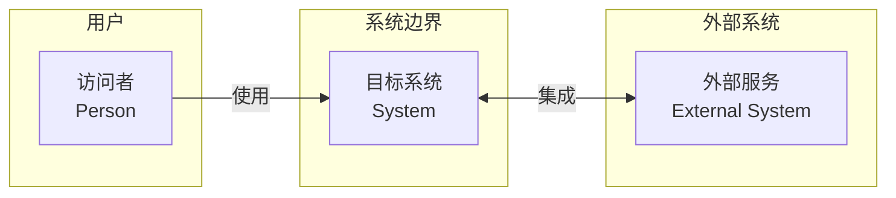
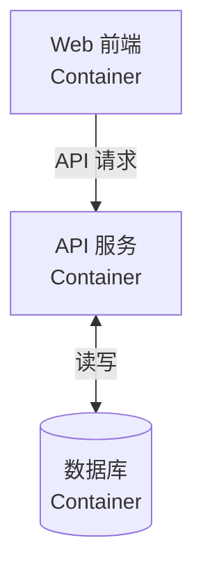

# 架构图与 ADR 管理

基于 C4 模型的架构图创建与更新，以及架构决策记录（ADR）的管理。

所有图表使用 Mermaid 语法（` ```mermaid `）。

## 触发方式

| 命令                                                  | 说明                             |
| ----------------------------------------------------- | -------------------------------- |
| `/doc-arch init --level 1/2/3`                        | 创建 C4 架构图（默认 Level 1+2） |
| `/doc-arch update`                                    | 更新已有架构图                   |
| `/doc-arch adr create <title>`                        | 创建新的 ADR                     |
| `/doc-arch adr list`                                  | 列出所有 ADR                     |
| `/doc-arch adr update --id ADR-001 --status Accepted` | 更新 ADR 状态                    |

## 工作流

### 1. 创建架构图

根据层级创建对应的 Mermaid 架构图文件到 `docs/2-architecture/diagrams/`：

**Level 1 — 系统上下文图** (`system-context.md`)

展示目标系统与用户、外部系统之间的关系。使用 Mermaid `flowchart` 语法，通过 `subgraph` 标记系统边界。

````


**Level 2 — 容器图** (`container-view.md`)

展示系统内部的运行单元（应用、服务、数据库）及其交互。

```



````

**Level 3 — 组件图（按需）** (`component-view.md`)

仅当用户明确要求时创建（`/doc-arch init --level 3`），展示关键模块内部结构。

### 2. 更新架构图

使用 `/doc-arch update` 并描述新增/变更的实体或关系，系统读取现有图文件，在保持已有结构的前提下添加新节点。

### 3. 自动索引同步

创建或更新架构图后，自动更新 `docs/INDEX.md` 中的引用。

### 4. ADR 管理

#### 创建 ADR

```bash
/doc-arch adr create 使用 PostgreSQL 作为主数据库
````

在 `docs/2-architecture/decisions/ADR-NNN-kebab-case-title.md` 创建文件，包含：

```
# ADR-NNN: 标题

## 状态

Proposed · 2026-07-27

## 背景

## 决策

## 理由

## 后果
```

#### ADR 文件编号规则

从 `ADR-001` 开始，扫描 `docs/2-architecture/decisions/` 中已有 ADR 的最大编号，自动递增。

#### 状态可选值

- `Proposed` — 提议中
- `Accepted` — 已采纳
- `Deprecated` — 已弃用
- `Superseded` — 已被替代（需注明替代的 ADR 编号）

### 5. C4 图与 docs-sync 联动

当 `reef-docs-sync` 检测到架构相关变更时，会在报告中提示：

> 可执行 `/doc-arch update` 更新架构图
