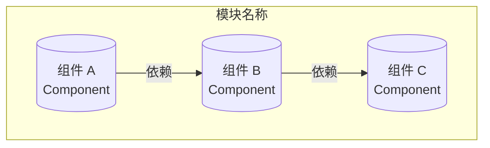

# 组件图 (C4 Level 3)

> 按需创建。展示关键模块的内部结构。

```mermaid
flowchart TD
    subgraph "模块名称"
        C1[("组件 A<br/>Component")]
        C2[("组件 B<br/>Component")]
        C3[("组件 C<br/>Component")]
    end

    C1 -->|"依赖"| C2
    C2 -->|"依赖"| C3
```

## 更新记录

| 日期   | 更新内容 | 更新人 |
| ------ | -------- | ------ |
| {date} | 初始创建 | —      |
