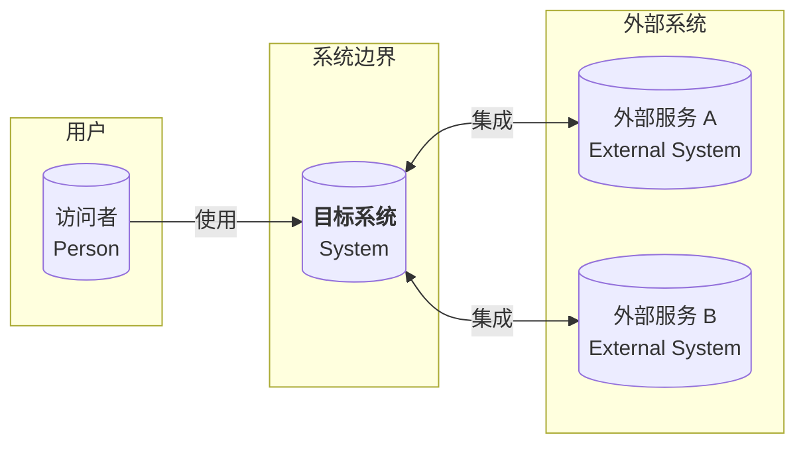

# 系统上下文图 (C4 Level 1)

> 展示目标系统与用户、外部系统之间的关系。

## 说明

- **Person**：使用系统的用户角色
- **System**：当前系统（蓝色边界内）
- **External System**：目标系统依赖的外部服务

## 更新记录

| 日期   | 更新内容 | 更新人 |
| ------ | -------- | ------ |
| {date} | 初始创建 | —      |
