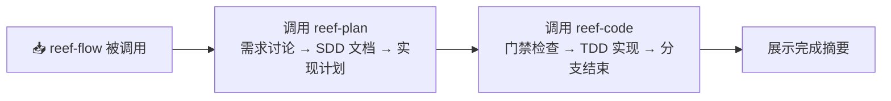

# Reef Flow

## 功能概述

reef-flow 是一个极薄编排层，本身不包含任何功能逻辑：



**reef-flow 不做：** 入口路由判断、需求讨论、文档生成、门禁检查、TDD 实现、code-audit。以上全部委托给 reef-plan 和 reef-code。

> **注意：** 自然对话默认唤起 `/reef-plan` 而非 `/reef-flow`。reef-flow 仅用于显式需要完整流程（规划+实现）的场景。

## 编排流程

### 步骤一：调用 reef-plan

```bash
skill "reef-plan" "<用户输入>"
```

reef-plan 将处理所有需求讨论（Path A 或 Path B）、SDD 文档生成和实现计划产出。

### 步骤二：调用 reef-code

reef-plan 执行完毕后，reef-flow 询问用户是否进入实现阶段。如果用户确认：

```bash
# 从最新 change 和 plan 文件推断上下文
CHANGE=$(ls openspec/changes/ | sort -r | head -1)
PLAN_FILE="docs/superpowers/plans/$(date +%Y-%m-%d)-$CHANGE.md"
skill "reef-code" "$PLAN_FILE"
```

如果用户选择暂不进入实现，reef-flow 输出 plan 文档路径供用户日后自行调用。

### 步骤三：展示摘要

reef-code 执行完毕后，汇总输出本次 flow 的结果摘要。
