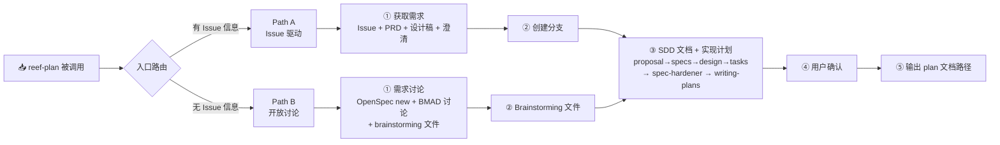

# Reef Plan

## 功能概述



> **📍 当前步骤：** 每次进入本 skill 后，在第一句回复中声明当前阶段编号。例如：
>
> ```
> > 📍 当前：Path A · 阶段一 — 获取需求
> ```

**reef-plan 只做规划，不做实现。** 规划完成后输出 plan 文档路径供 reef-code 消费。

## 前置条件

- 项目已通过 DeepStorm CLI 安装 setup 阶段
- 运行时通过 `.claude/settings.json` → `deepstorm.mcpCapabilities` 确认 MCP 服务可用性

### MCP 服务发现

AI SHALL 读取 `.claude/settings.json` → `deepstorm.mcpCapabilities`，确定当前可用的 provider。每个 provider 的 MCP 操作指南位于 `.claude/skills/deepstorm-mcp-{service}-{op}/SKILL.md`。AI 根据当前步骤所需的操作类型读取对应指南（读取 Issue → `deepstorm-mcp-jira-read`、读取文档 → `deepstorm-mcp-feishu-wiki-read`、读取设计稿 → `deepstorm-mcp-figma-read`）。

如果 `deepstorm.mcpCapabilities` 读取失败，AI SHALL 降级为"无 MCP 服务安装"，按手动模式运行各子步骤。

## 入口路由

**这是每次进入本 skill 后的第一步。** AI SHALL 根据用户输入判断是否存在 Issue 相关信息：

| 用户输入特征                           | 路由                           |
| -------------------------------------- | ------------------------------ |
| 包含 Issue URL、编号或明确引用         | → **Path A**（Issue 驱动流程） |
| 不包含任何 Issue 引用，仅描述需求/想法 | → **Path B**（开放讨论流程）   |
| 模棱两可                               | 询问用户确认                   |

## Path A — 阶段一：获取需求

### 1.1 解析 Issue 编号

按以下优先级获取 Issue 地址：

1. **slash 命令参数** — 如通过 `/reef-plan <url>` 调用
2. **用户消息** — 从用户当前输入中提取 Issue URL 或编号
3. **询问用户** — 以上均未获取到时，请用户提供

| 格式     | 示例                                               | 提取方式               |
| -------- | -------------------------------------------------- | ---------------------- |
| 完整 URL | `https://<instance>.atlassian.net/browse/PROJ-123` | 从 URL path 中提取 key |
| 完整编号 | `PROJ-123`                                         | 直接使用               |
| 纯数字   | `1234`                                             | 加项目前缀推断         |

### 1.2 获取 Issue 详情（MCP 动态适配）

如 `issue_tracker.available === true`：

1. 读取 `.claude/skills/deepstorm-mcp-jira-read/SKILL.md` 了解工具调用方式
2. 使用 MCP 工具获取 Issue 元数据

如 `issue_tracker.available === false`，请求用户手动粘贴 Issue 摘要。

### 1.3 获取 PRD 上下文（MCP 动态适配）

从 Issue 描述中搜索知识库链接。如 `knowledge_base.available === true`：

1. 读取 `.claude/skills/deepstorm-mcp-feishu-wiki-read/SKILL.md`
2. 使用 MCP 工具的文档读取方法获取 PRD 内容

降级：询问用户是否手动提供 PRD 内容。

### 1.4 澄清需求

向用户做针对性澄清：

- 核心改动范围
- Bug 复现 / Story 用户场景 / Task 验收标准
- 优先级和范围边界
- "第一版明确不做什么？"

记录澄清结果，纳入后续 proposal 的 "不做什么" 段。

### 1.5 获取设计稿（MCP 动态适配）

如 `design_tools.available === true`：

1. 读取 `.claude/skills/deepstorm-mcp-figma-read/SKILL.md`
2. 从 Issue 的 Design 字段或描述中提取设计工具链接
3. 使用 MCP 工具获取设计数据并派遣子代理分析

降级：告知用户"未检测到设计工具服务"。

### 1.6 更新上下文地图

对比当前 `.deepstorm/context.md` 与阶段一采集的项目信息，有实质性变化时更新。

### 1.7 Path A — 阶段二：创建分支

```bash
git stash push -m "reef-plan-auto-stash"
git checkout main && git fetch origin main && git reset --hard origin/main
git checkout -b <kebab-case-name>
git stash pop 2>/dev/null || true
```

分支名 = OpenSpec change 名。后续 skill 通过 `git branch --show-current` 感知上下文。

## Path B — 阶段一：需求讨论

### B1.1 创建 OpenSpec change

```bash
openspec new change "<kebab-case-name>"
```

### B1.2 结构化需求讨论

按以下框架以对话方式引导，逐步推进：

1. **核心意图**：你想解决什么问题？
2. **具体范围**：涉及哪些模块或文件？
3. **边界定义**：第一版明确不做什么？
4. **注意事项**：已知约束、技术依赖或风险？

### B1.3 需求澄清

针对性追问：

- 功能类：核心用户场景、目标用户
- 重构类：当前痛点、预期改善状态
- 边界模糊时：确认优先级和顺序

### B1.4 产出 Brainstorming 文件

```
_bmad-output/brainstorming/brainstorming-session-{date}-{seq}.md
```

内容：讨论主题、关键决策、需求要点、边界范围、后续步骤。

> **注意：** Path B 不在此处创建 git 分支。

### B1.5 更新上下文地图

检查 `.deepstorm/context.md`，不存在则创建模板，有实质性变化时更新。

## 阶段三（共享）：SDD 文档生成

```bash
CHANGE=$(git branch --show-current)  # Path A
# 或
CHANGE=$(ls openspec/changes/ | sort -r | head -1)  # Path B
```

### 3.1 创建 proposal

```bash
openspec instructions proposal --change "$CHANGE" --json
```

必须包含：Issue Reference / 需求来源说明、Motivation/Scope、Out of Scope、Acceptance Criteria Mapping、Impact、Known Risks、Validation。

### 3.2 对 proposal 执行 grill-me

```bash
skill "grill-me" "当前 change: $CHANGE - proposal"
```

### 3.3 创建 specs

```bash
openspec instructions specs --change "$CHANGE" --json
```

### 3.4 对 specs 执行 grill-me

```bash
skill "grill-me" "当前 change: $CHANGE - specs"
```

### 3.5 创建 design

```bash
openspec instructions design --change "$CHANGE" --json
```

整合设计工具数据和代码探索结果。design.md 必须包含 Change Scope Matrix 和 API Contract。

### 3.6 创建 tasks

```bash
openspec instructions tasks --change "$CHANGE" --json
```

### 3.7 应用 spec-hardener

加载 `reef:reef-harden` 技能对 specs 过五道筛。

### 3.8 生成实现计划（Writing-Plans）

加载 `superpowers:writing-plans`：

```bash
skill "superpowers:writing-plans" "当前 change: $CHANGE — 基于 tasks.md 和 specs/ 生成实现计划"
```

writing-plans 将：

- 从 tasks.md 和 specs/ 读取范围
- 从 design.md 读取 Change Scope Matrix
- 扫描代码库，映射文件结构
- 将 tasks 拆解为 bite-sized 实现步骤
- 保存到 `docs/superpowers/plans/$(date +%Y-%m-%d)-$(git branch --show-current).md`

执行 Self-Review 检查清单（spec 覆盖度、占位符扫描、类型一致性）。

### 3.9 语言规范

所有 SDD 文档（proposal/specs/design/tasks）正文使用中文。英文仅限专有名词和技术引用。

### 3.10 用户确认

展示文档概览（含实现计划），请用户审阅确认。

## 产出

reef-plan 完成后输出实现计划路径：

```
PLAN_FILE="docs/superpowers/plans/$(date +%Y-%m-%d)-$(git branch --show-current).md"
```

用户可自行调用 `/reef-code` 或 `/reef-flow` 进入实现阶段。

## 注意事项

- **reef-plan 不做任何代码改动** — 代码修改是 reef-code 的职责
- MCP provider 的 skill 指南位于 `.claude/skills/deepstorm-mcp-{service}-{op}/SKILL.md`
- 提交时 Path A 必含 Issue 引用，Path B 可选
