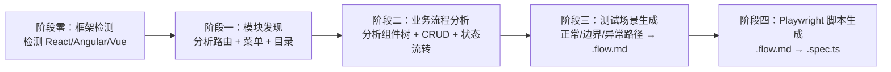
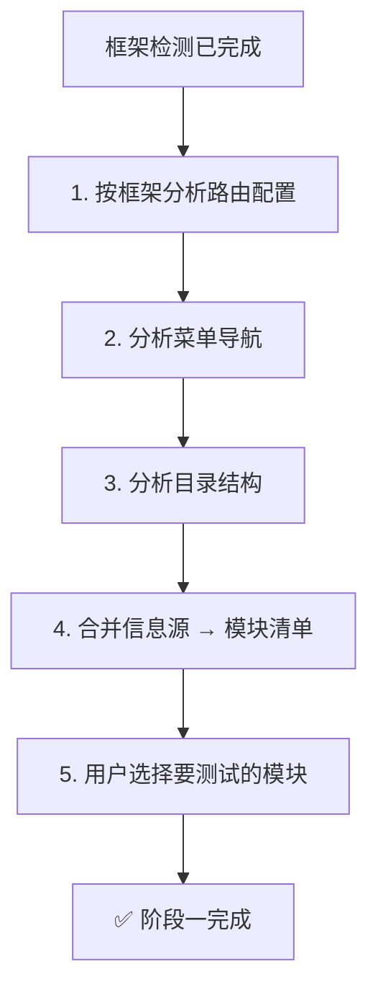
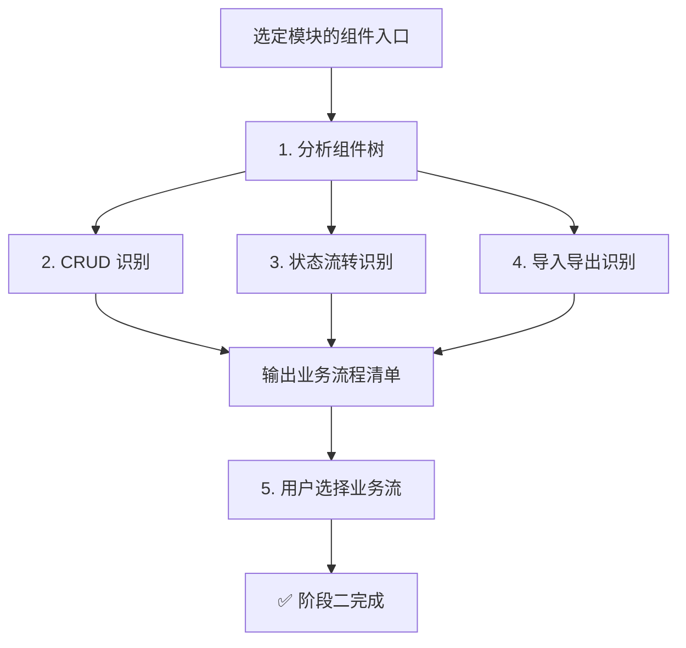

# Sweep Explore — 无文档系统的 E2E 测试自动生成

通过 **前端源码分析**，自动发现现有系统的功能模块和业务流程，系统性生成 E2E 测试。
支持 **React**、**Angular**、**Vue 3**、**Vue 2** 四种前端框架。

## 适用场景

**何时使用：**

- 已有线上运行的系统，但缺乏需求文档/PRD
- 想为遗留系统添加 E2E 测试覆盖
- 团队接手一个不熟悉的新项目，想快速理解其功能结构
- 需要为大型系统按模块逐步添加测试，而非一次性覆盖

**何时不使用：**

- 已有完善的需求文档 → 请使用 `/sweep-plan`（正向流程）
- 已有现成的 .flow.md 和测试脚本 → 无需再次生成
- 非主流前端框架（如 Svelte、Solid.js、Preact 等），暂不支持

## 前置条件

运行 `/sweep-explore` 前，请确保项目已通过 `/sweep-init` 初始化（`.deepstorm/settings.json` 中存在 `sweep.e2eProjectPath` 配置），且目标前端项目源码可访问。

---

## 五阶段工作流



每个阶段产出物作为下一阶段的输入，用户可在每个阶段审核和选择。

---

## 使用方式

| 方式             | 说明                                                                       |
| ---------------- | -------------------------------------------------------------------------- |
| **直接启动**     | `/sweep-explore` → 自动检测框架并进入探索流程                              |
| **指定项目路径** | `/sweep-explore path=../my-app` → 分析指定路径的前端项目                   |
| **指定框架**     | `/sweep-explore framework=react` → 跳过框架检测，按指定框架分析            |
| **指定模块**     | `/sweep-explore module=user-management` → 跳过阶段零和一，直接分析指定模块 |
| **增量模式**     | `/sweep-explore incremental` → 只分析新增模块                              |

---

## 阶段零：框架检测（Framework Detection）

**目标：** 自动检测目标项目使用的前端框架，为后续分析选择正确的模式。

### 检测方法

读取项目根目录或 `src/` 下的 `package.json`，检查 dependencies/devDependencies：

```bash
# 读取 package.json 中的关键依赖
cat package.json | grep -E '"react"|"@angular/core"|"vue"|"vue-router"|"react-router-dom"' 2>/dev/null
```

| 框架        | 关键依赖                                      | 特征文件               | 路由方案           |
| ----------- | --------------------------------------------- | ---------------------- | ------------------ |
| **React**   | `react` + `react-router-dom` / `react-router` | `.jsx` / `.tsx`        | React Router v5/v6 |
| **Angular** | `@angular/core` + `@angular/router`           | `@Component` 装饰器    | Angular Router     |
| **Vue 3**   | `vue` (3.x) + `vue-router` (4.x)              | `.vue` Composition API | vue-router 4       |
| **Vue 2**   | `vue` (2.x) + `vue-router` (3.x)              | `.vue` Options API     | vue-router 3       |

### 降级策略

如果 `package.json` 不可用或依赖不明确：

1. 扫描 `.jsx` / `.tsx` 文件 → 很可能为 React
2. 扫描 `.vue` 文件 → 很可能为 Vue
3. 扫描 `@Component` / `@Injectable` 装饰器 → 很可能为 Angular
4. 对每种可能框架都尝试分析路由，命中最多的结果作为框架推断
5. 输出检测结果供用户确认

```
🔍 框架检测结果：

  检测到 React 特征（package.json 中发现 react + react-router-dom）
  确认框架：React ✅

  按 Enter 确认，或输入框架名称修改（react/angular/vue3/vue2）>
```

---

## 阶段一：模块发现（Module Discovery）

**目标：** 从前端源码中自动发现系统包含哪些功能模块。

### 分析流程



### 1.1 按框架分析路由配置

根据阶段零检测到的框架类型，使用对应的分析模式。

#### React（react-router）

**常见配置文件：**

| 文件路径                           | 路由版本 | 特征 API                                     |
| ---------------------------------- | -------- | -------------------------------------------- |
| `src/routes.tsx` / `src/routes.ts` | v5/v6    | `<Routes>`, `<Route>`, `createBrowserRouter` |
| `src/router/index.tsx`             | v6       | `createBrowserRouter`, `RouterProvider`      |
| `src/App.tsx`                      | v5/v6    | 内联 `<Switch>` / `<Routes>`                 |
| `src/config/routes.ts`             | v5       | 对象数组 + `<Route>` 渲染                    |

**分析方法：**

- 提取 `<Route path="..." element={<Component />}>` 的 path 和组件名
- 提取 `createBrowserRouter([{ path, element }])` 的路由配置
- 注意 `React.lazy(() => import(...))` 懒加载模式
- 嵌套路由表示父子模块关系

#### Angular（Angular Router）

**常见配置文件：**

| 文件路径                        | 特征 API                       |
| ------------------------------- | ------------------------------ |
| `src/app/app-routing.module.ts` | `RouterModule.forRoot(routes)` |
| `src/app/app.module.ts`         | 内联路由配置                   |
| `src/app/*.module.ts`           | 各模块的路由配置               |

**分析方法：**

- 读取 `Routes` 类型数组：`{ path: 'users', component: UserListComponent }`
- 提取 `loadChildren: () => import('./users/users.module').then(m => m.UsersModule)` 懒加载模块
- 关注 `canActivate`, `canLoad` 权限守卫——这些是业务规则线索
- Angular 的 `NgModule` 结构天然对应模块划分
- 提取 `children` 嵌套路由

#### Vue 3（vue-router 4）

**常见配置文件：**

| 文件路径               | 特征 API                   |
| ---------------------- | -------------------------- |
| `src/router/index.ts`  | `createRouter({ routes })` |
| `src/router/routes.ts` | 单独的路由配置数组         |

**分析方法：**

- 读取 `createRouter` 的 `routes` 数组
- 提取 `{ path, name, component }` 配置
- 注意 `() => import('@/views/...')` 懒加载模式
- `children` 嵌套路由表示父子模块

#### Vue 2（vue-router 3）

**常见配置文件：**

| 文件路径              | 特征 API                    |
| --------------------- | --------------------------- |
| `src/router/index.js` | `new VueRouter({ routes })` |
| `src/router/index.ts` | `new VueRouter({ routes })` |

**分析方法：**

- 读取 `new VueRouter({ routes })` 配置
- 与 Vue 3 类似，使用 `() => import(...)` 懒加载
- `children` 嵌套路由表示父子模块

#### 查找路由文件的 Shell 命令

```bash
# React
find src -name "*.tsx" -o -name "*.ts" | xargs grep -l "Routes\|Route\|createBrowserRouter\|useRoutes" 2>/dev/null | head -10

# Angular
find src -name "*.ts" | xargs grep -l "RouterModule\|Routes\|loadChildren" 2>/dev/null | head -10

# Vue 3
find src -name "*.ts" -o -name "*.js" | xargs grep -l "createRouter\|createWebHistory\|createWebHashHistory" 2>/dev/null | head -10

# Vue 2
find src -name "*.ts" -o -name "*.js" | xargs grep -l "new VueRouter\|new Router" 2>/dev/null | head -10
```

### 1.2 按框架分析菜单导航

根据检测到的框架，查找对应的导航/菜单组件：

| 框架        | 常见组件/库                               | 查找关键词                                |
| ----------- | ----------------------------------------- | ----------------------------------------- |
| **React**   | Ant Design Menu, Material UI List/Sidebar | `Menu`, `Sidebar`, `Sider`, `Nav`         |
| **Angular** | Angular Material Sidenav, PrimeNG Menu    | `mat-sidenav`, `p-menu`, `nav`, `sidebar` |
| **Vue 3**   | Element Plus Menu, Naive UI Menu          | `el-menu`, `n-menu`, `Sidebar`            |
| **Vue 2**   | Element UI NavMenu, iView Menu            | `el-menu`, `i-menu`, `NavMenu`            |

**分析查找：**

```bash
# 根据框架类型查找菜单组件
# React
find src -name "*.tsx" -o -name "*.tsx" | xargs grep -l "Menu\|Sidebar\|Sider" 2>/dev/null | head -10

# Angular
find src -name "*.html" -o -name "*.ts" | xargs grep -l "mat-sidenav\|p-menu\|sidebar\|sidenav" 2>/dev/null | head -10

# Vue 3 / Vue 2
find src -name "*.vue" | xargs grep -l "el-menu\|n-menu\|sidebar\|Sidebar" 2>/dev/null | head -10
```

**菜单组织方式：**

| 方式      | 说明                                                                       |
| --------- | -------------------------------------------------------------------------- |
| 硬编码 UI | 组件内直接写菜单项（如 `<el-menu-item>用户管理</el-menu-item>`）           |
| 配置驱动  | 菜单数据与渲染分离，如 `menuConfig: { label: '用户管理', path: '/users' }` |
| 后端返回  | 菜单由 API 动态返回（`fetchMenu()` 后渲染）                                |
| 权限过滤  | 菜单项按角色/权限条件渲染                                                  |

**分析要点：**

- 菜单项的 label 是业务模块名称的第一手来源
- 菜单层级组织反映模块的父子关系（如 系统管理 → 用户管理）
- 注意 `v-if` / `*ngIf` / 条件渲染的菜单——按角色/权限控制是重要线索
- 配置驱动的菜单是最可靠的模块清单来源

### 1.3 分析目录结构

当路由和菜单信息不足时，通过目录结构辅助判断。不同框架的页面目录命名习惯：

| 框架        | 常见页面目录                              | 页面文件扩展名                   |
| ----------- | ----------------------------------------- | -------------------------------- |
| **React**   | `src/pages/`, `src/views/`, `src/routes/` | `.tsx`, `.jsx`                   |
| **Angular** | `src/app/`（每个模块一个目录）            | `.ts`（组件类）+ `.html`（模板） |
| **Vue**     | `src/views/`, `src/pages/`                | `.vue`（单文件组件）             |

**示例——视图目录结构（React/Vue）：**

```
src/views/ 或 src/pages/
├── user/            ← 用户管理模块
│   ├── list/        ← 用户列表页面
│   ├── create/      ← 创建用户页面
│   ├── edit/        ← 编辑用户页面
│   └── detail/      ← 用户详情页面
├── order/           ← 订单管理模块
│   ├── list/
│   ├── detail/
│   ├── approve/     ← 订单审核页面
│   └── refund/      ← 订单退款页面
└── dashboard/       ← 仪表盘模块
```

**示例——Angular 目录结构：**

```
src/app/
├── users/                  ← 用户管理模块
│   ├── users.module.ts     ← 模块定义
│   ├── users-routing.module.ts  ← 子路由
│   ├── user-list/          ← 用户列表
│   ├── user-form/          ← 用户表单（创建/编辑）
│   └── user-detail/        ← 用户详情
├── orders/                 ← 订单管理模块
│   ├── orders.module.ts
│   ├── orders-routing.module.ts
│   ├── order-list/
│   └── order-approve/
└── dashboard/
```

**组合推断规则：**

- 路由 path + 组件名 + 目录名 → 互相印证，取多数一致的结果
- 路由不足以确定模块归属时，以菜单结构为准（菜单反映业务组织）
- 路由和菜单都没有时，使用目录结构并标注"推测"
- Angular 的 `NgModule` 目录结构本身就是模块划分的直接映射，优先级最高

### 1.4 输出模块清单

向用户展示发现的模块清单：

```
📦 发现以下功能模块（共 N 个）：

  [ ] 1. 用户管理        /users         → 用户列表、创建、编辑、详情
  [ ] 2. 订单管理        /orders        → 订单列表、详情、审核、退款
  [ ] 3. 仪表盘          /dashboard     → 数据概览、图表
  [ ] 4. 设置            /settings      → 个人设置、系统配置
  ...

? 请选择要生成测试的模块（可多选，输入编号或 all）>
```

### 1.5 多选与继续

- 用户输入编号（如 `1,2`）或 `all` 选择模块
- 已选模块进入阶段二，未选模块跳过
- 支持后续单独对未选模块执行 `/sweep-explore module=<name>`

#### 降级处理：未发现任何模块

如果路由、菜单、目录结构三种信息源均无法确定功能模块：

1. 分析 `src/` 顶层目录结构，列出所有一级子目录
2. 检查是否有页面相关的目录命名约定（如 `pages/`、`views/`、`components/`）
3. **向用户报告分析结果**：

   ```
   ⚠️ 系统无法自动发现功能模块。

   可能原因：
   - 路由配置方式非标准（如动态路由、后端下发路由）
   - 菜单由后端动态返回，前端无静态配置
   - 项目结构不符合常见约定

   建议操作：
   1. 手动输入模块名称，系统将按目录结构分析
   2. 检查路由配置后重新运行
   3. 使用 `/sweep-plan`（如已有需求文档）
   ```

4. 提供手动输入模块的支持，用户输入后直接进入阶段二分析

---

## 阶段二：业务流程分析（Business Flow Analysis）

**目标：** 针对选定的功能模块，识别该模块下的业务操作流程。

### 分析流程



### 2.1 按框架分析组件树

针对选定模块的入口页面组件，按框架特性分析子组件关系。

**通用分析方法：**

1. 读取页面组件的代码
2. 查看 import / 引用语句，识别子组件
3. 跟踪子组件文件，理解其功能
4. 从组件命名推断业务功能

**React 组件分析：**

- 查看 JSX 中使用的子组件标签：`<UserTable>`, `<CreateUserModal>`
- 从 import 语句追踪组件路径：`import CreateUserModal from './modals/CreateUserModal'`
- 注意 `React.lazy` 和动态导入

**Angular 组件分析：**

- 查看模板（`.html`）中的选择器标签：`<app-user-table>`, `<app-create-user-modal>`
- 从模块装饰器 `declarations` / `imports` 中查找组件注册
- 注意 `@Input()` / `@Output()` 数据流接口
- 留意 `*ngIf`, `*ngFor` 等结构性指令中的业务逻辑

**Vue 组件分析：**

- 查看 `.vue` 文件中 `<template>` 段的子组件标签
- 从 `<script>` 段的 `import` / `components` 注册中追踪组件
- 注意 `v-if`, `v-for` 中的业务逻辑
- Composition API（Vue 3）或 Options API（Vue 2）的组件选项

**组件树示例：**

```
用户管理模块入口
├── UserSearchBar / search-bar    ← 搜索/筛选
├── UserTable / user-table        ← 用户列表展示
│   ├── Pagination / pager        ← 分页
│   └── ActionButtons             ← 操作按钮
├── CreateUserModal               ← 创建用户弹窗
├── EditUserModal                 ← 编辑用户弹窗
└── DeleteConfirmDialog           ← 删除确认弹窗
```

**组件命名约定——常见推断模式（跨框架通用）：**

| 组件名模式                         | 推断的业务功能     |
| ---------------------------------- | ------------------ |
| `*List*`, `*Table*`, `*Grid*`      | 列表查看/搜索/分页 |
| `*Create*`, `*Add*`, `*New*`       | 新增创建           |
| `*Edit*`, `*Update*`, `*Form*`     | 编辑修改           |
| `*Delete*`, `*Remove*`             | 删除操作           |
| `*Detail*`, `*View*`               | 详情查看           |
| `*Modal*`, `*Dialog*`, `*Drawer*`  | 弹窗表单           |
| `*Import*`, `*Upload*`             | 数据导入           |
| `*Export*`, `*Download*`           | 数据导出           |
| `*Approve*`, `*Reject*`, `*Audit*` | 审批/审核          |
| `*Setting*`, `*Config*`            | 配置管理           |
| `*Chart*`, `*Stat*`, `*Dashboard*` | 数据统计           |

### 2.2 识别 CRUD 流程

根据组件组合推断标准 CRUD 业务流程：

**列表流程（Read）：**

- 页面进入时调用列表 API → 展示分页表格 → 搜索/筛选 → 重新查询

**创建流程（Create）：**

- 点击"新增"按钮 → 打开创建弹窗/页面 → 填写表单 → 提交 → 成功后关闭/刷新列表

**编辑流程（Update）：**

- 点击列表中的"编辑"操作 → 打开编辑弹窗/页面 → 预填数据 → 修改表单 → 提交 → 刷新列表

**删除流程（Delete）：**

- 点击删除操作 → 弹出确认对话框 → 用户确认 → 执行删除 → 刷新列表

### 2.3 识别状态流转

对于包含状态变更的业务流程（如审批、订单流转）：

**查找线索：**

- 状态枚举/常量定义（`type OrderStatus = 'pending' | 'approved' | 'rejected'`）
- 状态机逻辑（`switch` / `if-else` 状态判断）
- 业务状态对应的操作按钮（条件渲染的 action）

**示例——订单状态流转：**

```typescript
// 状态枚举
enum OrderStatus {
  PENDING = 'PENDING', // 待审核
  APPROVED = 'APPROVED', // 已通过
  REJECTED = 'REJECTED', // 已驳回
  CANCELLED = 'CANCELLED', // 已取消
}

// 状态 → 可操作映射
const STATUS_ACTIONS = {
  [OrderStatus.PENDING]: ['approve', 'reject'],
  [OrderStatus.APPROVED]: ['view'],
  [OrderStatus.REJECTED]: ['edit', 'delete'],
};
```

### 2.4 识别导入导出

**导入流程（Import/Upload）：**

- 查找 `<input type="file">` 或 Upload/Dropzone 组件
- 关联的提交按钮和结果页面（导入进度、导入结果）

**导出流程（Export/Download）：**

- 查找导出按钮（如 `<Button>导出</Button>`）
- 关联的文件格式选择、导出参数设置、下载处理

### 2.5 输出业务流程清单

```
📋 用户管理模块 — 业务流程清单

  [ ] 1. 用户列表查看   → 列表显示、搜索、分页
  [ ] 2. 创建用户       → 表单填写、提交、结果确认
  [ ] 3. 编辑用户       → 数据预填、修改、保存
  [ ] 4. 删除用户       → 确认弹窗、执行、列表刷新

? 请选择要生成测试的业务流程（可多选，输入编号或 all）>
```

#### 降级处理：无法自动识别业务流程

如果 AI 无法从组件树和代码逻辑中推断业务流程：

1. 输出该模块的完整组件目录树和文件清单
2. 列出可疑的业务逻辑组件（如表单、表格、状态枚举、按钮等）
3. **引导用户手动描述业务流程**：

   ```
   ⚠️ 系统无法自动推断 [模块名] 的业务流程。

   可能原因：
   - 组件命名不包含业务语义（如 GenericForm、MyTable）
   - 业务逻辑通过配置驱动或后端下发
   - 代码结构复杂，涉及跨模块引用

   以下是该模块的组件目录结构：
   src/modules/xxx/
   ├── components/
   │   ├── GenericForm.vue       ← 可能是表单组件
   │   ├── DataTable.vue         ← 可能是列表组件
   │   └── ActionBar.vue         ← 可能是操作按钮

   请手动描述该模块包含哪些业务功能，例如：
   - "用户列表查看 → 创建用户 → 编辑用户 → 删除用户"
   - "订单列表 → 审核订单 → 导出订单"
   ```

4. 用户描述后，根据其输入直接进入阶段三（测试场景生成）

用户选择后进入阶段三。

---

## 阶段三：测试场景生成（Test Scenario Generation）

**目标：** 针对选定的业务流程，生成 .flow.md 测试意图文档。

### 场景类型覆盖

每个业务流程的 .flow.md 需要覆盖以下三类场景：

| 场景类型     | 说明                           | 优先级 |
| ------------ | ------------------------------ | ------ |
| **正常流程** | 业务操作成功完成的路径         | P0     |
| **边界条件** | 输入边界值、空数据、极限情况   | P1     |
| **异常流程** | 必填校验、重复提交、网络超时等 | P1     |

### 3.1 生成正常路径场景

从业务流程的操作步骤推导正常流程：

对于「创建用户」业务流程：

```markdown
## Flow: L01 - 创建用户正常流程

### 前置条件

- 用户已登录系统
- 用户有「用户管理」权限
- 用户列表页面已加载

### 执行步骤

1. 点击"新增用户"按钮
   ✅ 验证点：弹出创建用户弹窗，表单包含用户名、邮箱、角色等字段
2. 填写必填字段（用户名：`testuser`、邮箱：`test@example.com`、角色：`普通用户`）
   ✅ 验证点：表单字段输入正常，无校验错误提示
3. 点击"保存"按钮
   ✅ 验证点：弹窗关闭，列表刷新，新用户出现在列表中
4. 在搜索框中输入用户名 `testuser` 搜索
   ✅ 验证点：搜索结果仅包含新创建的用户

### 环境要求

- 目标环境：test
- 所需账号：管理员权限账号
```

### 3.2 生成边界条件场景

```markdown
## Flow: L02 - 创建用户边界条件

### 前置条件

- 用户已登录系统

### 执行步骤

1. 点击"新增用户"按钮，不填写任何字段，直接点击"保存"
   ✅ 验证点：表单校验提示必填字段错误，弹窗未关闭
2. 用户名输入超过最大长度的文本（如 50 个字符）
   ✅ 验证点：输入框限制字符数或显示超长提示
3. 输入已存在的用户名
   ✅ 验证点：提交后提示"用户名已存在"错误信息
```

### 3.3 生成异常场景

```markdown
## Flow: L03 - 创建用户异常场景

### 前置条件

- 用户已登录系统

### 执行步骤

1. 点击"新增用户"按钮，填写必填字段，提交前断网
2. 点击"保存"按钮
   ✅ 验证点：显示网络错误提示，弹窗未关闭，数据未提交
3. 恢复网络，再次点击"保存"
   ✅ 验证点：用户创建成功
```

### 3.4 输出格式规范

.flow.md 的格式**必须**与 sweep-plan 一致，确保可被 sweep-run 复用：

```markdown
# E2E 测试流程：{模块名} — {业务流程}

**来源：** sweep-explore 源码分析
**创建时间：** {YYYY-MM-DD HH:mm}

---

## 场景清单

| ID  | 场景             | 类型     | 优先级 |
| --- | ---------------- | -------- | ------ |
| L01 | 创建用户正常流程 | 正常流程 | P0     |
| L02 | 创建用户边界条件 | 边界条件 | P1     |
| L03 | 创建用户异常场景 | 异常场景 | P1     |

---

## Flow: L01 - 创建用户正常流程

### 前置条件

...

### 执行步骤

1. {操作步骤}
   ✅ 验证点：{预期结果}

### 环境要求

...
```

### 3.5 用户审核

生成 .flow.md 后，向用户展示场景摘要并确认：

```
✅ 已生成 3 个测试场景：

  L01 - 创建用户正常流程    [P0]
  L02 - 创建用户边界条件    [P1]
  L03 - 创建用户异常场景    [P1]

? 是否满意这些场景？
  1. 满意，继续生成测试脚本（进入阶段四）
  2. 需要修改（描述修改意见）
```

---

## 阶段四：Playwright 脚本生成（Playwright Script Generation）

**目标：** 基于 .flow.md，自动生成可执行的 Playwright E2E 测试脚本。

### 4.1 .flow.md → Playwright 语义映射

| .flow.md 元素     | Playwright 代码                                               | 说明             |
| ----------------- | ------------------------------------------------------------- | ---------------- |
| 前置条件          | `test.beforeEach()`                                           | 登录、导航到页面 |
| 执行步骤 中的操作 | `page.locator().click()` / `.fill()` / `.selectOption()`      | 页面交互         |
| ✅ 验证点         | `expect().toBeVisible()` / `.toHaveText()` / `.toHaveValue()` | 断言             |
| 环境要求          | `baseURL` 配置                                                | 测试配置         |

### 4.2 生成脚本模板

```typescript
import { test, expect } from '@playwright/test';

test.describe('用户管理 — 创建用户', () => {
  test.beforeEach(async ({ page }) => {
    // 前置条件：登录
    await page.goto('/login');
    await page.fill('[data-testid="username"]', 'admin');
    await page.fill('[data-testid="password"]', 'password');
    await page.click('[data-testid="login-btn"]');
    await expect(page).toHaveURL('/dashboard');
  });

  test('L01 - 创建用户正常流程', async ({ page }) => {
    // 导航到用户管理
    await page.click('text=用户管理');
    await expect(page).toHaveURL('/users');

    // 点击新增按钮
    await page.click('text=新增用户');
    await expect(page.locator('[data-testid="create-user-modal"]')).toBeVisible();

    // 填写表单
    await page.fill('[data-testid="username-input"]', 'testuser');
    await page.fill('[data-testid="email-input"]', 'test@example.com');
    await page.selectOption('[data-testid="role-select"]', '普通用户');

    // 提交
    await page.click('text=保存');
    await expect(page.locator('[data-testid="create-user-modal"]')).not.toBeVisible();

    // 验证列表中新增的用户
    await page.fill('[data-testid="search-input"]', 'testuser');
    await page.click('text=搜索');
    await expect(page.locator('table >> text=testuser')).toBeVisible();
  });

  test('L02 - 创建用户边界条件', async ({ page }) => {
    await page.click('text=用户管理');
    await page.click('text=新增用户');

    // 空表单提交
    await page.click('text=保存');
    await expect(page.locator('text=请填写用户名')).toBeVisible();
    await expect(page.locator('text=请填写邮箱')).toBeVisible();
  });
});
```

### 4.3 目录组织

生成的测试脚本放置在 `sweep.e2eProjectPath` 配置的 E2E 项目目录中：

```
{ e2eProjectPath }/
├── modules/
│   ├── user-management/
│   │   ├── create-user.flow.md
│   │   ├── create-user.spec.ts
│   │   ├── edit-user.flow.md
│   │   └── edit-user.spec.ts
│   ├── order-management/
│   │   ├── approve-order.flow.md
│   │   └── approve-order.spec.ts
│   └── ...
└── ...
```

### 4.4 Page Object 复用检测

在生成脚本前，检查 E2E 项目目录中是否已有 Page Object 文件：

```bash
# 查找已有 Page Object
find {e2eProjectPath} -name "*.page.ts" -o -name "*.po.ts" 2>/dev/null
```

如果发现已有 Page Object，分析其暴露的定位器和方法，生成的脚本中的 locator 优先复用：

```typescript
// 检测到已有的 UserPage Object
import UserPage from '../pages/user.page';

test('L01 - 创建用户正常流程', async ({ page }) => {
  const userPage = new UserPage(page);
  await userPage.goto();
  await userPage.clickCreate();
  await userPage.fillCreateForm({ username: 'testuser', email: 'test@example.com' });
  await userPage.submitForm();
  await expect(userPage.userTable).toContainText('testuser');
});
```

---

## 产出物总览

一个完整的 sweep-explore 会话产出以下文件：

```
{ e2eProjectPath }/
├── modules/
│   ├── {模块名}/
│   │   ├── {业务流程}.flow.md        ← 测试意图文档
│   │   └── {业务流程}.spec.ts        ← Playwright E2E 脚本
│   └── ...
└── _explore-report.md                ← 探索报告（可选）
```

其中 `.flow.md` 格式与 `sweep-plan` 完全一致，`sweep-run` 可无缝执行。

---

## 快速参考

### 命令速查

| 命令                                                  | 说明                             |
| ----------------------------------------------------- | -------------------------------- |
| `/sweep-explore`                                      | 启动完整探索流程（阶段零 → 四）  |
| `/sweep-explore module=<name>`                        | 跳过阶段零和一，直接分析指定模块 |
| `/sweep-explore framework=react\|angular\|vue3\|vue2` | 跳过框架检测，按指定框架执行     |
| `/sweep-explore path=<project-path>`                  | 分析指定路径的前端项目           |
| `/sweep-explore incremental`                          | 增量模式，只分析新增模块         |

### 源码分析优先级

```
路由配置（最高）> 菜单导航 > 目录结构（降级使用）
```

### 场景类型覆盖

| 类型     | 覆盖内容                     | 优先级 |
| -------- | ---------------------------- | ------ |
| 正常流程 | 业务操作成功完成的路径       | P0     |
| 边界条件 | 空数据、极限值、特殊字符     | P1     |
| 异常场景 | 必填校验、重复提交、网络超时 | P1     |
