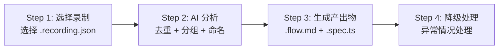

# Sweep Record — 浏览器操作录制 → E2E 测试生成

基于 `deepstorm record` CLI 录制的 `.recording.json`，AI 自动分析操作序列、推断断言、生成与 sweep-run 兼容的 `.flow.md` 和 `.spec.ts`。

## 适用场景

**何时使用：**

- 已有录制好的 `.recording.json` 文件（通过 `deepstorm record start -u <url>` 录制）
- 想将真人操作转化为可重复执行的 E2E 测试
- 项目无前端源码或源码结构不标准，无法使用 `/sweep-explore`
- 测试工程师能手动操作界面但不熟悉代码编写

**何时不使用：**

- 没有进行浏览器操作录制
- 需要从源码分析生成测试 → 请使用 `/sweep-explore`
- 已有现成需求文档 → 请使用 `/sweep-plan`

## 使用方式

| 方式         | 说明                                                                 |
| ------------ | -------------------------------------------------------------------- |
| **交互选择** | `/sweep-record` → 列出所有未处理的 `.recording.json`，选择后进入分析 |
| **直接指定** | `/sweep-record <name>` → 匹配对应名称的录制文件，跳过选择直接分析    |

---

## 四步工作流



---

## 安全门闸

> **使用本 skill 前必须先阅读以下全部流程说明**，然后逐节执行。该 skill 不依赖其他外部 skill。

---

## §1 录制文件选择

### 1.1 扫描录制目录

```bash
ls -lt .deepstorm/recordings/*.recording.json 2>/dev/null
```

### 1.2 展示列表

读取所有 `.recording.json` 文件的 `meta` 信息，向用户展示：

```
📁 录制文件列表：

[未处理]
  1. 2026-07-26 14:30:22 — 8 events — ?untitled
  2. 2026-07-26 15:10:05 — 24 events — ?untitled

[已处理 → test-flows/user-login.flow.md]
  3. 2026-07-25 10:00:00 — 15 events — user-login

? 请输入编号或输入文件名称 >
```

**判断规则：**

- 已处理：对应名称的 `.flow.md` 已存在于 `test-flows/` 中
- 未处理：无同名 `.flow.md`
- 标题展示：优先显示文件名；文件名无语义时显示 `?untitled`

### 1.3 直接指定

`/sweep-record <name>` 时：

- 在 `.deepstorm/recordings/` 中匹配文件名包含 `<name>` 的 `.recording.json`
- 唯一匹配 → 直接进入分析
- 多匹配 → 展示匹配列表让用户选择
- 无匹配 → 回到列表模式

### 1.4 异常处理

- 录制目录不存在 → 提示"尚未进行过录制，请先执行 `deepstorm record start -u <url>`"
- 无录制文件 → 提示同上
- 所有文件均已处理 → 提示用户是否要重新分析某文件

---

## §2 AI 事件分析

### 2.1 读取录制数据

加载选中的 `.recording.json`，解析 `meta` 和 `events` 数组。

**截图存储说明：**

截图已外链存储为独立的 JPEG 文件，`recording.json` 中的 `type: "screenshot"` 事件通过 `data.path` 字段引用文件路径。AI 分析时先加载轻量的事件 JSON，需要视觉上下文时按需读取截图文件。

- `type: "screenshot"` 事件的 `data` 结构：`{ label, path, format: 'jpeg', ts }`
- `format` 字段固定为 `"jpeg"`，`path` 为相对 `.recording.json` 的路径
- 使用 `Read` 工具读取截图文件：`Read 文件路径/.deepstorm/recordings/{data.path}`
- **旧格式兼容**：若截图事件 `data` 中包含 `data` 字段（base64 字符串），识别为旧格式内嵌，降级为无视觉上下文分析，标注"截图内嵌格式"

### 2.2 事件去重与语义分组

使用 AI 对原始事件执行：

**去重规则：**

- 同一元素 <500ms 内的多次 click → 合并为一次
- focus + input + blur → 聚合为一个 input 步骤（保留最终值）
- 连续 mousemove/scroll 事件已在 CLI 阶段过滤，此处检查残留

**语义分组提示：**

分析 `events[]` 数组，将零散事件聚合法操作步骤：

```markdown
将以下原始事件序列：

click on <input#username> → input value="admin" → click on <input#password> →
input value="****" → click on <button#login> → navigation to /dashboard

分组为语义步骤：

1. 填写用户名（admin）
2. 填写密码
3. 点击"登录"按钮
4. 验证跳转到仪表盘页面
```

**分组策略：**

- 连续输入在同一区域 → 合并为"填写 {表单名}"分组
- click + input + blur → 合并为"填写 {字段名} 为 {值}"
- 下拉选择 → "选择 {选项名}"
- click + navigation → "点击 {元素名} 并跳转"
- 相邻的 click → 保留为独立操作（除非同一元素 <500ms）

### 2.3 断言推断

基于以下数据源自动推断断言：

**网络响应断言（优先级高）：**

- 从 `type: "network"` 事件中提取 URL 和 statusCode
- statusCode 200 → ✅ 验证点：接口 {path} 返回状态码 200
- statusCode 4xx/5xx → ✅ 验证点：接口 {path} 返回 {code}（错误提示：{摘要}）
- 响应体摘要有错误信息 → 追加验证点

**页面导航断言：**

- 从 `type: "navigation"` 事件提取目标 URL
- 完整导航 → ✅ 验证点：页面 URL 跳转到 {url}
- SPA 路由变化 → ✅ 验证点：URL 变为 {path}

**页面标题/内容断言：**

- 导航后标题变化 → ✅ 验证点：页面标题变为 {新标题}
- 如有截图且 AI 可见差异 → ✅ 验证点：{元素名} 可见（视觉确认）

**截图辅助分析（外链读取）：**

截图已外链存储，AI 在推断断言阶段按需读取，而非一次性加载全部截图。

读取时机：

- 先完成事件序列的初步分析和语义分组
- 在推断断言阶段，按需读取关键操作前后的截图
- 优先读取 `navigation` / `submit` / `click` 事件前后的截图
- 不读取无显著状态变化的事件间的截图

读取方式：

- 根据截图事件的 `data.path` 字段确定文件路径
- 使用 `Read` 工具读取对应的 JPEG 文件
- 分析完成后不保留截图数据（避免上下文累积）
- 无截图或读取失败时降级为纯事件驱动的断言推断，在报告中标注"缺少截图确认"

### 2.4 流程自动命名

**命名策略：**

1. 综合页面标题序列、URL 路径、操作语义 → 推断业务名称
2. 使用英文 kebab-case，3-5 个词
3. 反映核心操作目的（如 `user-login`、`create-order`、`approve-workflow`）

**命名提示词示例：**

```markdown
基于以下操作序列推断该测试流程的名称（英文 kebab-case，3-5 词）：

页面标题序列：Dashboard → Login → User Management
URL 路径序列：/ → /login → /users
操作摘要：输入用户名 → 输入密码 → 点击登录

推荐：user-login
```

**置信度：**

- 页面标题和 URL 包含业务关键词 → 高置信度
- 仅能从操作推断 → 中等置信度，名称加 `?` 前缀标记
- 完全无法推断 → 推荐 `?untitled-flow`，提示用户手动命名

### 2.5 用户确认

```
✅ AI 分析完成

📋 共识别 6 个语义操作步骤
📸 含 3 张截图分析
🔍 推断 5 个验证点

📝 推荐流程名称：user-login
是否接受此名称？(Y/n) >
```

- 用户按 Enter → 接受推荐名称
- 用户输入新名称 → 使用自定义名称
- AI 推荐名称含 `?` 前缀时 → 强制要求用户命名

---

## §3 测试生成

### 3.1 生成 .flow.md

基于分析结果生成 `.flow.md`，格式与 sweep-explore 产出的 `.flow.md` 一致：

**文件结构：**

```markdown
# E2E 测试流程：{flow-name}

**来源：** sweep-record 浏览器录制
**创建时间：** {YYYY-MM-DD HH:mm}

---

## 场景清单

| ID  | 场景             | 来源     |
| --- | ---------------- | -------- |
| L01 | {操作序列主流程} | 录制分析 |

---

## Flow: L01 - {主流程}

### 前置条件

- 打开目标页面 {url}

### 执行步骤

1. {操作描述（中文）}
   ✅ 验证点：{预期结果}

### 环境要求

- 目标环境：{从录制 URL 推断，如 test/staging/prod}
```

**注意事项：**

- 精确的 Playwright locator 信息不出现在 `.flow.md` 中（保持可读性）
- 每个语义分组对应一个 `Flow: L{N} - {标题}` 章节
- 文件头部标记来源为 `sweep-record`
- 步骤数量超过 15 时考虑拆分为多个 Flow

**多流程拆分：**

- 录制包含多个独立语义流程 → 拆分为多个 `Flow:` 章节，共用同一 `.flow.md`
- 录制包含完全无关的两组操作 → AI 建议生成多个 `.flow.md` 文件并请求用户确认

### 3.2 生成 .spec.ts

基于录制数据中的精确 locator 直接生成 Playwright 测试脚本：

**生成策略：**

- 使用录制数据中的精确 locator（`getByRole`、`getByText`、`getByPlaceholder`、`getByTestId`、CSS 选择器），优先级同设计文档 D2
- 每个步骤前添加中文注释说明操作意图
- 操作后添加对应的 `expect()` 断言（从 Step 2.3 推断）
- 录制中的输入值直接硬编码（供后续人工替换为测试数据变量）
- `.spec.ts` 的 `test.describe` 名称 = flow-name

**文件命名：**

- `.flow.md` → `test-flows/{flow-name}.flow.md`
- `.spec.ts` → `test-flows/{flow-name}.spec.ts`

### 3.3 用户确认流程

```
📝 即将生成以下文件：

  1. test-flows/user-login.flow.md  (6 steps, 5 assertions)
  2. test-flows/user-login.spec.ts  (6 Playwright steps)

? 确认生成？(Y/n) >
```

- 用户确认 → 写入文件
- 用户拒绝 → 返回修改

### 3.4 异常处理

**录制为空或无有效事件：**

- 有效事件数 = 0 → 提示"录制文件中无有效事件，无法生成测试"，建议重新录制
- 有效事件数 < 2 → 提示"录制事件不足，可能无法生成有意义的测试脚本"，但仍尝试生成，附带低质量警告

---

## §4 降级处理

### 4.1 录制文件损坏

```bash
# 验证 JSON 格式
cat .deepstorm/recordings/{file}.recording.json | python3 -m json.tool > /dev/null 2>&1
```

若 JSON 解析失败：

- 提示"录制文件可能已损坏"并显示解析错误位置
- 建议用户重新录制
- 如文件部分可读，尝试提取有效事件片段

### 4.2 分析失败

当 AI 无法合理分组或推断时：

- 输出原始事件序列的直观展示
- 提示"AI 无法有效分析该录制内容"
- 可能原因：录制内容过于复杂、浏览器崩溃导致数据不完整、页面涉及需要交互的 iframe
- 建议：重新录制，将流程拆分为更小的步骤

### 4.3 旧格式截图兼容

如果 `screenshot` 事件的 `data` 中包含 `data` 字段（base64 字符串）而非 `path` 字段：

- 识别为旧格式（base64 内嵌）截图
- 降级为无视觉上下文分析
- 在分析报告中标注"截图内嵌格式，无法按需读取详细视觉信息"
- 继续基于事件序列进行断言推断

### 4.4 无截图时的断言策略

如果录制过程中截图失败、不存在或读取失败：

- 降级为纯网络响应和导航状态推断断言
- 标记缺少截图的步骤为"无截图确认"（降低断言可信度）
- 提示用户"部分操作缺少截图，建议补录以获得更好的断言覆盖"

---

## 快速参考

### 命令速查

| 命令                   | 说明                       |
| ---------------------- | -------------------------- |
| `/sweep-record`        | 交互选择录制文件并进入分析 |
| `/sweep-record <name>` | 直接指定录制文件名称       |

### 产出物

```
test-flows/
├── {flow-name}.flow.md    ← 测试意图文档（sweep-run 兼容）
└── {flow-name}.spec.ts    ← Playwright 测试脚本
```
