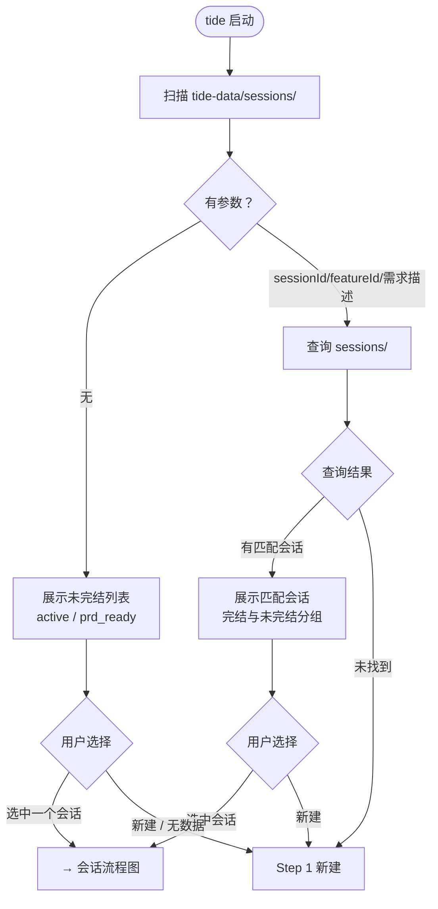
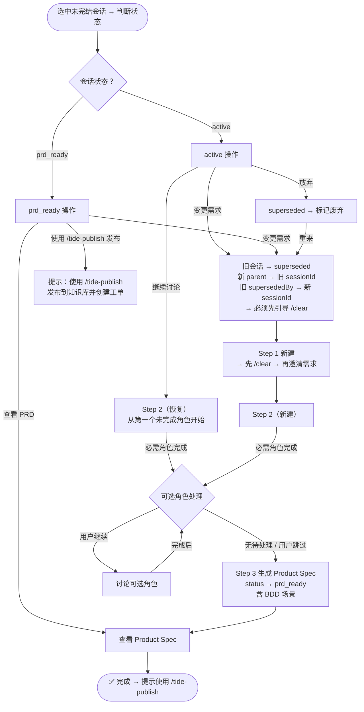

# Tide — BMAD 产品需求讨论工作流

Tide 是 DeepStorm 产品侧的 BMAD 工作流，通过结构化讨论引导需求逐步收敛，最终生成 **Product Spec（产品规格文档）**。

Product Spec 包含业务上下文、BDD 行为场景（Given-When-Then）、功能需求和非功能约束，为下游开发阶段（OpenSpec → SDD）提供结构化输入。

> **发布与归档**由 `tide-publish` skill 独立处理。讨论完成后，使用 `/tide-publish` 发布到知识库并拆分为开发任务。

---

## 数据存储约定

**根目录：** `tide-data/`（在当前项目根目录下），建议加入项目 `.gitignore`。

| 路径                                  | 用途                                        |
| ------------------------------------- | ------------------------------------------- |
| `tide-data/sessions/{sessionId}.json` | 需求会话（active / prd_ready / superseded） |
| `tide-data/sessions/.sequence`        | 会话 ID 序列号                              |
| `tide-data/sessions/.index.json`      | 会话摘要索引（轻量缓存，入口优先读取）      |
| `tide-data/prds/{sessionId}-prd.md`   | Product Spec Markdown                       |
| `tide-data/prds/{sessionId}-prd.json` | Product Spec JSON 快照                      |

启动时自动创建 `tide-data/{sessions,prds}` 两个子目录。

---

## 工作流程

### 入口：数据扫描 + 输入解析

**触发时机：**

- 用户显式输入 `/tide` 或提及 Tide
- **或** 用户明确表达需求讨论意图（"我想/需要/做一个/讨论一下..."）

> **提示强度：** 随口抱怨（"这个按钮好丑"）或模糊想法 → **不接管**。等用户明确表达再激活

> **讨论中规则：** 已有角色讨论（Step 2）时用户提新需求 → **不自动开新 session**，提示用户选择"结束当前建新"或"先记录继续当前"

**数据准备：**

1. **优先加载索引缓存**：读取 `.index.json` 直接获取 session 摘要列表，文件不存在或解析失败时降级为逐个读取
2. **异常处理：** JSON 解析失败时跳过该文件，继续加载其他文件，并提示用户损坏文件数
3. **依赖 skill 检查（仅入口一次）：**
   - `bmad` 未安装 → ⚠️ 警告："缺少 bmad 多角色讨论能力，建议 `npx bmad-method install` 安装"（不阻止运行）
   - `grill-me` 未安装 → 💡 提示："安装 grill-me 提升需求追问体验"（不阻止运行）

**决策流程：**



#### 入口操作详情

**无参数（入口列表）：** 扫描 `tide-data/sessions/`，按状态分组展示：

| 状态                       | 展示内容                                                          |
| -------------------------- | ----------------------------------------------------------------- |
| 🔴 active（讨论中）        | Session ID · Feature ID · 简介 · 创建日期 · 已完成角色 · 可选角色 |
| 🟢 prd_ready（PRD 已完成） | Session ID · Feature ID · 简介 · 创建日期 · PRD 路径              |

入口列表为空时，先引导 `/clear`，再进入 Step 1。进入分析师 Mary 角色，引导用户提出需求，**不要**被动等待。

**有参数查询：** 根据 sessionId / featureId / 中文描述搜索 `sessions/`。匹配规则：

| 参数类型  | 匹配方式                               | 未找到时                       |
| --------- | -------------------------------------- | ------------------------------ |
| sessionId | 精确匹配                               | 提示不存在，可新建或回到列表   |
| featureId | 精确匹配（多版本按 createdAt 倒序）    | 提示无记录，可新建或搜索关键词 |
| 中文描述  | 关键词模糊匹配（brief/summary），top 5 | 直接新建（不提示）             |

**各状态可选操作：**

| 会话状态  | 可用操作                                                    |     `/clear` 要求     |
| --------- | ----------------------------------------------------------- | :-------------------: |
| active    | 继续讨论 · 变更需求（→ S1）· 放弃                           | 变更需求时先 `/clear` |
| prd_ready | 查看 PRD · **使用 `/tide-publish` 发布** · 变更需求（→ S1） | 变更需求时先 `/clear` |

### 会话流程图



---

### Step 1: 初始化会话

用户从入口选择了「新建」「重来」后：

**上下文隔离（完成后再继续 Step 1）：**

1. **AI 声明切换** — 以明确语句宣告上下文切换，**禁止引用旧内容**
2. **引导 `/clear`** — 在声明后提示用户清空终端，等待用户回复后再继续

**上下文隔离完成后的 Step 1：**

1. 如果入口已传入上下文（如 featureId、brief 预填值），直接用；**否则向用户澄清需求后，AI 提炼为一段不超过 50 字的中文概要存入 `brief`**
2. 读取 `tide-data/sessions/.sequence` 计算新的 sessionId，计算后将新序列号写回 `.sequence` 文件
3. 根据需求描述生成 featureId（格式参考 `references/data-format.md`）
   - 如果 AI 提供了 featureId 备选方案，且用户选了与 brief 不一致的方案，提示用户是否要更新 brief 描述
4. 如果入口关联了旧会话（parent），在新会话 JSON 中设置 `parent` 字段
5. 创建 session JSON 文件，`status: "active"`
6. 告知用户 sessionId 和 featureId
7. **写入索引缓存**：在 `.index.json` 中追加新 session 的摘要条目

进入第 1 个角色（💼 业务分析师 Mary），角色引导 prompt 见 `references/role-prompts.md`。analyst 入场时先**简要复述 `brief`**，在已确认的 brief 基础上深入讨论，**不要重复问"你想做什么需求"**。

---

### Step 2: 角色讨论流程

Step 2 有两种入口：

- **S2_NEW（新建）** — 从 Step 1 进入，从第一个角色（analyst）从头开始
- **S2_RESUME（恢复）** — 从入口选中 active 会话进入，跳过已完成的角色，从第一个未完成角色继续

**规则：**

- 一次只扮演一个角色
- 一次只问一个问题
- 引导用户自己决策，不替用户做决定
- 讨论语言跟随用户

**Checklist 约束（重要）：**

每个角色有固定的讨论 checklist（`references/checklists.md`），用于防止跳过重要环节。

1. **进入角色时** — 立即展示全部 checklist 项（均标记 ⬜），参考格式：

   > **原则：** 展示 checklist 为**目录预览**，让用户了解讨论范围。展示后**只追问第一项未完成项**，不同时问所有项。

   ```
   📋 分析师 Mary — 讨论进度
   ⬜ 需求背景和业务目标
   ⬜ 目标用户画像
   ⬜ 核心痛点分析
   ⬜ 竞品调研
   ⬜ 关键成功指标
   ```

2. **每轮讨论后** — 评估用户回答覆盖了哪些项，更新 checklist 状态（⬜ → ☑️），展示最新进度

3. **完成判定：**
   - **必需角色（analyst、pm）：** 全部 ☑️ 后才能进入 Step 3 生成 PRD，硬性门禁
   - **可选角色（architect、designer、po）：** 如果用户同意跳过，则添加 `skipped: true` 占位记录，不阻塞 PRD 生成；如果开始讨论，则需要全部 ☑️ 才算完成

4. **用户说"差不多"时** — 检查 checklist 中是否有未勾选项，若有则追问

**Checklist 持久化—三步走：**

```
进入角色时
  ↓
① 创建骨架 — 在 session JSON 的 steps[] 中追加一条新记录：
   {role: "analyst", skipped: false, completedAt: null, checklist: [...]}
   写入文件
  ↓
每轮讨论后
  ↓
② 更新条目 — 仅修改 checklist 中对应项的 done 值（false→true）
   写入文件
  ↓
角色完成时
  ↓
③ 完成填写 — 补全 summary、decisions、requirements，设置 completedAt
   写入文件
```

这样对话在任意时刻中断，恢复时：

- 看到 `checklist` 中哪些 done=true → 从未完成的项开始问
- 看到 `completedAt: null` → 知道角色未完成
- 看到 `skipped: true` → 跳过该角色

---

### Step 3: 生成 Product Spec

**触发时机：** 所有必需角色（analyst + pm）讨论完成后的自动步骤。

1. 按以下模板生成 Product Spec Markdown，保存到 `tide-data/prds/{sessionId}-prd.md`
2. 保存 JSON 快照到 `tide-data/prds/{sessionId}-prd.json`
3. 更新 session JSON 的 `status` 为 `prd_ready`，并同步更新 `.index.json` 中对应条目的 status
4. 展示 PRD 给用户预览，并提示：**"Product Spec 已生成。使用 `/tide-publish` 发布到知识库并拆分为开发任务。"**

#### BDD 场景生成规则

在生成 Product Spec 时，AI 必须将 PM John 讨论中自然出现的**用户行为描述**转化为结构化的 BDD 场景（Given-When-Then）。具体规则：

**场景来源：**

- PM checklist 中的「用户故事」→ 提取为 Happy Path 场景
- PM checklist 中的「边界与反例」→ 提取为异常流程/边界场景
- 分析师 Mary 的「核心痛点分析」→ 补充异常场景的上下文
- 讨论中用户提到的具体操作路径 → 直接转化为场景

**场景分类：**

| 分类       | 标识     | 用途                           |
| ---------- | -------- | ------------------------------ |
| happy-path | 正常流程 | 核心功能的主要操作路径         |
| error-flow | 异常流程 | 超时、失败、拒绝访问等异常情况 |
| boundary   | 边界场景 | 极限数据、并发、权限边界       |

**格式示例：**

```
### 正常流程

**S-1: 用户扫码登录成功**
```

Given 用户已登录企业微信
When 用户在登录页选择「企业微信登录」
Then 页面展示二维码
And 用户扫码后自动完成登录

```

### 异常流程

**S-2: 二维码过期处理**
```

Given 用户已打开扫码页面
When 二维码超过 5 分钟未扫码
Then 二维码自动刷新
And 页面提示「二维码已刷新」

```

```

**注意事项：**

- 场景必须来源于讨论中实际涉及的内容，禁止凭空编造
- 每个场景应有明确的 `Given`（前置条件）、`When`（操作）、`Then`（预期结果）
- 允许 `And`/`But` 扩展多个预期结果
- 一个功能通常包含 1-3 个 happy-path + 1-2 个 error-flow + 0-2 个 boundary 场景
- 不要试图覆盖所有可能性，聚焦于讨论中明确提到的场景

#### 异常处理（PRD 文件丢失）

如果后续访问时发现 Product Spec 文件不存在，按以下顺序恢复：

1. 优先从 `tide-data/prds/{sessionId}-prd.json` 快照重新生成 Markdown
2. 如 JSON 快照也不存在，从 session JSON 的 `steps[]` 记录重新生成
3. 重新写入 PRD 文件，告知用户文件已恢复

---

### 流程结束后的行为

| 结束节点      | 触发条件         | AI 行为                                 |
| ------------- | ---------------- | --------------------------------------- |
| ✅ PRD 已生成 | Step 3 完成      | 提示使用 `/tide-publish` 进行发布和归档 |
| 🗑️ 放弃       | 用户选择「放弃」 | 标记 `superseded`，告知已废弃           |
| ⏸️ 暂退       | 用户中途退出     | 回到正常对话，会话保留在列表            |

---

### 讨论中收到 `/tide`

1. **保存进度** — checklist 已持久化
2. **退出角色** — 回到入口列表
3. 用户可选「继续讨论」或选择其他会话

### 会话关联

用户选择「变更需求/重来」后：

1. 读取旧会话 JSON 作为参考上下文
2. 新 `parent` = 旧 sessionId，旧 `supersededBy` = 新 sessionId，旧 status → `superseded`
3. **上下文隔离：** AI 必须先宣告切换并引导 `/clear`，禁止引用旧内容

---

### 会话恢复

用户从入口选择「继续/恢复」后：

1. **查找文件：** 在 `sessions/` 中查找
2. 根据 `status` 决定恢复行为：

   | status      | 恢复路径                                                             |
   | ----------- | -------------------------------------------------------------------- |
   | `active`    | 找到第一个未完成角色（先 `skipped`，再 `completedAt`），从该角色继续 |
   | `prd_ready` | 展示 PRD，提示使用 `/tide-publish` 发布                              |

3. 角色全部完成但 status 仍为 `active` → 进入 Step 3

**恢复时：** `skipped: true` 步骤直接跳过；checklist 优先从 `steps[].checklist` 读取，为空则从 decisions/requirements 推断，仅展示未完成项。

---

**参考文件索引：** `references/data-format.md`（数据格式）· `references/role-prompts.md`（角色 prompt）· `references/checklists.md`（checklist）· `references/prd-template.md`（Product Spec 模板）

---

## 关键约束

1. **不要跳过必需角色** — analyst 和 pm 必须完成
2. **Feature ID 规则：**
   - 不要超过 **5 个英文单词**（`AUTH-LOGIN-WECOM` 计为 3 个）
   - AI 拿不准时，提供 **2-3 个备选方案**让用户选择，不要自己做主
3. **BDD 场景必须源自讨论** — 禁止编造未讨论过的场景
