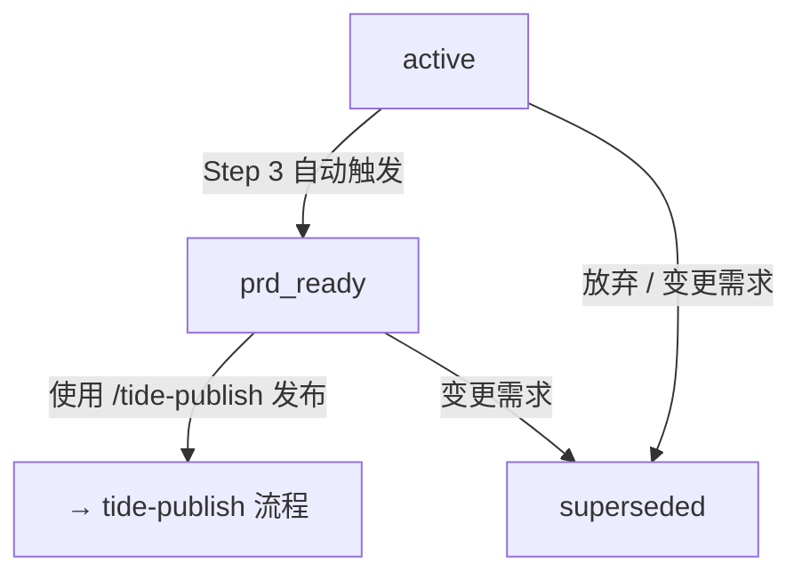

# 数据格式参考

## 会话 ID 格式

```
tide-YYYYMMDD-NNN
```

- YYYYMMDD = 当前日期
- NNN = 当日递增序列号（从 001 开始）
- 例：`tide-20260611-001`

**序列号维护：** `tide-data/sessions/.sequence` 文件记录上次序列号，格式为 `20260611 005`。首日没有此文件时从 001 开始。

**跨天处理：** 读取 `.sequence` 文件时，检查日期部分是否等于今天。如果日期不等于今天（跨天了），将 NNN 重置为 `001` 并从 `001` 开始。

**异常处理：** 如果 `.sequence` 文件内容损坏（格式错误、日期乱码等），**忽略该文件，重新生成**。基于当前 `sessions/` 目录中最大的 sessionId 序列号 + 1 计算新序列号。如果 `sessions/` 为空，从 001 开始。

---

## Feature ID 格式

```
MODULE-FUNCTION-SUBFUNCTION
```

全大写 + 连字符，例：`AUTH-LOGIN-WECOM`、`PAYMENT-ORDER-REFUND`。

**自动生成规则（当用户未指定时）：**

1. 先将需求描述**翻译成英文**，准确表达原意
2. 从英文翻译中提取 2-4 个核心关键词，按逻辑层级排列：`模块-功能-子功能`
3. 如果需求跨多个领域，取最核心的意图

> 例如：用户说"添加企业微信扫码登录" → 翻译为 "Add WeChat Work QR code login" → 提取 `AUTH-LOGIN-WECOM`
> 用户说"优化商品列表的加载速度" → 翻译为 "Optimize product list loading speed" → 提取 `PRODUCT-LOAD-OPTIMIZE`

**长度限制：** featureId 不超过 **5 个英文单词**（`AUTH-LOGIN-WECOM` 计为 3 个，`PAYMENT-ORDER-REFUND-V2` 计为 4 个）。

**备选机制：** 如果 AI 对提取哪 2-4 个词拿不准，提供 **2-3 个备选方案**让用户选择，不要自己做主。

**原则：** 生成的 featureId 要能让人一眼看出需求意图，不要用无意义的 hash 或过短的缩写。

---

## Session JSON 格式

```json
{
  "sessionId": "tide-20260611-001",
  "featureId": "AUTH-LOGIN-WECOM",
  "brief": "企业微信扫码登录",
  "createdAt": "2026-06-11T10:00:00.000Z",
  "status": "prd_ready",
  "parent": null,
  "supersededBy": null,
  "steps": [
    {
      "role": "analyst",
      "summary": "讨论了企业微信在企业通讯录...",
      "decisions": ["使用扫码而非手动输入"],
      "requirements": ["支持企业微信扫码"],
      "skipped": false,
      "checklist": [
        { "item": "需求背景和业务目标", "done": true },
        { "item": "目标用户画像", "done": true },
        { "item": "核心痛点分析", "done": true },
        { "item": "竞品和市场调研", "done": true },
        { "item": "关键成功指标", "done": true }
      ],
      "completedAt": "2026-06-11T10:15:00.000Z"
    },
    {
      "role": "pm",
      "summary": "讨论了用户故事和功能范围...",
      "decisions": ["优先支持企业微信"],
      "requirements": ["支持企业微信扫码登录", "扫码授权页 UI"],
      "skipped": false,
      "checklist": [
        { "item": "用户故事编写", "done": true },
        { "item": "功能范围定义", "done": true },
        { "item": "优先级排序", "done": true },
        { "item": "验收标准", "done": true },
        { "item": "边界与反例", "done": true }
      ],
      "completedAt": "2026-06-11T10:25:00.000Z"
    }
  ]
}
```

### 字段说明

| 字段           | 类型              | 说明                                                                                                                    |
| -------------- | ----------------- | ----------------------------------------------------------------------------------------------------------------------- |
| `sessionId`    | string            | 会话唯一 ID，格式 `tide-YYYYMMDD-NNN`                                                                                   |
| `featureId`    | string            | 功能标识，格式 `MODULE-FUNCTION-SUBFUNCTION`                                                                            |
| `brief`        | string            | 需求中文概要，AI 从用户输入提炼，**不超过 50 字**。用于列表展示和关键词搜索匹配                                         |
| `createdAt`    | string (ISO 8601) | 会话创建时间                                                                                                            |
| `status`       | string            | 会话状态，见下方状态说明                                                                                                |
| `parent`       | string \| null    | 需求变更/重来时关联的旧会话 sessionId；`null` 表示原始会话                                                              |
| `supersededBy` | string \| null    | 取代此会话的新会话 sessionId；`null` 表示未被取代                                                                       |
| `steps`        | array             | 角色讨论记录数组，每个 step 包含：`role`, `summary`, `decisions`, `requirements`, `skipped`, `checklist`, `completedAt` |

### Steps 子字段

| 字段           | 类型           | 说明                                                                                            |
| -------------- | -------------- | ----------------------------------------------------------------------------------------------- |
| `role`         | string         | 角色 ID：`analyst` / `pm` / `architect` / `designer` / `po`                                     |
| `summary`      | string         | 本角色讨论总结                                                                                  |
| `decisions`    | string[]       | 关键决策列表                                                                                    |
| `requirements` | string[]       | 功能需求/要求列表                                                                               |
| `skipped`      | boolean        | 是否为用户跳过的可选角色，缺省 `false`                                                          |
| `checklist`    | array          | 讨论进度清单，每项含 `{item: string, done: boolean}`                                            |
| `completedAt`  | string \| null | 完成时间。有值 = 该角色已处理完毕（已完成**或**已跳过，配合 `skipped` 区分）；`null` = 尚未处理 |

### 状态说明

| 状态         | 含义                                       | 何时设置                     | 后续操作                            |
| ------------ | ------------------------------------------ | ---------------------------- | ----------------------------------- |
| `active`     | 讨论进行中。还有角色未完成或可选角色待询问 | Step 1 新建时设为此值        | 继续角色讨论                        |
| `prd_ready`  | PRD 已生成。所有必需角色讨论完成           | Step 3 PRD 生成后设为此值    | 查看 PRD、使用 `/tide-publish` 发布 |
| `superseded` | 已废弃（变更需求/放弃/重来）               | 用户选择变更或放弃时设为此值 | 查看历史，通过 parent 追踪替代会话  |

> **发布相关状态**（`published`、`publish_error`、`completed`）由 `tide-publish` skill 管理，详见 `packages/tide/skills/tide-publish/references/data-format.md`。

### 状态流转图



> `tide-discuss` 的状态流转止于 `prd_ready`。`prd_ready` 后的发布和归档由 `tide-publish` 独立处理（`prd_ready → published → completed → 归档`）。

### 关联信息展示

查看 `superseded` 状态的会话时，自动加载关联会话的信息一并展示：

> 此会话（AUTH-LOGIN-WECOM，tide-20260611-001）已被
> 🔄 **AUTH-LOGIN-TOKEN v2**（tide-20260612-001）取代
> 📄 PRD: tide-data/prds/tide-20260611-001-prd.md

---

## 角色定义

5 个 BMAD 角色，按固定顺序进行：

| 顺序 | ID          | 名称                | 必需？  | 说明                                 |
| ---- | ----------- | ------------------- | ------- | ------------------------------------ |
| 1    | `analyst`   | 📊 业务分析师 Mary  | ✅ 必需 | 了解背景、痛点、竞品、目标用户       |
| 2    | `pm`        | 📋 产品经理 John    | ✅ 必需 | 功能范围、用户故事、优先级、验收标准 |
| 3    | `architect` | 🏗️ 架构师 Winston   | ⬜ 可选 | 技术可行性、风险、系统影响           |
| 4    | `designer`  | 🎨 UX 设计师 Sally  | ⬜ 可选 | 交互方案、设计约束                   |
| 5    | `po`        | 👑 产品负责人 Chris | ⬜ 可选 | 业务价值、发布策略                   |

**必需角色（2 个）：** `analyst`、`pm` — 必须完成才能生成 PRD
**可选角色（3 个）：** `architect`、`designer`、`po` — 用户可以选择跳过
