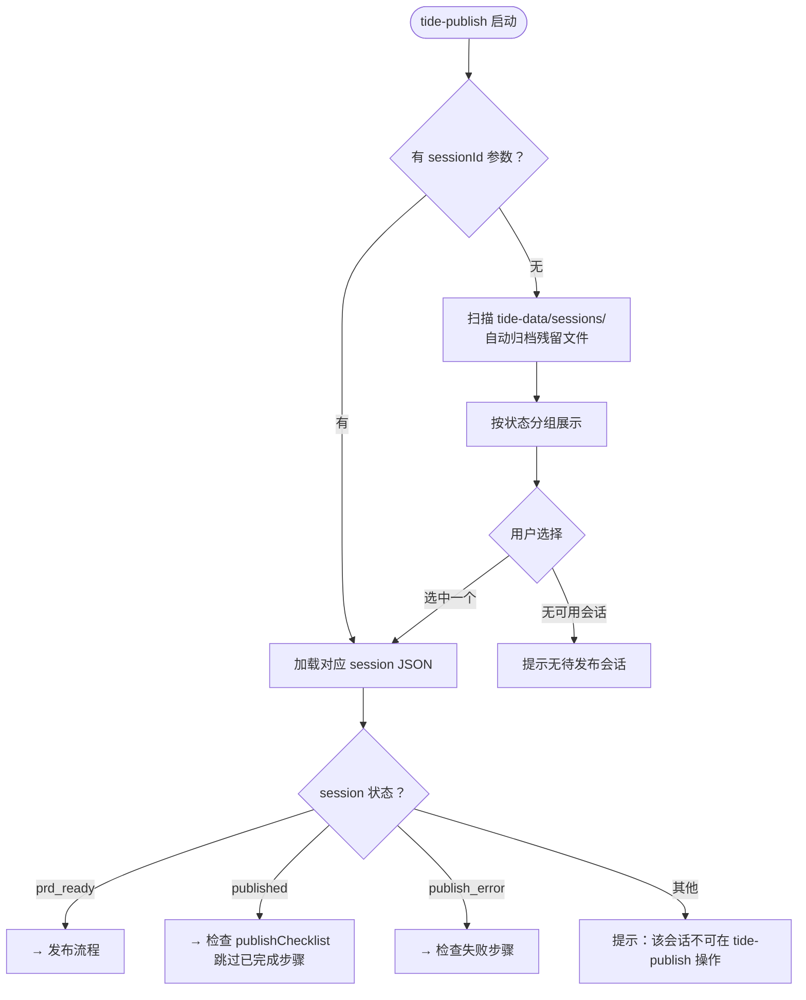

# Tide — 发布与归档工作流

Tide Publish 负责将 `tide-discuss` 产出的 Product Spec（PRD）发布到外部系统并归档。

它处理会话生命周期中的「发布阶段」：`prd_ready → published → completed → 归档`。

> **前置条件：** 需要 tide-discuss 已完成讨论并生成了 PRD（`status: prd_ready`）。

---

## 数据存储约定

**根目录：** `tide-data/`（在当前项目根目录下），所有路径相对于用户当前工作目录（`$PWD`）。

| 路径                                       | 用途                                                         |
| ------------------------------------------ | ------------------------------------------------------------ |
| `tide-data/sessions/{sessionId}.json`      | 待发布/进行中的会话（prd_ready / published / publish_error） |
| `tide-data/archive/{sessionId}.json`       | 已归档的完结会话（completed / superseded）                   |
| `tide-data/sessions/.sequence`             | 会话 ID 序列号                                               |
| `tide-data/sessions/.index.json`           | 会话摘要索引（轻量缓存）                                     |
| `tide-data/prds/{sessionId}-prd.md`        | PRD Markdown 快照                                            |
| `tide-data/prds/{sessionId}-prd.json`      | PRD JSON 快照                                                |
| `tide-data/abandoned/{sessionId}-prd.md`   | 废弃会话的 PRD 文件                                          |
| `tide-data/abandoned/{sessionId}-prd.json` | 废弃会话的 PRD JSON 快照                                     |

启动时自动创建 `tide-data/{sessions,archive,prds,abandoned}` 四个子目录。

---

## 工作流程

### 入口：选择待发布的会话

**触发时机：**

- 用户显式输入 `/tide-publish [sessionId]`
- tide-discuss 完成时提示用户使用 `/tide-publish` 发布
- 用户说「发布」「推送」「拆任务」「创建工单」「归档」

**数据准备：**

1. 如果传入了 sessionId 参数，直接加载该会话 JSON
2. 没有参数时，扫描 `tide-data/sessions/`，按状态分组展示可操作的会话：

   | 状态                             | 展示内容                                               |
   | -------------------------------- | ------------------------------------------------------ |
   | 🟢 prd_ready（待发布）           | Session ID · Feature ID · 简介 · 创建日期 · PRD 路径   |
   | 🟢 published（已发布，待拆任务） | Session ID · Feature ID · 简介 · 知识库链接 · PRD 路径 |
   | 🔴 publish_error（发布失败）     | Session ID · Feature ID · 失败步骤 · PRD 路径          |

3. 自动归档残留：对 status 为 completed / superseded 但仍在 sessions/ 中的文件，自动移动到 archive/

**决策流程：**



---

### 发布流程

#### MCP 能力发现（⚠️ 前置检查）

进入实际发布步骤前，**必须先完成 MCP 能力发现**：

1. 读取 `.claude/settings.json` → `deepstorm.mcpCapabilities`，了解本 skill 需要哪些能力域以及每个域的可用 provider
2. 如果当前 session JSON 中存在 `services.capabilities`，跳过重新发现，直接使用缓存值
3. 首次发现（无缓存时）：按能力映射结果决定各步的执行策略，将结果写入 `services.capabilities`
4. 用户要求重试时忽略缓存，重新发现并更新

**可用性判定：**

- `knowledge_base.available = true` → 4a 可执行，否则跳过
- `issue_tracker.available = true` → 4b 可执行、4c 可创建工单，否则跳过
- providers 数组长度 > 1 → 在该步骤入口询问用户选择

---

#### 4a. 知识库推送

将 PRD Markdown 推送到知识库。

**前置检查：**

1. 检查 `tide-data/prds/{sessionId}-prd.md` 是否存在
2. 不存在时按优先级恢复：JSON 快照 → session steps → 重新生成 Markdown

**执行策略：**

| 场景                 | 行为                                                                                                                   |
| -------------------- | ---------------------------------------------------------------------------------------------------------------------- |
| 1 个 provider 可用   | **自动推送**：读取 `.claude/skills/deepstorm-mcp-{provider-id}-write/SKILL.md`，使用该 MCP 推送 PRD                    |
| ≥ 2 个 provider 可用 | **用户选择**：展示可用列表供用户选择，结果持久化到 `services.knowledgeBase.provider`                                   |
| 无可用               | **跳过**：`publishChecklist[0]` 记录 `{step:"knowledge_base_push", done:true, skipped:true}`，告知用户后进入 published |

**完成后：**

- 保存 `services.knowledgeBase` → `{provider, url}`
- `publishChecklist[0]` → `{step:"knowledge_base_push", done:true}`
- `status` → `published`
- 同步更新 `.index.json` 对应条目

**失败后：** `publishChecklist[0]` 记录错误，`status` → `publish_error`，提示用户重试或放弃

---

#### 4b. 任务拆分

将 PRD 拆解为可执行任务清单，由用户确认。

| 场景            | 行为                                                                                                |
| --------------- | --------------------------------------------------------------------------------------------------- |
| 工单系统可用    | **正常拆分**：PRD → Epic + Story 层级 → 展示给用户确认 → 写入 `services.issueTracker.taskBreakdown` |
| ≥ 2 个 provider | **额外步骤**：入口询问「本次使用哪个工单系统？」结果持久化到 `services.issueTracker.provider`       |
| 无可用          | **跳过 4b+4c**：`publishChecklist[1/2]` 标记 skipped，`status` → `completed`，自动归档              |

**拆分规则：**

- **Epic：** `{featureId} — {brief}`，包含完整背景和目标
- **Story：** 每个 FR / 用户故事对应一个 Story，含验收标准（从 PRD scenarios / acceptanceCriteria 提取）
- **Task：** 较大 Story 可拆为子 Task
- **优先级：** 从 PRD 继承

**用户中止：** 用户说「先这样」→ 保持 `published`，`publishChecklist[1].done = false`，提示可随时继续

---

#### 4c. 创建工单

按 4b 确认的任务清单创建工单。

**执行策略：**

| 场景               | 行为                                                                                     |
| ------------------ | ---------------------------------------------------------------------------------------- |
| 唯一 provider      | **自动创建**：读取 `.claude/skills/deepstorm-mcp-{provider-id}-write/SKILL.md`，逐条创建 |
| 用户已选择         | 使用 `services.issueTracker.provider` 记录的 provider                                    |
| 多 provider 且未选 | 在入口询问，结果持久化                                                                   |

**失败处理：**

| 结果     | 行为                                                                                                                           |
| -------- | ------------------------------------------------------------------------------------------------------------------------------ |
| 全部成功 | 保存 URL 到 `services.issueTracker.urls`，`publishChecklist[2]` 记录完成，移除 `failedItems`，`status` → `completed`，自动归档 |
| 部分失败 | 成功 URL 加入 `urls`，失败项记录到 `publishChecklist[2].failedItems`，`status` → `publish_error`                               |
| 全部失败 | 全部记录为 `failedItems`，`status` → `publish_error`，提示检查 MCP 连接                                                        |

**重试：** 下次进入 tide-publish 时，从 `services.issueTracker.taskBreakdown` 重建上下文，仅重试 `failedItems`

---

### 归档

**归档时机：**

| 时机                       | 状态         | 行为             |
| -------------------------- | ------------ | ---------------- |
| 4c 全部成功或 MCP 全部跳过 | `completed`  | 立即归档         |
| 用户选择「放弃/放弃发布」  | `superseded` | 立即归档         |
| 每次入口扫描               | —            | 自动搬移残留文件 |

**归档操作：**

1. `sessions/{sessionId}.json` → `archive/`
2. 从 `.index.json` 移除条目
3. `superseded` 时：检查 `prds/{sessionId}-prd.*` 存在则移入 `abandoned/`（completed 不移）
4. 归档会话不出现在入口列表，可通过 sessionId/featureId 精确查询恢复时的只读展示

---

### 恢复与重试

入口扫描时，对 `publish_error` 状态的会话展示如下信息：

```
🔴 {sessionId} — {featureId}
   PRD: tide-data/prds/{sessionId}-prd.md
   失败步骤: {failedStep}
   可操作: 重试 / 放弃发布
```

**重试行为：**

1. 读取 session JSON → 检查 `publishChecklist`，跳过 `skipped` 和 `done: true` 的步骤
2. 部分失败（4c 有 `failedItems`）：从 `services.issueTracker.taskBreakdown` 重建上下文，仅重试失败项
3. 4a 失败但服务仍可用：重试 4a → 成功后继续 4b/4c
4. 服务不可用：提示放弃发布

**恢复断点：**

- `done: true` + 无 `skipped` → 已完成，跳过
- `done: true` + `skipped: true` → 被跳过，跳过
- `done: false` + 无 `failedItems` → 从未执行，从头开始
- `done: false` + 有 `failedItems` → 仅重试失败项

---

### 流程结束后的行为

| 结束节点    | 触发条件                   | AI 行为                        |
| ----------- | -------------------------- | ------------------------------ |
| ✅ 完成归档 | 4c 全部成功或 MCP 全部跳过 | 告知完成，如需新建使用 `/tide` |
| 🗑️ 放弃发布 | 用户选择「放弃/放弃发布」  | 告知已归档为 superseded        |
| ⏸️ 暂停     | 用户选择「稍后再处理」     | 展示待处理列表                 |

---

## 关键约束

1. **不参与需求讨论** — tide-publish 只处理发布和归档，不修改 PRD 内容或讨论需求
2. **幂等操作** — 发布步骤通过 `publishChecklist` 保证幂等，可安全重试
3. **MCP 依赖** — 知识库推送和工单创建依赖对应 MCP 服务的 skill 指南，首次使用需配好 MCP

---

**参考文件：** `references/publish-flow.md`（详细发布流程）· `references/data-format.md`（发布用数据格式）
