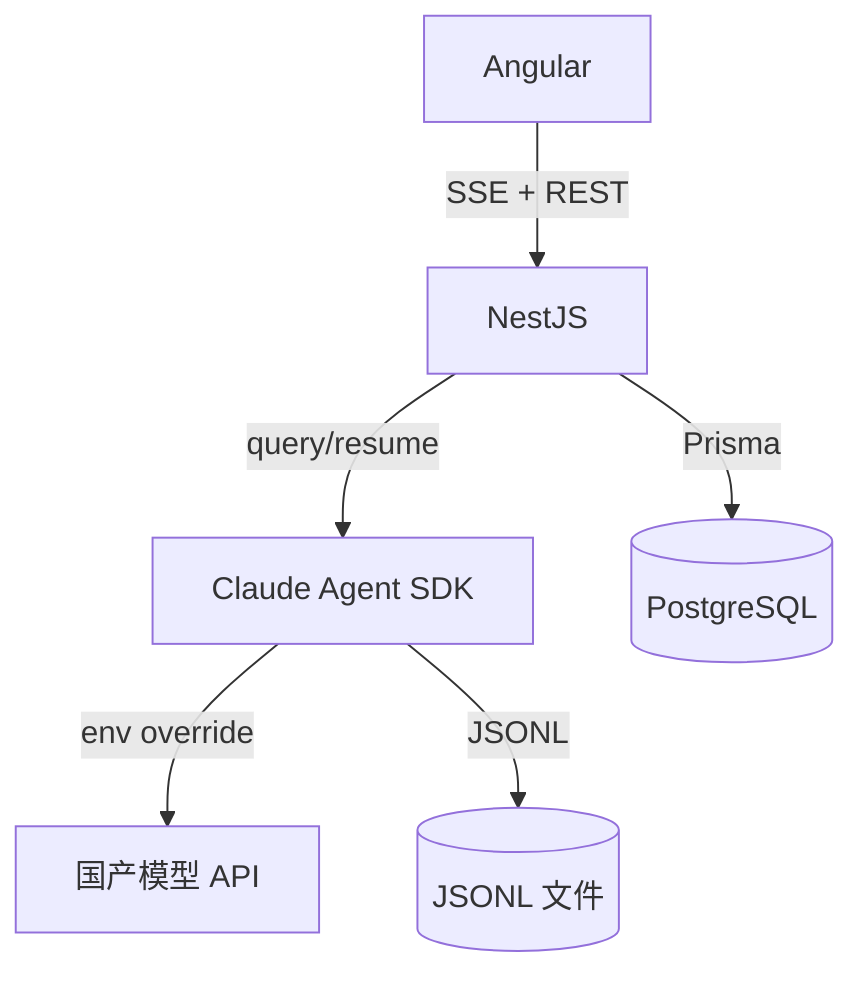

# 项目上下文地图

> AI 消费的紧凑摘要 | 人工详档见 `docs/`
> 更新: 2026-08-01

---

## 技术栈

- **后端**：TypeScript / NestJS 11
- **前端**：Angular 21 + PrimeNG 21 + Tailwind CSS 4
- **ORM**：Prisma 6 + PostgreSQL 17（4 表：users / projects / sessions / assets）
- **AI 引擎**：Claude Agent SDK（TypeScript）
- **AI 模型**：多模型注册（已实现，change `multi-model-runtime-switching`）：`server/config/models.yaml` 注册多 provider（DeepSeek / Kimi，含 `enabled` 开关），前端手动选择（`GET /models`），后端经 `query()` 的 `model` + `env` 逐调用切换；Key 走 per-provider 环境变量 / `apiKeyEnv_N` 独立池，全局 `ANTHROPIC_*` 已废弃
- **实时通信**：SSE
- **构建**：pnpm workspaces（monorepo）
- **端口**：后端 3100，前端 4300

## 模块结构

| 模块          | 路径                                | 说明                                                   |
| ------------- | ----------------------------------- | ------------------------------------------------------ |
| Auth          | `backend/src/auth`                  | 测试账号 JWT 登录                                      |
| Project       | `backend/src/project`               | 项目 CRUD                                              |
| Session       | `backend/src/session`               | 会话管理 + 级联清理                                    |
| Chat          | `backend/src/chat`                  | 消息转发 + SSE + 请求队列 + KeyPool                    |
| Agent         | `backend/src/agent`                 | Claude Agent SDK 封装                                  |
| ModelRegistry | `backend/src/common/model-registry` | 多 provider 注册（models.yaml）+ Key 解析 + 可用性判定 |
| Asset         | `backend/src/asset`                 | 资产面板（PRD / task 等）                              |
| Frontend      | `frontend/src`                      | Angular SPA，三栏布局                                  |

## 核心依赖关系

## 架构决策索引

所有 ADR 已移至独立文件：`docs/2-architecture/decisions/`

| ADR     | 标题                   | 状态 |
| ------- | ---------------------- | ---- |
| ADR-001 | 消息存储与数据库策略   | ✅   |
| ADR-002 | AI 引擎选型            | ✅   |
| ADR-003 | 并发控制架构           | ✅   |
| ADR-004 | 可观测性与日志方案     | ✅   |
| ADR-005 | 前端技术栈             | ✅   |
| ADR-006 | 后端框架选型           | ✅   |
| ADR-007 | MVP 认证策略           | ✅   |
| ADR-008 | 会话连续性与 UI 保护   | ✅   |
| ADR-009 | Skills 注册机制        | ✅   |
| ADR-010 | 工程基础设施与容器化   | ✅   |
| ADR-011 | SigNoz 日志方案        | ✅   |
| ADR-012 | 轮次与预算上限管控     | ✅   |
| ADR-013 | 多模型注册与运行时切换 | ✅   |

## 外部引用

- **PRD**：`tide-data/prds/oceanus-mvp-prd.md`（已移除——清理过）
- **系统设计**：`docs/2-architecture/overview.md`
- **数据模型**：`docs/2-architecture/data-model.md`
- **API 文档**：`docs/3-api/api-reference.md`
- **文档索引**：`docs/INDEX.md`

---

> 维护：AI 首次加载此文件获取项目概览。详细内容请参考 `docs/` 下分目录文档。
