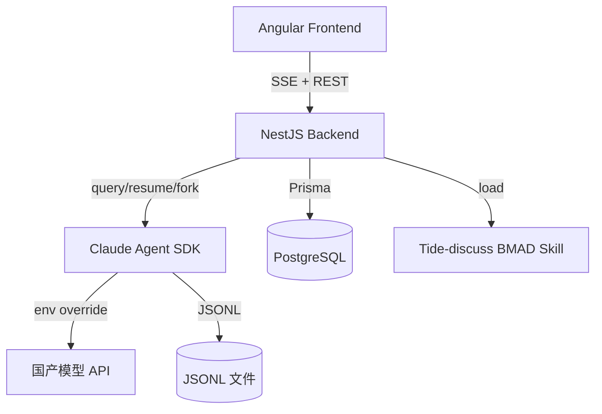

# 项目上下文地图

> 已根据 Tide 讨论和 PRD 填充 | 更新: 2026-07-24

---

## 技术栈

- **语言**：TypeScript (NestJS) / TypeScript (Angular)
- **前端框架**：Angular + PrimeNG + Tailwind CSS
- **后端框架**：NestJS
- **ORM/数据库**：Prisma + PostgreSQL（4 表：users / projects / sessions / assets）
- **AI 框架**：Claude Agent SDK (TypeScript)
- **AI 模型**：国产模型（Kimi K2.6），通过 `ANTHROPIC_*` 环境变量接入
- **实时通信**：SSE（Server-Sent Events）
- **构建工具**：pnpm workspaces (monorepo)
- **包管理**：pnpm
- **端口约定**：后端 3100，前端 4300

## 关键模块

| 模块           | 路径                | 说明                                           |
| -------------- | ------------------- | ---------------------------------------------- |
| Auth Module    | backend/src/auth    | 测试账号登录，JWT Token                        |
| Project Module | backend/src/project | 项目 CRUD                                      |
| Session Module | backend/src/session | 会话管理 + 删除（级联清理 DB + JSONL）         |
| Chat Module    | backend/src/chat    | 消息转发 + SSE 流式推送（SDK 驱动内容）        |
| Agent Module   | backend/src/agent   | 封装 Claude Agent SDK，加载 Tide-discuss Skill |
| Asset Module   | backend/src/asset   | 资产面板（PRD + Jira 任务等）                  |
| Frontend       | frontend/src        | Angular SPA，PrimeNG 组件，三栏布局            |

## 架构决策记录（ADR）

| 决策     | 选择                            | 理由                                  |
| -------- | ------------------------------- | ------------------------------------- |
| 消息存储 | SDK JSONL，不存 DB              | SDK 内置 SessionStore，避免重复造轮子 |
| 会话管理 | 物理删除，无归档                | 简化 MVP，级联清理 DB + JSONL         |
| 数据库   | 仅存映射关系                    | 消息完整内容由 SDK 管理               |
| SDK 语言 | TypeScript                      | NestJS 原生集成，下一项目切 Python    |
| SDK 版本 | 锁定旧版（对应 Python v0.1.62） | 新版 tool-calling API 不兼容国产模型  |
| 国内模型 | 通过 `ANTHROPIC_*` env 覆盖     | SDK 闭源，环境变量是唯一接入方式      |
| 认证     | 写死测试账号                    | 降低 MVP 复杂度，后续接入 SSO         |

## 外部引用

- **PRD**：`tide-data/prds/oceanus-mvp-prd.md`
- **Tide Tasks**：`tide-data/tasks/`（18 个 Task）
- **Brainstorming**：`_bmad-output/brainstorming/brainstorming-session-20260723-001.md`
- **SDK 版本参考**：Python v0.1.62 对应 TS 版本待确认（npm 2026年1月版）
- **SDK 配置**：通过 `.env` 文件设置 `ANTHROPIC_BASE_URL` / `ANTHROPIC_MODEL` / `ANTHROPIC_SMALL_FAST_MODEL` / `ANTHROPIC_API_KEY`
- **Brainstorming (Langfuse + 日志)**：`_bmad-output/brainstorming/brainstorming-session-2026-07-23-01.md`

## 新增技术决策（2026-07-23）

| 决策              | 选择                           | 理由                                                    |
| ----------------- | ------------------------------ | ------------------------------------------------------- |
| LLM 可观测性      | Langfuse（自托管）             | SDK 调用链追踪、Token 消耗、错误追踪、成本分析          |
| 日志框架          | Pino + `nestjs-pino`           | 2026 年新项目推荐，5-10x 性能优势                       |
| 日志目录          | `logs/{project}/{session}.log` | 按项目/会话分文件                                       |
| traceId           | 每次 HTTP 请求自动生成         | 与 sessionId 分离，traceId=请求级别，sessionId=会话级别 |
| Langfuse 模型接入 | 不需要 LLM Key                 | Langfuse 只消费 OTel 数据，不调模型                     |

## 新增技术决策（2026-07-24）

| 决策              | 选择                                                           | 理由                                                                                                                                                                             |
| ----------------- | -------------------------------------------------------------- | -------------------------------------------------------------------------------------------------------------------------------------------------------------------------------- |
| isStreaming 时序  | 发送消息后**立即**设置 `isStreaming=true`，不等待 SSE 首个事件 | 防止 `session_created` → `sessionId` 信号传播 → `effect()` → `loadHistory()` 清空刚发送的用户消息。effect() 已通过 `if (isStreaming())` 守卫跳过重载，提前设标志位可保护内存消息 |
| 发送/中断按钮合并 | 同一按钮位置根据 `isStreaming()` 切换发送/中断状态             | 减少 UI 元素数量，用户视线不需要在输入框上方和右侧来回移动；`@if/@else` 控制流替代条件显隐                                                                                       |
| 用户消息保护策略  | 内存优先——流式中不重载历史                                     | 会话连续性修复后，`session_created` 事件在首条消息时才出现，导致 sessionId 从空变为真实值，触发 effect 重载历史。isStreaming 守卫是最小侵入的修复方案                            |

## 依赖关系

---

## 新增技术决策（2026-07-25 — 工程化升级 P0+P1）

| 决策          | 选择                                    | 理由                                                                              |
| ------------- | --------------------------------------- | --------------------------------------------------------------------------------- |
| CI/CD         | GitHub Actions                          | PR + push main 双触发，lint→typecheck→test→build 四阶段                           |
| 错误追踪      | GlitchTip（自托管 Docker）              | MIT 开源，Sentry SDK 100% 兼容，仅需 2GB 内存 vs Sentry 14GB；可复用现有 PG+Redis |
| 应用容器化    | Server multi-stage build + Client Nginx | 生产模式；Nginx 反向代理 /api → server:3100                                       |
| Git Hooks     | Husky + lint-staged + commitlint        | 与 Claude Code hooks 并存，覆盖手动 git commit 场景                               |
| 分支保护      | GitHub Branch Protection                | 要求 CI 通过才能合并到 main                                                       |
| 依赖管理      | Renovate（后续 P2）                     | 更适合 monorepo + pnpm workspace                                                  |
| Monorepo 编排 | Turborepo（后续 P2）                    | 比 Nx 轻量，与 pnpm 配合更自然                                                    |
| E2E 测试      | Playwright（后续 P2）                   | 复用已有 MCP server                                                               |

## 工程化 Roadmap

| 轮次              | 内容                                                       | 状态      |
| ----------------- | ---------------------------------------------------------- | --------- |
| **P0+P1**（本轮） | CI/CD、Dockerfile、Husky/commitlint、客户端测试、GlitchTip | 🚧 进行中 |
| P2                | Renovate、E2E、Turborepo                                   | 📋 待排期 |
| P3                | Env Zod 校验、API 代码生成、安全扫描                       | 📋 待排期 |

---

> 维护：首次填充于 2026-07-23 reef-start Phase 1。有新的技术决策或踩坑时追加。
