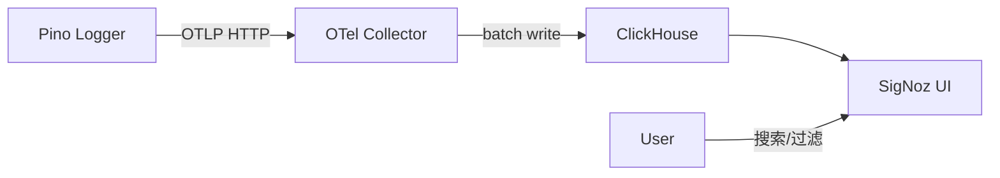

# 环境配置详解

> 本文包含 Docker 服务、环境变量、可观测性等基础设施配置。

---

## 前置条件

| 工具             | 版本要求 | 用途                    |
| ---------------- | -------- | ----------------------- |
| Node.js          | >= 24    | 运行后端和前端          |
| pnpm             | 11.17.0  | 包管理（corepack 管控） |
| Docker           | 最新     | 数据库和可观测性服务    |
| Claude Agent SDK | —        | AI Agent 引擎           |

---

## Docker 服务

所有基础设施通过 Docker Compose 管理。详见项目根目录 `docker-compose.yml`。

### 服务清单

**默认 profile（基础设施）：**

| 服务            | 容器名                    | 端口        | 用途                |
| --------------- | ------------------------- | ----------- | ------------------- |
| PostgreSQL      | `oceanus-postgres`        | 5432        | 主数据库            |
| Redis           | `oceanus-redis`           | 6379        | 缓存                |
| ClickHouse      | `oceanus-clickhouse`      | 8123 / 9000 | Langfuse 分析型存储 |
| MinIO           | `oceanus-minio`           | 9100 / 9101 | Langfuse 对象存储   |
| Langfuse Worker | `oceanus-langfuse-worker` | —           | 异步事件处理器      |
| Langfuse Web    | `oceanus-langfuse`        | 3001        | LLM 可观测性控制台  |

**app profile（额外应用服务）：**

| 服务          | 端口 | 用途                 |
| ------------- | ---- | -------------------- |
| Server        | 3100 | NestJS 后端          |
| Client        | 80   | Angular 前端 (Nginx) |
| GlitchTip Web | 8000 | 错误追踪控制台       |
| SigNoz        | 8080 | 日志聚合与搜索       |

### 日常命令

```bash
make db-up-min    # 最小模式（仅 PostgreSQL，日常推荐）
make db-up        # 完整模式（全部服务）
make db-down      # 停止所有容器
make db-status    # 查看服务状态
make db-logs      # 查看所有容器日志
```

> **磁盘提示：** ClickHouse 预分配约 2-4 GB。日常推荐 `make db-up-min`。

---

## Langfuse 可观测性

### 前提

确认端口 3001 可访问：

```bash
make db-up    # 或 docker compose up -d redis clickhouse minio langfuse-web langfuse-worker
```

### 配置

1. 访问 `http://localhost:3001` 注册账号（任意邮箱即可）
2. **Settings → API Keys**，复制 Public Key 和 Secret Key
3. 编辑 `server/.env`：

```env
LANGFUSE_PUBLIC_KEY=pk-xxxxxxxxxxxxxxxxxxxxxxxxxxxxxxxxxxxxxxxx
LANGFUSE_SECRET_KEY=sk-xxxxxxxxxxxxxxxxxxxxxxxxxxxxxxxxxxxxxxxx
LANGFUSE_BASE_URL=http://localhost:3001
```

> `LANGFUSE_BASE_URL` 未配置时自动静默（no-op）。

---

## GlitchTip 错误追踪

### 前提

```bash
docker compose --profile app up -d glitchtip-web glitchtip-worker
```

### 配置

1. 访问 `http://localhost:8000`，注册管理员账号
2. **Create Project** → 选任意平台类型（Sentry SDK 兼容）
3. **Project Settings → Client Keys (DSN)**，复制 DSN
4. 编辑 `server/.env`：

```env
GLITCHTIP_DSN=http://<key>@localhost:8000/<project_id>
```

编辑 `client/src/environments/environment.ts`：

```ts
glitchtipDsn: 'http://<key>@localhost:8000/<project_id>',
```

> `GLITCHTIP_DSN` 留空时错误追踪静默跳过。

---

## SigNoz 日志

> SigNoz（Apache 2.0）是 Oceanus 的集中日志平台，提供日志搜索、过滤和可视化能力。

### 前提

```bash
docker compose up -d signoz signoz-otel-collector signoz-clickhouse signoz-zookeeper
```

### 访问

```bash
open http://localhost:8080
```

SigNoz UI 提供日志搜索与分析功能：

- **Logs Explorer** — 按时间倒序浏览全部日志，支持 `service.name`、`severity`、时间范围过滤
- **实时日志流** — 自动刷新最新日志
- **日志-链路关联** — 日志自动携带 `trace_id` / `span_id`，可从日志跳转到对应 Trace

### 控制日志级别

```env
# server/.env
LOG_LEVEL=info
```

可选值：`fatal` / `error` / `warn` / `info` / `debug` / `trace`

未设置时默认：production 为 `info`，其他环境为 `debug`。

### 架构


