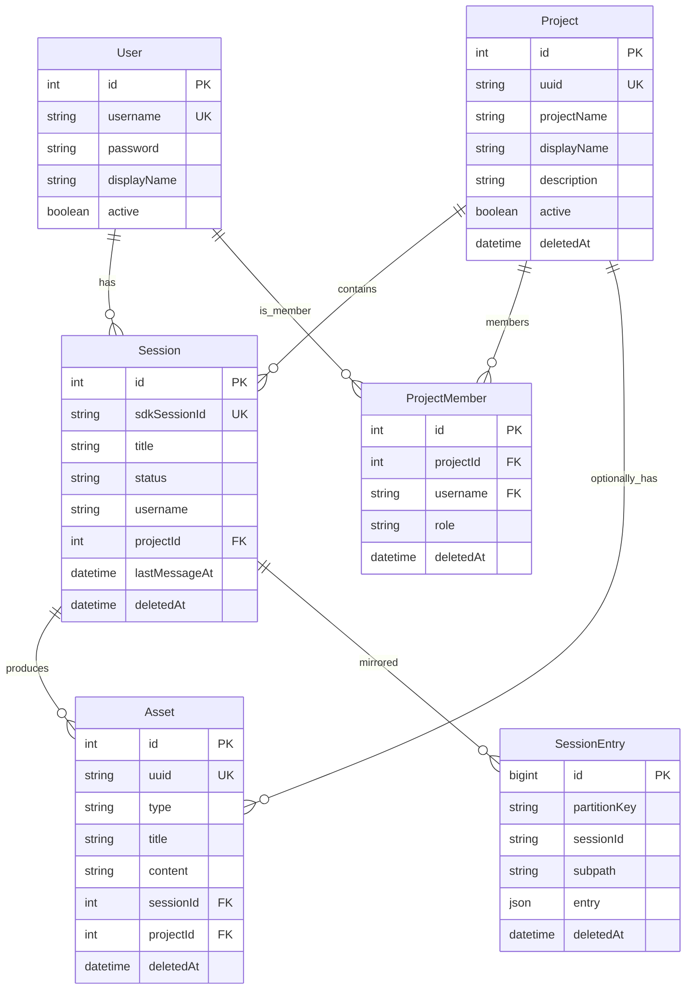

# 数据模型

> 基于 Prisma schema 自动生成 | 更新: 2026-08-02

---

## Prisma 模型

> `ProjectMember` 通过 `username` 自然键关联 User，无独立 FK 列指向 users.id。
> `SessionEntry` 不设 FK（规避 SDK append 先于 Session 懒创建的时序竞态），删除由服务层 `$transaction` 保证。
> `Project.projectName` 非唯一（历史为 `@unique`，软删后可复用同名项目）。⚠️ 见下方「软删与唯一性」。

## 表关系

| 关系                    | 说明                                  |
| ----------------------- | ------------------------------------- |
| Project → Session       | 项目下的会话（一对多）                |
| Session → Asset         | 会话产出的资产（一对多）              |
| Project → Asset         | 项目下的资产，可选关联                |
| Project → ProjectMember | 项目成员（owner / member）            |
| User → ProjectMember    | 用户参与的项目                        |
| Session → SessionEntry  | 会话消息镜像（无 FK，服务层事务删除） |

## 会话分区

会话按 **`partitionKey = ${projectName}/${username}`** 分区隔离，同一项目内不同用户互不可见；不同项目的会话数据彼此隔离。owner 与非成员访问一律返回统一 404。

## 软删

5 张业务表（Project / ProjectMember / Session / SessionEntry / Asset）均含 `deletedAt DateTime?`（`deleted_at`）列，删除走**逻辑删除**而非物理 DELETE：

- **删除项目**（owner-only）：`$transaction` 级联软删 Session → ProjectMember → SessionEntry（按 `partitionKey` 前缀）→ Asset → Project，随后项目物理目录移入回收站（失败仅记日志，不阻断 DB）。
- **删除会话 / 资产**：同样 `updateMany set deletedAt` 级联软删。
- **读查询**：一律过滤 `deletedAt: null`（`list` / `getById` / `assertMember` / `assertOwner` / 会话 / 资产查询）。
- **回收站**：物理目录 `rename` 到 `.trash/`（时间戳唯一，重名不覆盖）。

### 软删与唯一性 ⚠️

软删后允许复用同名 `projectName`（新项目可占用已删项目的标识）。理想做法是 DB 层**部分唯一索引** `CREATE UNIQUE INDEX ... ON projects(projectName) WHERE deleted_at IS NULL`，但 **Prisma 6.19 PSL（legacy schema engine）不支持 `@@index where` 参数**（该能力仅存在于 Prisma 7 新 schema engine），故无法在 `schema.prisma` 中声明。

当前以**应用层预校验**兜底：`ProjectService.create` 先 `findFirst({ where: { projectName, deletedAt: null } })`，命中抛 `ConflictException`。并发下存在极小竞态窗口（两个同 request 同时通过预校验），MVP 可接受；升级 Prisma 至支持版本后应补 DB 级部分唯一索引（见 ADR-016）。

## 消息存储

| 消息类型         | 存储位置                                    | 用途              |
| ---------------- | ------------------------------------------- | ----------------- |
| user / assistant | `SessionEntry`（claude_session_entries 表） | 前端历史展示      |
| result           | `SessionEntry` + assets 表                  | 资产提取          |
| stream_event     | 日志（不存 DB）                             | 前端 SSE 实时渲染 |

消息完整内容由 Prisma `SessionEntry` 表按 `partitionKey` 分区管理，DB 的 sessions 表存会话映射关系，SessionEntry 存消息镜像。**不再使用 messages 表，也不再使用 JSONL 文件系统**。

详细决策见 [ADR-001: 消息存储与数据库策略](decisions/ADR-001-message-storage.md)。

## 完整 schema

详见 `server/prisma/schema.prisma`。
