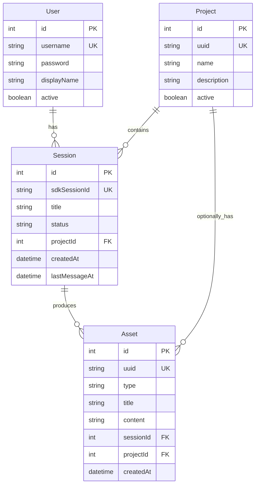

# 数据模型

> 基于 Prisma schema 自动生成 | 更新: 2026-07-27

---

## Prisma 模型

## 表关系

| 关系              | 说明                     |
| ----------------- | ------------------------ |
| Project → Session | 项目下的会话（一对多）   |
| Session → Asset   | 会话产出的资产（一对多） |
| Project → Asset   | 项目下的资产，可选关联   |

## 消息存储

| 消息类型         | 存储位置                           | 用途              |
| ---------------- | ---------------------------------- | ----------------- |
| user / assistant | PostgreSQL messages 表             | 前端历史展示      |
| result           | PostgreSQL messages 表 + assets 表 | 资产提取          |
| stream_event     | 日志（不存 DB）                    | 前端 SSE 实时渲染 |

**注意：** `Message` 模型已从 Prisma schema 中移除。消息完整内容由 SDK JSONL 文件系统管理，DB 仅存映射关系和最终资产。

## 完整 schema

详见 `server/prisma/schema.prisma`。
