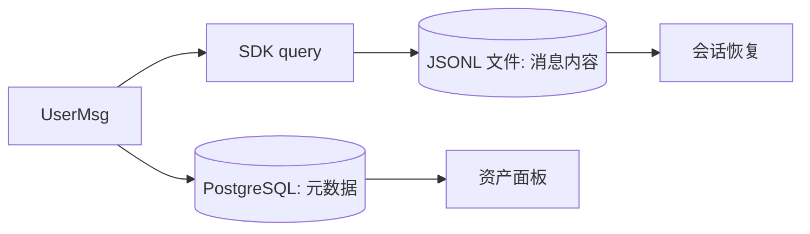

# ADR-001: 消息存储与数据库策略

## 背景

Oceanus 的消息数据需要持久化，面临两条存储路径：PostgreSQL 或 SDK 内置的 JSONL 文件系统。

## 决策

| 选择                          | 理由                                   |
| ----------------------------- | -------------------------------------- |
| 消息完整内容由 SDK JSONL 管理 | SDK 内置 SessionStore，避免重复造轮子  |
| DB 仅存映射关系               | 用户、项目、会话的基本信息及资产元数据 |
| 物理删除，无归档              | 简化 MVP，级联清理 DB + JSONL 文件     |

## 影响

- SDK 消息不可直接 SQL 查询，需通过 SDK 的 `resume` API 恢复
- 删除会话时需要同时清理两条链路
- 保持 DB 轻量（4 表：users / projects / sessions / assets）

## 备选方案

- **全量 DB 存储**：需要自定义 Message 表 + 序列化层，与 SDK SessionStore 功能重叠，增加维护成本

## Mermaid

