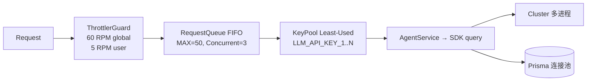

# ADR-003: 并发控制架构

## 背景

多用户同时使用 Oceanus 时，需要对 LLM API 调用进行并发控制，防止 API 限流和资源耗尽。

## 决策

五层并发控制体系：

| 层           | 组件                      | 策略                                            |
| ------------ | ------------------------- | ----------------------------------------------- |
| ① 速率限制   | `@nestjs/throttler`       | 全局 60 RPM + 用户 5 RPM                        |
| ② 请求队列   | 内存 FIFO + 信号量        | `MAX_CONCURRENT_LLM=3`，队列上限 50             |
| ③ API Key 池 | KeyPool                   | Least-Used 策略轮询多 Key（`LLM_API_KEY_1..N`） |
| ④ 多进程     | Node.js `cluster`         | 利用多核 CPU，每 Worker 独立队列                |
| ⑤ 连接池     | Prisma `connection_limit` | 按 Worker 分配 DB 连接                          |

## 影响

- 请求排队时通过 SSE 事件（Queued / QueuePosition / Dequeued）通知前端
- Cluster 模式下 Rate Limiter 和队列独立于各 Worker（无共享状态）
- KeyPool 失败计数 >3 后标记为不健康（故障摘除）

## 已知限制

- Cluster 下队列独立，后续可迁移至 Redis
- 预计等待时间固定按 `position × 10s` 估算
- 无熔断器模式——KeyPool 仅做失败计数

