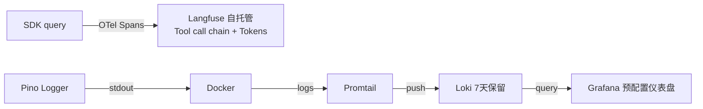

# ADR-004: 可观测性与日志方案

## 背景

Oceanus 需要 LLM 调用追踪和集中式日志查询能力，不上云、自托管。

## 决策

### 链追踪：Langfuse

- 自托管 Docker，消费 SDK OTel 数据（OpenInference 格式）
- 记录 tool_use 调用链、Token 消耗、响应延迟
- 不需要 LLM Key——Langfuse 只消费 OTel 数据，不调模型
- SDK 零侵入集成，`LANGFUSE_BASE_URL` 未配置时自动静默

### 日志：Pino → Grafana + Loki

| 决策     | 选择                                        |
| -------- | ------------------------------------------- |
| 日志框架 | Pino + `nestjs-pino`                        |
| 日志输出 | 仅 stdout（不移文件）                       |
| 日志采集 | Promtail → push Loki                        |
| 日志查询 | Grafana（预配置 Loki 数据源 + 仪表盘）      |
| 日志级别 | `LOG_LEVEL` 环境变量控制                    |
| 保留期   | 7 天                                        |
| traceId  | 每次 HTTP 请求自动生成（与 sessionId 分离） |

## 影响

- `.env` 新增 `LOG_LEVEL`，取代 `NODE_ENV` 硬编码
- 文件日志（`./logs/combined.log`）已移除
- SessionLogService 保持独立，不受影响

