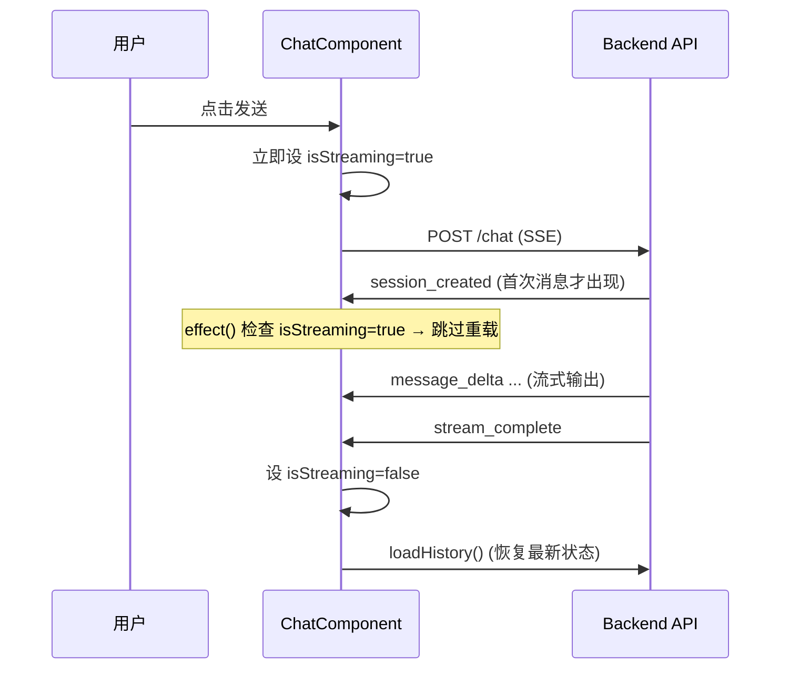

# ADR-008: 会话连续性与 UI 状态保护

## 背景

修复了会话连续性 bug：`session_created` 事件在首条消息时才出现，导致 `sessionId` 从空变为真实值，触发 effect() 重载历史而清空刚发送的用户消息。

## 决策

| 决策               | 选择                                  | 理由                                   |
| ------------------ | ------------------------------------- | -------------------------------------- |
| `isStreaming` 时序 | 发送消息后**立即**设 `true`，不等 SSE | 防止 effect() 重载清空内存消息         |
| 发送/中断按钮合并  | 同一位置按 `isStreaming()` 切换       | 减少视线移动，`@if/@else` 替代条件显隐 |
| 用户消息保护       | 内存优先——流式中不重载历史            | isStreaming 守卫是**最小侵入**修复方案 |

## 影响

- 用户消息在流式输出期间不会被意外清除
- 中断按钮和发送按钮位置统一，符合用户预期
