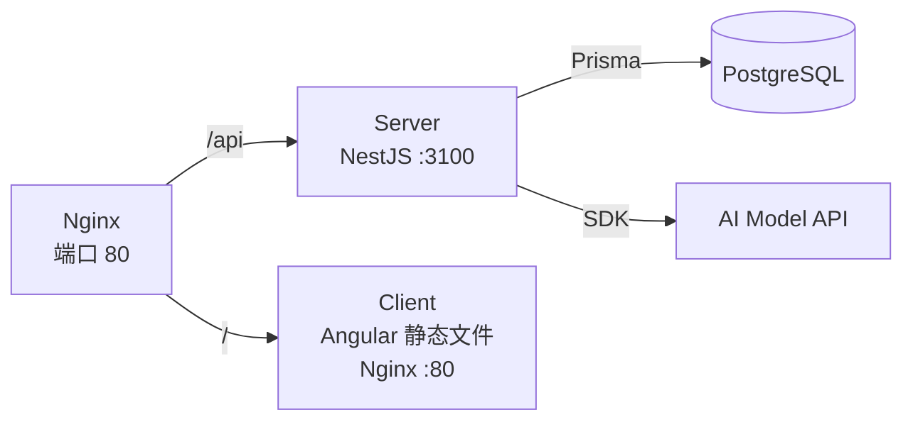

# ADR-010: 工程基础设施与容器化

## 背景

基于工程化升级 P0+P1 需求，需要建立 CI/CD、错误追踪、Git Hooks 和 Docker 容器化方案。

## 决策

### CI/CD：GitHub Actions

- PR + push main 双触发
- 四阶段：lint → typecheck → test → build
- 分支保护要求 CI 通过才能合并到 main

### 错误追踪：GlitchTip

- MIT 开源，Sentry SDK 100% 兼容
- 仅需 2GB 内存 vs Sentry 14GB
- 可复用现有 PostgreSQL + Redis

### 容器化

- Server: multi-stage build (node:20-alpine)
- Client: Nginx 提供静态文件
- Docker Compose profile 区分基础设施 (`default`) 与应用服务 (`app`)

### Git Hooks

- Husky + lint-staged + commitlint
- 与 Claude Code hooks 并存

## Roadmap

| 轮次              | 内容                                                       | 状态      |
| ----------------- | ---------------------------------------------------------- | --------- |
| **P0+P1**（本轮） | CI/CD、Dockerfile、Husky/commitlint、客户端测试、GlitchTip | ✅ 已完成 |
| P2                | Renovate、E2E、Turborepo                                   | 📋 待排期 |
| P3                | Env Zod 校验、API 代码生成、安全扫描                       | 📋 待排期 |
