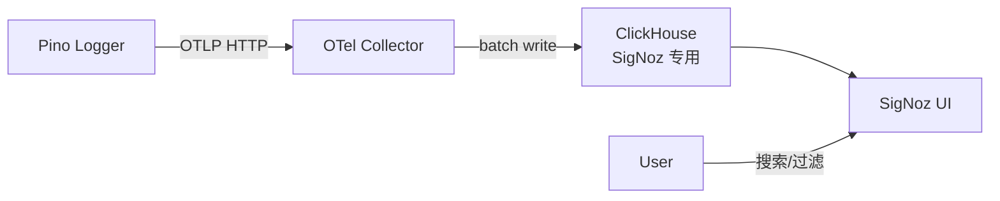

# ADR-011: SigNoz 日志方案（替换 Grafana + Loki）

## 背景

ADR-004 选用 Grafana + Loki + Promtail 作为日志方案。三者均采用 AGPL v3 许可证，在商业化分发或嵌入场景下存在合规风险。需替换为宽松许可证方案。

## 决策

### 日志平台：SigNoz（Apache 2.0）

| 决策         | 选择                                                          |
| ------------ | ------------------------------------------------------------- |
| 日志平台     | SigNoz 单二进制版（UI + API + Alertmanager），Apache 2.0 许可 |
| 日志采集方式 | `@opentelemetry/instrumentation-pino`，OTLP HTTP 协议导出     |
| 日志存储     | SigNoz 独立 ClickHouse 实例，与 Langfuse 隔离                 |
| 部署方式     | 整合到项目主 `docker-compose.yml`，固定标签 `0.113.0`         |
| 日志级别控制 | 保留 `LOG_LEVEL` 环境变量，不变                               |

### 关键设计点

- **零侵入采集**：使用 `instrumentation-pino`，不修改现有 `logger.info/warn/error` 调用
- **自动 trace 关联**：OTel SDK 自动注入 `trace_id` / `span_id`，支持日志-链路跳转
- **优雅降级**：OTel Collector 不可达时 SDK 内置重试队列，启动失败不阻塞应用
- **优雅关闭**：进程收到 `SIGTERM` 时主动关闭 OTel SDK

### 链追踪保持不变

Langfuse（自托管）继续负责 LLM 调用追踪和 Token 计量，不受本次变更影响。

## 影响

- `docker-compose.yml`：移除 grafana/loki/promtail 容器，新增 signoz/signoz-otel-collector/signoz-clickhouse/signoz-zookeeper
- `server/package.json`：新增 6 个 `@opentelemetry/*` 依赖
- `server/src/`：新增 `logging-otel.ts`（SDK 初始化），`main.ts` 入口追加 import
- `infra/`：新增 `otel-collector-config.yaml`，删除 grafana/loki/promtail 配置目录
- `docs/`：更新 overview.md、environment.md、INDEX.md
- 开发机新增 SigNoz 容器组，闲置内存约 1.6GB

## 备选方案

| 方案               | 理由不选                                                           |
| ------------------ | ------------------------------------------------------------------ |
| Datadog            | 依赖外部 SaaS，不满足不上云要求                                    |
| Better Stack       | 依赖外部 SaaS，且日志量受免费层限制                                |
| Grafana + Loki OSS | AGPL v3 不变，仅移除 Promtail 不能消除合规风险                     |
| Loki + OTel        | Loki 本身仍为 AGPL v3；Grafana Labs 的 Loki 商业许可与 AGPL 不兼容 |
| Self-hosted ELK    | Elastic License 变更历史有争议；资源开销高于 SigNoz                |

