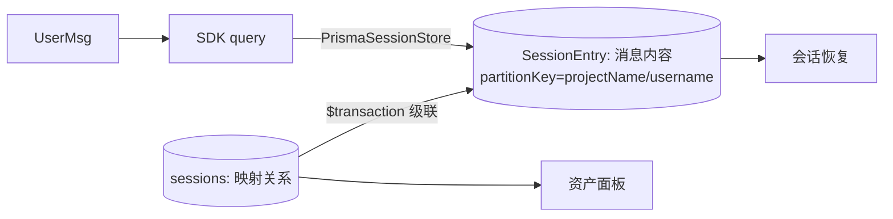

# ADR-014: 会话消息落库 SessionEntry + (项目 × 用户) 分区隔离

## 背景

Oceanus 需要支撑多项目、多用户：同一项目下不同用户各自维护会话，不同项目数据彼此隔离。原方案（ADR-001）把消息完整内容放在 SDK 内置 JSONL 文件系统，DB 只存映射关系，无法按项目/用户做 SQL 级隔离，删除/迁移也依赖文件系统操作。

## 决策

| 选择                                             | 理由                                                               |
| ------------------------------------------------ | ------------------------------------------------------------------ |
| 消息完整内容由 Prisma `SessionEntry` 表管理       | 支持 SQL 查询/隔离，删除走事务，避免文件系统竞态                    |
| `partitionKey = ${projectName}/${username}` 分区  | 会话按项目 × 用户寻址，天然实现多租户隔离                          |
| `SessionEntry` 不设 FK                           | 规避 SDK append 先于 Session 懒创建的时序竞态                      |
| 删除走 `$transaction`（Entry → Session）          | 保证级联清理原子性，不留孤儿数据                                   |
| owner 越权访问统一返回 404                        | 不暴露资源存在性（防枚举）                                         |
| 不设增量迁移，重写初始 migration.sql + seed       | 项目未发布，保持初始 schema 干净                                   |

## 影响

- 消息内容可从 `claude_session_entries` 按 `partitionKey` 直接 SQL 查询
- 删除项目/会话时需级联清理对应 `partitionKey` 的全部 `SessionEntry`
- 会话恢复改走 SDK `query`（内置 SessionStore 由 Prisma 适配器实现）
- 保持 6 表：users / projects / project_members / sessions / claude_session_entries / assets

## Mermaid

