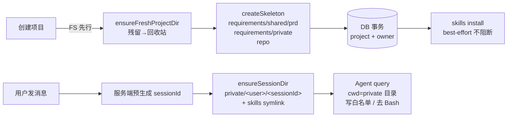

# ADR-015: 项目物理工作区与 Agent 运行隔离

## 背景

Oceanus 是多项目多用户平台，但 Agent 会话此前运行在共享环境：无项目专属物理目录、skills 散落、PRD 落盘无归置、删除项目不清理文件系统。多项目并行时存在数据串扰风险，PRD 归档也依赖人工整理。

## 决策

| 选择                                                                          | 理由                                                                       |
| ----------------------------------------------------------------------------- | -------------------------------------------------------------------------- |
| 每项目独立物理目录：`requirements/shared/prd`、`requirements/private`、`repo` | Agent 会话/归档按项目物理隔离，天然防串扰                                  |
| `WorkspacePathBuilder` 统一路径构建（防穿越）                                 | 所有目录字符串单一来源，杜绝 `../` 路径注入                                |
| 创建项目 **FS 先行**：残留处理（进回收站）→ 骨架 → DB 事务                    | FS 失败不产生 DB 记录；DB 失败 best-effort 清刚建骨架，无孤儿目录          |
| skills 经 `spawn CLI` 安装，仅复制 tide-* 模板 + 版本标记                     | 不跑 `deepstorm setup` 全量初始化（避免改写 settings/hooks），保持白名单   |
| Agent 会话 cwd = 项目 private 目录，写白名单仅会话目录，去 Bash 工具          | 隔离写入面：Agent 只能写自己会话目录，不能碰 shared/ 或其他项目            |
| 会话 ID 服务端预生成（`randomUUID`）+ 同步会话目录                            | SDK 自生成 session_id 无法与服务端目录映射；预生成保证「先建目录后进 SDK」 |
| skills 安装 best-effort 不阻断首轮流；版本过期惰性刷新                        | skills 故障不影响聊天可用性，缺装由后续惰性刷新补                          |

## 影响

- 项目创建在 DB 事务前先动文件系统（FS 先行），失败语义：FS 失败=创建失败、DB 失败=骨架进回收站
- Agent 运行时被限制在项目物理目录内，跨项目访问需显式 additionalDirectories 白名单
- 删除项目时物理目录移入 `.trash/`（时间戳唯一），DB 软删与 FS 回收站分离

## Mermaid

详细参考：设计文档 D-1（模块划分）、D-3（FS 先行）、D-4（spawn CLI）、D-6（写白名单）、D-10（预生成 session_id）。
