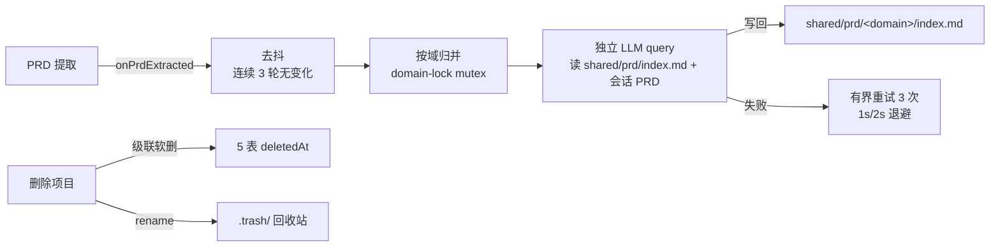

# ADR-016: 全链路软删与 PRD 归档合并

## 背景

删除需要可恢复（误删、审计），且删除项目后原物理目录应进入回收站；PRD 产出分散在各会话目录，需要自动合并归档到项目共享目录，形成稳定的需求基线。

## 决策

| 选择                                                                                               | 理由                                                                                                                                                                                                                                                                       |
| -------------------------------------------------------------------------------------------------- | -------------------------------------------------------------------------------------------------------------------------------------------------------------------------------------------------------------------------------------------------------------------------- |
| 5 表 `deletedAt` 软删（Project/ProjectMember/Session/SessionEntry/Asset）                          | 可恢复 + 审计；删除走 `updateMany set deletedAt` 而非物理 DELETE                                                                                                                                                                                                           |
| 删除项目级联软删 + 物理目录进 `.trash/`                                                            | DB 软删与 FS 回收站分离，目录 rename 失败不阻断 DB                                                                                                                                                                                                                         |
| 读查询统一过滤 `deletedAt: null`                                                                   | 软删记录对业务查询完全不可见，owner 越权统一 404                                                                                                                                                                                                                           |
| `projectName` 移除 `@unique`，软删后允许复用同名                                                   | 重名项目是新需求；软删记录不占用活跃命名空间                                                                                                                                                                                                                               |
| PRD 归档：去抖（连续 3 轮无变化）→ 按域归并 → 独立 LLM 合并写回共享 `index.md`                     | 合并是重操作，去抖防抖动；域归并锁避免同域并发写坏                                                                                                                                                                                                                         |
| 归档合并独立 `query()`（读共享 index + 会话 PRD，工具 Read/Write）                                 | 不在主对话内合并，避免污染用户上下文与额外 token 消耗                                                                                                                                                                                                                      |
| 合并有界重试（3 次指数退避）+ domain-lock mutex                                                    | 同域串行、跨域并行；LLM 失败自动重试，不无限阻塞                                                                                                                                                                                                                           |
| 级联口径：`sessionEntry` 按 `sessionId in [...]` 精确级联；`asset` 按 `session.projectId` 关系级联 | `sessionEntry` 无 FK（规避 SDK append 时序竞态），先抓本项目全部会话 id 再精确级联，`partitionKey` 前缀仅作命名空间防御，避免按前缀误伤「软删后复用同名」项目的活跃记录；`asset` 创建时不落 `projectId`（由会话推导），故按关系级联，删除项目后其 PRD 资产一并软删不可再读 |

## 影响

- 软删记录永久保留（MVP 不提供物理清理）；部分唯一索引受限见下
- ArchiveService 需要独立模型调用配额（`ARCHIVE_MERGE_MAX_TURNS` / `_BUDGET`）
- 会话私有 PRD 落盘 `requirements/private/<user>/<sessionId>/*.md`，合并产物进 `requirements/shared/prd/<domain>/index.md`

## Known Limitations

- **projectName 部分唯一索引暂缺** ⚠️：DB 层 `CREATE UNIQUE INDEX ... WHERE deleted_at IS NULL` 因 **Prisma 6.19 PSL 不支持 `@@index where`**（该能力仅存在于 Prisma 7 新 schema engine）无法声明。当前以 `ProjectService.create` 应用层预校验（`findFirst where deletedAt: null`）兜底，并发下存在极小竞态窗口。升级 Prisma 至支持版本后应补 DB 级约束。
- **软删不物理清理**：MVP 不提供定时清理/彻底删除，DB 与 `.trash/` 持续增长。

## Mermaid

详细参考：设计文档 D-8（部分唯一索引）、D-9（软删级联与回收站）、D-11（归档去抖/归并/mutex/重试）。
