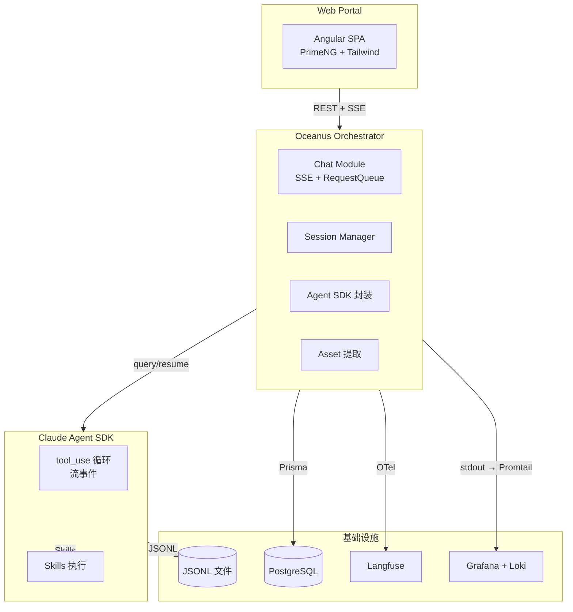
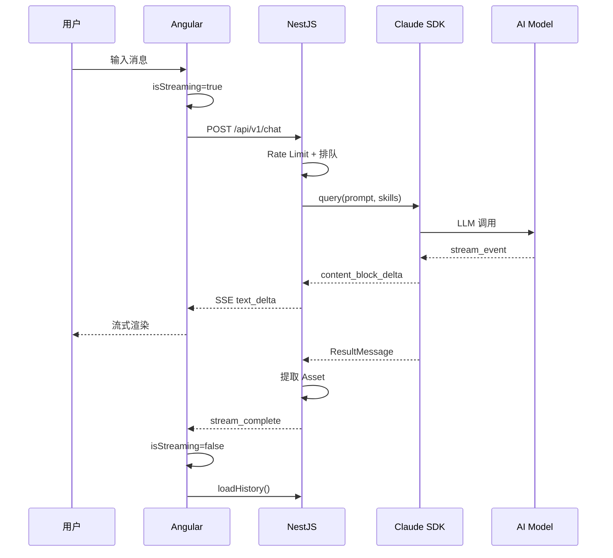
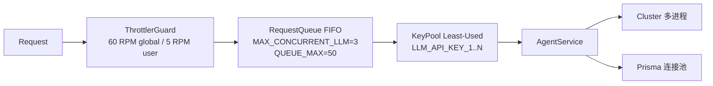
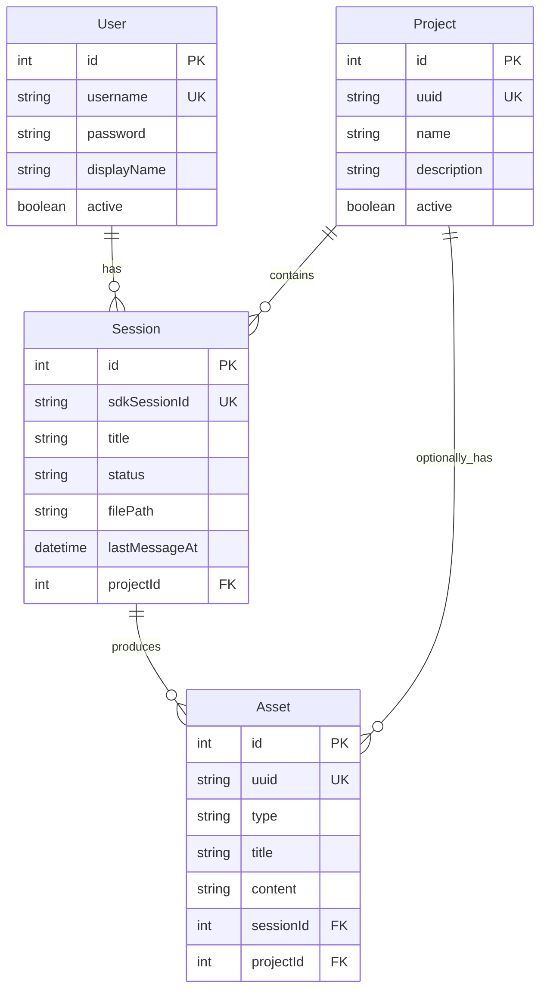

# 系统架构总览

> Single Source of Truth | 更新: 2026-07-27
> 相关文档：[数据模型](data-model.md) | [ADR 索引](decisions/) | [API 文档](../3-api/api-reference.md)

---

## 项目定位

**Oceanus**（俄刻阿诺斯），古希腊神话中的大洋神——万物之源，万流之宗。项目是 AI 全链路开发中台，将产品讨论、需求分析、代码生成到部署运维的研发流程全链路平台化。

- **短期（MVP）**：聚焦产品经理场景——需求诊断、PRD 生成、方案对比
- **中长期**：覆盖需求 → 开发 → 测试 → 上线的全研发流程
- **与 DeepStorm 的关系**：DeepStorm 是 AI 协同工具集 / CLI，Oceanus 是基于 DeepStorm 的企业级平台

---

## 四层架构

| 层                   | 职责                                                                      |
| -------------------- | ------------------------------------------------------------------------- |
| **Web Portal**       | UI 展示、用户交互、SSE 流式渲染、资产管理                                 |
| **Oceanus 编排层**   | 会话管理、上下文窗口、SSE 桥接、资产提取、模型路由、请求队列              |
| **Claude Agent SDK** | Agent 循环、Skill 执行、MCP 工具调用、OTel 可观测性                       |
| **基础设施**         | PostgreSQL（映射关系）、JSONL（消息内容）、Loki（日志）、Langfuse（追踪） |

**核心原则：SDK 负责循环，Oceanus 负责编排。** SDK 内部的 tool_use 循环是黑盒，Oceanus 通过 stream_event 监听但不控制。

---

## 模块说明

| 模块    | 路径                   | 职责                                         |
| ------- | ---------------------- | -------------------------------------------- |
| Auth    | `backend/src/auth/`    | 测试账号登录，JWT Token 签发                 |
| Project | `backend/src/project/` | 项目 CRUD                                    |
| Session | `backend/src/session/` | 会话管理 + 级联清理（DB + JSONL）            |
| Chat    | `backend/src/chat/`    | 消息转发 + SSE 流式推送 + 请求队列 + KeyPool |
| Agent   | `backend/src/agent/`   | Claude Agent SDK 封装                        |
| Asset   | `backend/src/asset/`   | 资产面板（PRD、诊断报告等）                  |

---

## 一条消息的完整流程

---

## 并发控制体系

详细设计见 [ADR-003: 并发控制架构](decisions/ADR-003-concurrency-architecture.md)。

---

## 消息存储边界

| 消息类型     | 来源         | 存储位置            | 用途                |
| ------------ | ------------ | ------------------- | ------------------- |
| stream_event | SDK 流事件   | 日志（不存 DB）     | 前端 SSE 渲染、调试 |
| user         | SDK query    | PostgreSQL          | 历史展示            |
| assistant    | SDK 回复     | PostgreSQL          | 历史展示            |
| result       | SDK 最终输出 | PostgreSQL + Assets | 资产提取            |

**原则**：user/assistant 存纯文本，result 存结构化 JSON，中间事件不入 DB。SDK 内部状态由 SDK 文件系统管理，Oceanus 不复制。

---

## 端口约定

| 组件                    | 端口 |
| ----------------------- | ---- |
| Oceanus 后端（NestJS）  | 3100 |
| Oceanus 前端（Angular） | 4300 |
| Langfuse                | 3001 |
| Grafana                 | 3002 |
| GlitchTip               | 8000 |
| PostgreSQL              | 5432 |
| Redis                   | 6379 |
| ClickHouse              | 8123 |

---

## 数据模型

---

## 技术栈

| 领域     | 选型                                                     |
| -------- | -------------------------------------------------------- |
| 后端框架 | NestJS 11                                                |
| 前端框架 | Angular 21（Standalone + OnPush + Signal）               |
| UI 组件  | PrimeNG 21（Aura theme）                                 |
| CSS      | Tailwind CSS 4                                           |
| ORM      | Prisma 6                                                 |
| 数据库   | PostgreSQL 17                                            |
| AI 引擎  | Claude Agent SDK（TypeScript）                           |
| AI 模型  | 默认 Claude Sonnet 5，可切换国产模型                     |
| 实时通信 | SSE                                                      |
| 日志     | Pino → stdout → Promtail → Loki → Grafana                |
| 追踪     | OTel → Langfuse（自托管）                                |
| 错误追踪 | GlitchTip（自托管，Sentry SDK 兼容）                     |
| 包管理   | pnpm workspaces                                          |
| CI/CD    | GitHub Actions                                           |
| 容器化   | Docker multi-stage（Server Alpine + Nginx 提供静态文件） |
