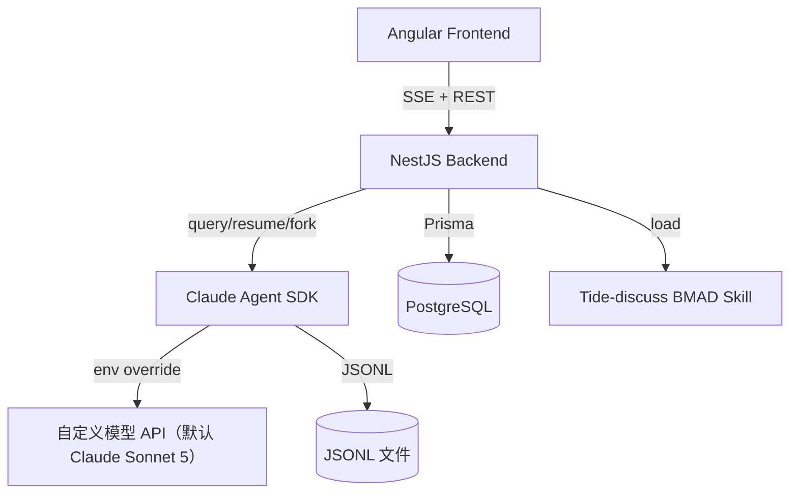

# Oceanus — AI 中台系统总览

> 本文档综合整理自 `.deepstorm/context.md`、`README.md`、架构图示及演示文稿内容。
> 创建：2026-07-24 | 最后更新：2026-07-26

---

## 目录

1. [业务背景与目标](#1-业务背景与目标)
   - 1.1 项目定位
   - 1.2 项目溯源
   - 1.3 核心理念
   - 1.4 产品路线图
   - 1.5 MVP 范围
   - 1.6 全链路愿景（中长期）
   - 1.7 与 DeepStorm 的关系
2. [技术架构思考](#2-技术架构思考)
   - 2.1 整体架构分层
   - 2.2 Oceanus ↔ SDK 边界原则
   - 2.3 一条消息的完整流程
   - 2.4 项目隔离模型
   - 2.5 对话管理与数据模型
   - 2.6 可观测性方案
   - 2.7 质量评估方案
   - 2.8 部署架构
3. [技术选型](#3-技术选型)
   - 3.1 核心技术决策一览
   - 3.2 AI Agent SDK 选型
   - 3.3 语言与框架选择
   - 3.4 Skills 注册机制
   - 3.5 前端技术栈
   - 3.6 新增技术决策（2026-07-23）
   - 3.7 Claude Agent SDK 能力调研
4. [数据模型](#4-数据模型)
5. [附录](#5-附录)

---

## 1. 业务背景与目标

### 1.1 项目定位

**Oceanus** 是一个以 **Skill 为核心能力载体**、底层基于 **Claude Agent SDK** 的 **AI 中台**。这是一项公司级战略项目，由领导层推动，目标是用 AI 重塑整个软件研发流程。

- **短期（MVP，6-8 周）：** 聚焦产品经理场景——需求诊断、PRD 生成、方案对比
- **中长期：** 覆盖需求 → 开发 → 测试 → 上线的全研发流程，逐步扩展至工程侧、测试、运维
- **角色演进：** MVP 仅面向产品经理（不限角色思考），后续扩展至开发、测试、运维角色

### 1.2 项目溯源

> **Oceanus（俄刻阿诺斯）**，古希腊神话中环绕世界的大洋神，泰坦十二神之一。他是一条永不枯竭的巨川，**万物之源，万流之宗**——三千河神与三千海洋仙女皆为其子嗣。

Oceanus 的命名寓意着这个平台的愿景：所有项目从同一源头诞生，沿着各自河道奔涌向前。Oceanus 不枯竭、不干涸——它是公司的数字基础设施。

传统开发模式中，每个项目从零搭建工具链、流程规范、CI/CD 管线；人员流动带来知识断层，工具更迭造成历史债务。Oceanus 的答案是：

> **将完整的开发能力平台化，让每一个新项目从诞生之初就站在巨人的肩膀上。**

```
┌─────────────────────────────────────────────────────────┐
│                    Oceanus                               │
│            ┌─ 讨论 → 需求 → 代码 → 测试 → 部署 ─┐      │
│  项目 A ───┤   └─ 迭代 → 运维 → 监控 → 复盘 ─┘   ├───  │
│  项目 B ───┤   ┌─────────────────────────────┐    ├───  │
│  项目 C ───┤   │  每条"河流"都是一个独立项目   │    ├───  │
│  ···       └───┴─────────────────────────────┘    │     │
│                                                    │     │
│  所有项目从同一源头诞生，沿着各自河道奔涌向前。         │     │
│  Oceanus 不枯竭、不干涸——它是公司的数字基础设施。      │     │
└─────────────────────────────────────────────────────────┘
```

### 1.3 核心理念

| 理念       | 含义                                               |
| ---------- | -------------------------------------------------- |
| **线上化** | 把线下文档、讨论搬到 AI 平台，实现全流程数字化     |
| **规范化** | 质量评估确保输出一致性，金标数据集 + LLM-as-Judge  |
| **资产化** | Skill / Agent 市场持续复用最佳实践，跨项目资产共享 |

### 1.4 产品路线图

| Phase              | 内容                                                 | 周期    |
| ------------------ | ---------------------------------------------------- | ------- |
| **Phase 1（MVP）** | PM 侧最小闭环：引擎 + Web Portal + 3 个核心 Skill    | 6-8 周  |
| **Phase 1.5**      | 补充 Skill（竞品分析、访谈大纲、合规检查、深度研究） | +3-4 周 |
| **Phase 2**        | 工程侧接入（Spec 生成、评审调度、开发任务分配）      | +4-6 周 |
| **Phase 3**        | 测试/运维（测试用例生成、CI 集成、部署检查）         | +4-6 周 |
| **Phase 4**        | 知识库 v2、跨项目资产共享、Skill/Agent 市场          | +4-8 周 |

### 1.5 MVP 范围

#### Phase 1 — 引擎 + Web Portal + 3 核心 Skill

**引擎层：**

- Claude Agent SDK 集成，基础 orchestrator 运行
- Skill 注册机制（SDK Skills 文件系统模式）
- Agent 配置管理
- 对话会话管理

**Skill 层（由产品同学设计，工程实现）：**

| Skill        | 模式         | 说明                                                      |
| ------------ | ------------ | --------------------------------------------------------- |
| **想法诊断** | 对话式 Skill | 多轮对话，六问框架逐步澄清需求，每次返回状态 + 下一个问题 |
| **PRD 生成** | 单步 Tool    | 一次性传入信息，组装为结构化 PRD                          |
| **方案对比** | 单步 Tool    | 多方案对比 + 可行性标记                                   |

**Web 层：**

- Agent 市场页 / Skill 市场页 / 模型接入页
- 项目工作区：左侧聊天 + 右侧资产面板
- 项目 CRUD

**MVP 特性边界：**

| 特性              | MVP                                         | 后续                                  |
| ----------------- | ------------------------------------------- | ------------------------------------- |
| Skill 管理        | 仅内置 DeepStorm Skill                      | 自定义 Skill → 定义、注册、版本、下架 |
| Agent 管理        | 系统预置 Agent，用户不可定义                | Agent 市场可能不需要                  |
| 项目管理          | ✅ 独立项目目录隔离                         | 可扩展资源配额管理                    |
| 对话/会话管理     | ✅ 聊天消息入 PostgreSQL + SDK 文件系统双存 |                                       |
| 文档/资产自动生成 | ✅ PRD、方案对比、诊断报告                  |                                       |
| 质量评估          | ✅ 金标数据集 + LLM-as-Judge（手动触发）    | 持续改进                              |
| Skill 市场        | ❌                                          | Phase 4                               |
| Agent 市场        | ❌                                          | 可能不需要                            |
| 多角色工作流      | ❌                                          | Phase 2+                              |

### 1.6 全链路愿景（中长期）

Oceanus 的长期目标是将完整研发流程平台化，每个阶段都有对应的能力支撑：

#### 🌊 阶段一：需求孕育（Source）

从一段口头描述或一个 Slack 消息开始，进入需求分析流水线：

1. 多角色 BMAD 讨论（产品 / 技术 / 设计视角）
2. 生成结构化 PRD
3. 输出 OpenSpec 任务拆解 → 飞书 / Jira

**关键产出：** 结构化需求文档、任务优先级图谱、技术预案

#### 🌊 阶段二：项目诞生（Spring）

根据需求自动创建项目工程：

1. **脚手架生成** — 选择技术栈，自动生成完整项目骨架
2. **架构约束注入** — 代码规范、分层约定、Git 工作流、CI/CD 配置一步到位
3. **MCP 环境预配** — 自动绑定 GitHub / Jira / Figma / 飞书等外部工具凭据

**关键产出：** 可运行的工程目录、零配置的开发环境、即时可用的 CI 管线

#### 🌊 阶段三：代码奔涌（Stream）

1. **OpenSpec 驱动** — 从任务拆解到代码实现，遵循 Spec-Driven Development
2. **多 Agent 协同** — 架构 Agent 负责设计、代码 Agent 负责实现、Review Agent 负责审查
3. **知识增强** — 自动检索 Context7 文档、公司内历史代码、最佳实践

**关键产出：** 符合编码规范的业务代码、单元测试、API 文档

#### 🌊 阶段四：测试与发布（Torrent）

1. 自动化测试生成（单测 → 集成测试 → E2E）
2. 覆盖率分析 + 质量门禁
3. 自动生成 CHANGELOG、语义版本号
4. 发布到预发布环境

**关键产出：** 测试报告、覆盖率报告、发布包、Release Notes

#### 🌊 阶段五：运维与演化（Current）

1. 部署编排（Kubernetes / 云原生）
2. 监控告警对接（Prometheus / Grafana / CloudWatch）
3. 故障排查辅助（日志分析、链路追踪、根因推测）
4. 持续迭代闭环（用户反馈 → 新一轮需求分析）

**关键产出：** 部署状态、监控面板、故障报告、迭代建议

### 1.7 与 DeepStorm 的关系

```
DeepStorm  :  开发工具集或 CLI，解决"开发者怎么用 AI 工具"
Oceanus    :  AI 中台平台，解决"企业怎么管理 AI 驱动的开发流程"
```

| 对比维度 | DeepStorm                | Oceanus                     |
| -------- | ------------------------ | --------------------------- |
| 用户画像 | 开发者个人               | 整个研发团队 / 企业         |
| 形态     | CLI + Claude Code skills | 中台平台（Web + Agent SDK） |
| 范围     | 单次会话的 AI 协作       | 全项目生命周期管理          |
| 复用     | 手动按需调用             | 自动化编排 + 资产沉淀       |
| 交付     | npm 包                   | 平台服务                    |

**Oceanus 内部集成 DeepStorm** 作为其开发技能库。DeepStorm 的 Tide、Reef、Sweep、Atoll 套件在 Oceanus 中被封装为 Agent toolkit，供编排引擎调度。

---

## 2. 技术架构思考

### 2.1 整体架构分层

Oceanus 采用四层架构，每层职责清晰：

```
┌─────────────────────────────────────────────────┐
│         Web Portal（Angular SPA + PrimeNG）        │
│     项目工作区 · Agent 管理 · 资产管理 · 聊天 UI     │
└──────────────────────┬──────────────────────────┘
                       │ REST API + SSE
┌──────────────────────▼──────────────────────────┐
│          Oceanus Orchestrator（NestJS）            │
│  Session Manager · Context Windower · SSE Bridge  │
│  Asset Extractor · Model Router · Evaluation      │
└──────────────────────┬──────────────────────────┘
                       │ in-process SDK
┌──────────────────────▼──────────────────────────┐
│           Claude Agent SDK（npm）                  │
│     provider 可配置（默认 Claude Sonnet 5 / 国产模型）             │
│     Tool Calling 循环 · Skills 执行 · OTel 导出     │
└──────────────────────┬──────────────────────────┘
                       │
┌──────────────────────▼──────────────────────────┐
│          DeepStorm Skills 注册表（SDK Skills）      │
│    tide-discuss（想法诊断）· tide-prd（PRD 生成）   │
│    SKILL.md 行为指令 · references/ 引用文档         │
└─────────────────────────────────────────────────┘
```

**分层职责：**

| 层                   | 职责                                                         |
| -------------------- | ------------------------------------------------------------ |
| **Web Portal**       | UI 展示、用户交互、SSE 流式渲染、资产管理                    |
| **Oceanus 编排层**   | 会话管理、上下文窗口、SSE 桥接、资产提取、模型路由、质量评估 |
| **Claude Agent SDK** | Agent 循环、Skill 执行、MCP 工具调用、OTel 可观测性          |
| **DeepStorm Skills** | 行为指令（SKILL.md）、运行时数据（tide-data/）               |

### 2.2 Oceanus ↔ SDK 边界原则

**核心原则：SDK 负责循环，Oceanus 负责编排。**

不要把 Oceanus 做成自己的 harness——SDK 内部的 tool_use 循环是黑盒，Oceanus 通过流事件"监听"中间状态，但不控制循环流程。

| 职责               | 谁负责                                                  |
| ------------------ | ------------------------------------------------------- |
| tool_use 循环      | ✅ SDK 内部管理，Oceanus 不干预                         |
| SDK Skills 注册    | **DeepStorm**（SKILL.md → 项目 `.claude/skills/` 目录） |
| MCP 外部服务       | ✅ SDK 按需连接（Jira / Feishu / 其他，Skill 声明引用） |
| Skill 执行中间产物 | **Skill 自行管理**（写项目目录 tide-data/）             |
| 流事件发出         | ✅ SDK（content_block_start/delta/stop）                |
| SSE 转发到前端     | **Oceanus**（监听 stream_event → RxJS Subject → SSE）   |
| 上下文窗口压缩     | ✅ SDK 自动处理                                         |
| 摘要生成           | **Oceanus**（窗口满 20 轮后触发）                       |
| Session 创建与管理 | **Oceanus**（DB 持久化映射关系）                        |
| 资产提取           | **Oceanus**（从 ResultMessage.structured_output 提取）  |
| 项目目录与隔离     | **Oceanus**（创建项目文件夹、管理环境）                 |
| 模型路由           | **Oceanus**（按 Skill 选择 provider config）            |
| 可观测性           | SDK OTel + **Oceanus**（添加 business tags）            |
| 成本追踪           | **Oceanus**（从 ResultMessage.total_cost_usd 记录）     |

### 2.3 一条消息的完整流程

```
 1. 用户发消息 → Angular → POST /api/v1/chat（projectId 在请求体中）
 2. Oceanus Controller 接收消息
 3. Oceanus SessionManager 加载/创建 Session
 4. Oceanus ContextWindower 构建上下文（最近 N 轮 + 摘要）
 5. Oceanus ModelRouter 决定使用哪个模型（默认 Claude Sonnet 5，可通过 ANTHROPIC_* 环境变量切换）
 6. Oceanus 调 SDK query():
    - prompt: 用户消息
    - cwd: /projects/{projectId}（SDK 自动扫描 .claude/skills/）
    - settingSources: ["user", "project"]
    - skills: "all"（启用所有可用 Skill）
    - allowedTools: ["Read", "Bash", "Grep", "Glob", "mcp__*"]
    - mcpServers: { jira, feishu, ... }（Skill 引用的外部服务）
    - includePartialMessages: true
    - outputFormat: { type: "json_schema", schema: assetSchema }
    - 指定 provider 配置
 7. SDK 开始内部 agent 循环：
    a. SDK 识别用户意图 → 匹配 DeepStorm Skill（如 tide-discuss）
    b. SDK 加载 Skill 指令（SKILL.md 内容）
    c. SDK 内部 tool_use 循环：
       - 模型推理 → tool_use 决策（如调用 Bash 写文件）
       - SDK 调用 Bash 工具 → 项目目录写入 tide-data/
       - 继续推理 → 调用 MCP（Jira 创建 Issue）
       - Skill 完成
 8. 循环中 Oceanus SSE Bridge 持续监听 stream_event：
    - text_delta → 前端实时渲染流式文本
    - content_block_start(tool_use) → 前端显示 "[正在分析...]"
    - content_block_stop → 前端恢复
 9. SDK 返回 ResultMessage:
    - structured_output → AssetExtractor 提取为 Asset
    - session_id → SessionManager 持久化
    - total_cost_usd → 成本记录
10. Oceanus 检查上下文窗口是否需要触发摘要
11. SSE 通知前端"消息完成"
12. 前端渲染最终界面 + 资产列表
```

**流事件序列（完整顺序）：**

```
StreamEvent (message_start)
StreamEvent (content_block_start) — text
StreamEvent (content_block_delta) — text_delta...
StreamEvent (content_block_stop)
StreamEvent (content_block_start) — tool_use
StreamEvent (content_block_delta) — input_json_delta...
StreamEvent (content_block_stop)
  └── SDK 内部执行 Tool handler（无需 Oceanus 介入）
StreamEvent (message_delta)  — 更新 stop_reason/usage
StreamEvent (message_stop)
AssistantMessage — 完整消息（含 tool_use 结果）
  └── 下一轮循环...
ResultMessage — 最终结果 + structured_output + session_id
```

### 2.4 项目隔离模型

**原则：Oceanus 只负责环境，Skill 负责内容。**

每个 Project 拥有独立的运行环境，通过文件系统隔离而非 Docker（MVP 阶段）：

| 隔离层   | 实现                               | 用途                               |
| -------- | ---------------------------------- | ---------------------------------- |
| 项目目录 | `/projects/{projectId}/`           | Skill 读写 `tide-data/` 等中间产物 |
| 进程隔离 | 单进程多 SDK Session（`cwd` 参数） | 每个项目独立目录                   |
| 共享层   | public npm packages（DeepStorm）   | 所有项目共用同一份 Skill 定义      |

**项目目录结构：**

```
/projects/{projectId}/
├── .claude/
│   ├── skills/
│   │   ├── tide-discuss/
│   │   │   └── SKILL.md          ← DeepStorm Skill 行为指令
│   │   │   └── references/       ← Skill 引用文档
│   │   ├── tide-prd/
│   │   │   └── SKILL.md
│   │   └── ...
│   └── MCP 配置
├── tide-data/                     ← Skill 运行时数据
│   ├── sessions/                  ← 讨论会话 JSON
│   ├── prds/                      ← 生成的 PRD
│   ├── archive/                   ← 已归档
│   └── .index.json                ← 会话摘要索引
└── .env                           ← 环境变量
```

**Oceanus 的职责：**

- 创建项目目录（`/projects/{id}/`）
- 管理 SDK Session 生命周期
- 监控 `tide-data/` 目录变化以提取已完成资产

**Skill 的职责：**

- 管理工作文件（`tide-data/sessions/`、`tide-data/prds/` 等）
- 控制工作流中间产物的读写
- 通过项目目录与外部 MCP 服务交互

### 2.5 对话管理与数据模型

#### 消息存储边界

| 消息类型     | 来源           | 存储位置                               | 用途                        |
| ------------ | -------------- | -------------------------------------- | --------------------------- |
| stream_event | SDK 流事件     | 日志文件（不存 DB）                    | 前端 SSE 实时渲染、调试日志 |
| user         | SDK query 输入 | PostgreSQL `messages` 表               | 前端历史展示                |
| assistant    | SDK 回复       | PostgreSQL `messages` 表               | 前端历史展示                |
| result       | SDK 最终输出   | PostgreSQL `messages` 表 + `assets` 表 | 历史展示 + 资产提取         |

**简化原则：** user/assistant 存纯文本、result 存结构化 JSON、中间事件不入 DB。SDK 内部状态由 SDK 文件系统管理，Oceanus 不复制。

#### Session Brief 策略（两步替换）

采用零成本的两步策略，不调用 LLM 做摘要：

```
用户发第一条消息         → brief = 用户输入截取前 50 字
Skill 完成，产出的 title → brief = 替换为结果标题（如 PRD 标题）
```

```typescript
// Step 1: 用户第一条消息时
if (messages.count === 0) {
  const brief = userText.slice(0, 50) + (userText.length > 50 ? '...' : '');
  await prisma.session.update({ where: { id }, data: { brief } });
}

// Step 2: result 返回时，如包含标题则替换
if (msg.type === 'result' && msg.structured_output?.title) {
  await prisma.session.update({ where: { id }, data: { brief: msg.structured_output.title } });
}
```

### 2.6 可观测性方案

#### 架构

```
SDK query() → OTel Spans ─→ agent.loop / tool.use / llm.call
                  │
                  ├── Oceanus 注入业务标签
                  │     ├── project.id
                  │     ├── session.id
                  │     └── skill.name
                  │
                  └── OpenInference 格式 → Langfuse（自托管）
```

#### 成本展示

ResultMessage 直接返回 `total_cost_usd`，Oceanus 在 session 结束时汇总：

| 层面     | 存储                   | 前端展示             |
| -------- | ---------------------- | -------------------- |
| 单次对话 | Message 级别 cost 字段 | "本次对话花费 $0.XX" |
| 累计统计 | Session 聚合 totalCost | Project 列表页柱状图 |
| 原始数据 | Langfuse               | 后台管理             |

#### 日志方案

Oceanus 采用 **Pino + Grafana + Loki** 三阶日志链路：

| 决策项   | 选择                                                           |
| -------- | -------------------------------------------------------------- |
| 日志框架 | Pino + `nestjs-pino`（5-10x 性能优势）                         |
| 日志输出 | stdout（Docker 统一采集，不写文件）                            |
| 日志收集 | Promtail → Loki（仅采集 `oceanus-server` 容器）                |
| 日志存储 | Loki 本地文件系统，7 天保留期                                  |
| 日志查询 | Grafana（预配置 Loki 数据源 + 基础仪表盘）                     |
| 日志级别 | `LOG_LEVEL` 环境变量控制，默认 `info`（生产）/ `debug`（开发） |
| traceId  | 每次 HTTP 请求自动生成（与 sessionId 分离）                    |

```
Pino ──stdout──▶ Docker ──logs──▶ Promtail ──push──▶ Loki ──query──▶ Grafana
  ▲ LOG_LEVEL                     Promtail 仅采集              7 天保留期      预配置数据源
    控制输出级别                  oceanus-server 容器                             + 仪表盘
```

> **2026-07-26 更新：** 从文件日志（`./logs/combined.log`）迁移至 Grafana + Loki 栈。移除文件日志配置，SessionLogService 保持独立不变。

### 2.7 质量评估方案

#### 架构

```
金标数据集（5 条 / Skill，手工标注）
     ↓
DeepStorm Skill 执行 → 产出结果
     ↓
Judge LLM（独立模型，不与 Agent 模型相同）→ 对比评分
     ↓
{ score: 0-100, dimensions: [...], reason: '...' }
     ↓
PostgreSQL Evaluation 表
```

#### 评分维度

| Skill    | 维度                             |
| -------- | -------------------------------- |
| 想法诊断 | 准确性 / 完整性 / 可执行性       |
| PRD 生成 | 结构完整性 / 需求覆盖度 / 一致性 |
| 方案对比 | 维度全面性 / 客观性 / 推理深度   |

#### 触发方式

- **仅手动触发**：开发者在后台操作面板点击「评估」→ 自动跑 Judge 流程
- 不自动评估（避免在 MVP 阶段产生不可控成本）

#### Judge 模型

- 与 Agent 模型 **分开**，避免同模型偏见
- 推荐 GPT-4o 或 Claude Sonnet 系列（具体模型待定）

### 2.8 部署架构

#### 核心原则：Oceanus 不需要 Docker（MVP 阶段）

```
外网用户 → Nginx（反向代理）
              ├── / → Angular SPA 静态文件
              └── /api → proxy_pass（长连接 SSE）
                              │
                    Oceanus (NestJS) 单进程多项目
                      ├── Project A (cwd: /data/A)
                      ├── Project B (cwd: /data/B)
                      └── Project C (cwd: /data/C)
                              │
                    PostgreSQL（统一外部实例）
                    Langfuse（可观测性，Docker/Cloud）
```

#### 为什么不在一开始用 Docker

| 理由             | 说明                                                   |
| ---------------- | ------------------------------------------------------ |
| SDK `cwd` 已隔离 | 每个 Project 的目录独立，文件系统互不影响              |
| 进程间通信复杂   | 把 SDK 放容器需包装 HTTP/gRPC bridge，SSE 流式穿透困难 |
| 无额外收益       | MVP 阶段不涉及 CPU/内存硬隔离、安全沙箱需求            |
| 启动延迟         | 容器热启动有开销，用户等待变长                         |

#### 什么时候需要 Docker

- 用户自定义 Skill 需要安装第三方依赖（不同项目用不同 Node/Python 版本）
- 需要严格资源配额（限制某个项目的 CPU/内存使用）
- 安全沙箱（防止 Skill 恶意操作宿主系统）

这些在 MVP 阶段都不涉及。

#### 端口约定

| 组件            | 端口 |
| --------------- | ---- |
| 后端（NestJS）  | 3100 |
| 前端（Angular） | 4300 |

---

## 3. 技术选型

### 3.1 核心技术决策一览

| 决策项       | 结论                                                                         | 理由                                                         |
| ------------ | ---------------------------------------------------------------------------- | ------------------------------------------------------------ |
| 后端语言     | **TypeScript / Node.js**                                                     | 团队第一语言、DeepStorm 资产复用、前后端统一                 |
| AI 引擎      | **Claude Agent SDK（TS 版）**                                                | 支持 DeepSeek 等自定义 Provider，原生 Skills 机制            |
| 默认 AI 模型 | **Claude Sonnet 5**（通过 ANTHROPIC_* 环境变量可切换为 DeepSeek 等国产模型） | 默认使用 Anthropic API；通过 SDK Provider 抽象可兼容国内模型 |
| 前端框架     | **Angular + PrimeNG + Tailwind CSS**                                         | 纯 SPA；团队 Java 背景，学习曲线低                           |
| 后端框架     | **NestJS**                                                                   | DI/模块化/装饰器与 Spring 架构高度相似                       |
| ORM          | **Prisma**                                                                   | Schema → 类型安全 Client → Migration                         |
| 数据库       | **PostgreSQL**                                                               | 成熟稳定，支持未来 pgvector 扩展                             |
| 认证         | **静态 admin 登录页 → JWT Token（MVP）**                                     | 降低复杂度，后续接入 SSO/LDAP                                |
| 可观测性     | **Langfuse（自托管，OTel → OpenInference）**                                 | MVP 即引入                                                   |
| 存储         | PostgreSQL（元数据）+ SDK JSONL 文件（消息内容）                             |                                                              |
| 包管理       | **pnpm workspaces（monorepo）**                                              | 现代 monorepo 方案                                           |
| 构建         | **pnpm**                                                                     | 快速、磁盘效率高                                             |

### 3.2 AI Agent SDK 选型

#### 为什么不是 LangGraph / 工作流框架

| 维度        | Harness Agent（选型）                | LangGraph               |
| ----------- | ------------------------------------ | ----------------------- |
| 工作流模式  | 动态 agent 循环，运行时自主决策      | 预定义 DAG pipeline     |
| 灵活性      | ✅ 适合开放式任务（需求讨论、诊断）  | ❌ 适合固定流程         |
| Skills 支持 | ✅ 原生 SKILL.md 行为指令            | ❌ 需自行抽象           |
| 流式输出    | ✅ 原生 stream_event + tool_use 事件 | ✅（但配置复杂）        |
| 错误恢复    | SDK 自动管理                         | 需手动编排              |
| 学习曲线    | 平缓，配置化                         | 陡峭，需理解 graph 概念 |

**结论：** 需求讨论具有动态变化性和不可预测性，Harness Agent 的运行时自主决策能力是关键。LangGraph 更适合固定流程（pipeline 式），不匹配 Oceanus 的核心场景。

#### Claude Agent SDK vs Pi vs DeepAgents

| 维度            | Claude Agent SDK（选型）           | Pi Agent Harness  | DeepAgents (LangChain) |
| --------------- | ---------------------------------- | ----------------- | ---------------------- |
| 语言            | **TypeScript**                     | TypeScript        | Python                 |
| Skills 机制     | **✅ 原生文件系统 SKILL.md**       | ❌ 类似但生态不同 | ❌ 需自行构建          |
| DeepStorm 兼容  | **✅ 零成本对接**                  | ⚠️ 适配改造成本高 | ❌ 需重写              |
| 自定义 Provider | **✅ 支持 DeepSeek 等任意模型**    | ❌ 仅 Anthropic   | ✅ LangChain 模型生态  |
| 流事件          | **✅ 原生 content_block_**         | ⚠️ 需自行搭建     | ⚠️ LangGraph callback  |
| SSE 集成        | **✅ stream_event → RxJS → SSE**   | ❌ 无原生桥接     | ⚠️ 需额外封装          |
| OTel 可观测性   | **✅ 官方支持、Langfuse 集成**     | ⚠️ 手动埋点       | ✅ LangChain 生态      |
| Session 管理    | **✅ continue/resume/forkSession** | ⚠️ 基础支持       | ⚠️ 基础支持            |
| MCP 集成        | **✅ 原生 mcpServers 配置**        | ❌ 无             | ❌ 无                  |
| 社区成熟度      | ⭐⭐⭐⭐ 官方维护                  | ⭐⭐ 开源社区     | ⭐⭐⭐ LangChain       |

**结论：** Claude Agent SDK 在 Skills 机制、DeepStorm 兼容性、流事件/SSE/MCP 集成等方面全面占优，是唯一能零成本对接 DeepStorm 的方案。

**版本说明：** 通过 `ANTHROPIC_BASE_URL` / `ANTHROPIC_MODEL` / `ANTHROPIC_SMALL_FAST_MODEL` / `ANTHROPIC_API_KEY` 环境变量接入。默认使用 Anthropic API（Claude Sonnet 5），可通过环境变量切换至兼容国产模型 API 的 provider。

### 3.3 语言与框架选择

#### TypeScript vs Python vs Java

| 维度             | TypeScript                       | Python                   | Java                      |
| ---------------- | -------------------------------- | ------------------------ | ------------------------- |
| 团队熟悉度       | ⭐⭐⭐⭐⭐（第一语言）           | ⭐⭐（不熟）             | ⭐⭐⭐⭐（有经验）        |
| DeepStorm 复用   | ⭐⭐⭐⭐⭐（npm import）         | ⭐⭐（需重写或桥接）     | ⭐（完全需桥接）          |
| SDK 原生支持     | ⭐⭐⭐⭐⭐（Claude SDK TS 原生） | ⭐⭐⭐（需桥接）         | ❌ 不支持                 |
| 前后端统一       | ⭐⭐⭐⭐⭐（同语言、类型共享）   | ⭐⭐                     | ⭐⭐                      |
| MVP 开发效率     | ⭐⭐⭐⭐⭐（Node.js 快速迭代）   | ⭐⭐⭐                   | ⭐⭐（配置重）            |
| 企业级后端成熟度 | ⭐⭐⭐⭐⭐（NestJS）             | ⭐⭐⭐（Django/FastAPI） | ⭐⭐⭐⭐⭐（Spring Boot） |

#### NestJS vs Spring Boot

| 维度           | NestJS（选型）                        | Spring Boot（不采用）           |
| -------------- | ------------------------------------- | ------------------------------- |
| 架构模式       | ✅ 模块/DI/装饰器，与 Spring 高度相似 | ✅ 原生                         |
| Agent SDK 集成 | ✅ Claude SDK TS 可直接 npm import    | ❌ 需额外 HTTP bridge 转发      |
| SSE 流式穿透   | ✅ 同进程 RxJS，零开销                | ⚠️ WebFlux 实现，增加部署复杂度 |
| MVP 迭代速度   | ✅ Node.js 热重载，快速原型           | ⚠️ 编译+启动慢，不适合快速迭代  |
| AI 生态集成    | ✅ 前后端同语言，类型定义共享         | ❌ 需额外序列化层               |
| 团队平滑迁移   | ✅ 语法/架构与 Spring 高度类比        | —（已有基础，但 AI 工具链缺失） |

**关键洞察：** 团队 Java 背景是选择 NestJS 的**加分项**而非选择 Java 的理由——NestJS 借鉴了 Spring 的 DI/模块/装饰器模式，让 Java 团队以最低学习成本接入 Node.js 生态，同时获得 Agent SDK 原生集成能力。

#### NestJS vs Express vs Fastify

| 特性                | NestJS            | Express    | Fastify |
| ------------------- | ----------------- | ---------- | ------- |
| 架构（类似 Spring） | ✅ 模块/DI/装饰器 | 松散中间件 | 插件式  |
| TypeScript 原生     | ✅                | 需配置     | 支持    |
| SSE 内置（RxJS）    | ✅                | 需插件     | 需插件  |
| Java 团队学习曲线   | 低                | 中         | 中      |

### 3.4 Skills 注册机制

**核心决策：DeepStorm Skills 通过 SDK Skills API（文件系统驱动）注册，不包装为 MCP Tool。**

#### 为什么不是 MCP Tool 包装

| 维度           | SDK Skills（选型）                       | MCP Tool 包装（不采用）   |
| -------------- | ---------------------------------------- | ------------------------- |
| 注册方式       | SKILL.md 放入 `.claude/skills/` 自动注册 | 手写 tool() + schema 定义 |
| 工作流支持     | ✅ 原生（多角色讨论等复杂指令）          | ❌ 原子函数调用           |
| DeepStorm 兼容 | ✅ 零改造成本                            | ❌ 需大量改造             |
| 运行时决策     | ✅ SDK 自主选择 Skill 调用               | ❌ 需 Oceanus 前置编排    |

**结论：** DeepStorm 的 Skill 是**行为指令文档**不是函数，SDK Skills 恰好为此设计。MCP Tool 包装是错误抽象。

#### Skill 与 Tool 的分工

| 概念           | 作用              | 示例                                |
| -------------- | ----------------- | ----------------------------------- |
| **SDK Skills** | 行为指令/工作流   | tide-discuss（需求讨论 5 角色流程） |
| **MCP Tools**  | 原子操作/外部服务 | Jira Create Issue、Feishu Wiki 推送 |
| **Bash Tools** | 文件系统操作      | 读写 tide-data/ 目录                |

Skill 的 SKILL.md 中声明所需的 MCP 能力，运行时由 SDK 按需连接对应的 MCP Server。

#### 注册方式（代码示例）

```typescript
import { query } from '@anthropic-ai/claude-agent-sdk';

// DeepStorm Skills 文件在项目 .claude/skills/ 下
// SDK 通过 cwd + settingSources + skills 自动加载，无需 register()

for await (const msg of query({
  prompt: userMessage,
  options: {
    cwd: '/projects/{projectId}',
    settingSources: ['user', 'project'],
    skills: 'all',
    allowedTools: ['Read', 'Bash', 'Grep', 'Glob', 'mcp__jira__*', 'mcp__feishu__*'],
    mcpServers: {
      jira: jiraMcpServer,
      feishu: feishuMcpServer,
    },
    includePartialMessages: true,
    outputFormat: { type: 'json_schema', schema: assetSchema },
  },
})) {
  if (msg.type === 'stream_event') {
    /* 转发 SSE */
  }
  if (msg.type === 'result') {
    /* 提取资产 */
  }
}
```

#### 安装方式

DeepStorm 的 `setup` 命令将 SKILL.md 复制到项目 `.claude/skills/{skill-name}/` 目录。Oceanus 在创建新项目时运行 `deepstorm setup` 或直接预置所有内置 Skill 文件。

### 3.5 前端技术栈

| 技术         | 版本             | 用途                    |
| ------------ | ---------------- | ----------------------- |
| Angular      | 21（standalone） | 前端框架                |
| PrimeNG      | 21               | UI 组件库（Aura theme） |
| Tailwind CSS | 4                | CSS 工具类              |
| RxJS         | 7                | 响应式编程、SSE 流处理  |

#### 为什么选择 Angular SPA 而非 Next.js

| 特性                  | Next.js        | Angular SPA（选型）                 |
| --------------------- | -------------- | ----------------------------------- |
| SSR/SEO               | ✅ 原生        | ❌ 内部工具不需要                   |
| 交互密集型（聊天 UI） | 中等           | ✅ 强项                             |
| 部署复杂度            | 高（SSR 服务） | 低（静态文件 + Nginx）              |
| 与后端解耦            | 同一项目       | ✅ 完全独立                         |
| 团队技能匹配          | 需学 React     | ✅ Angular + PrimeNG 匹配 Java 团队 |

#### 前端架构模式

- **Standalone 组件**（无 NgModule 导入）
- **OnPush 变更检测**
- **Signal** 响应式状态管理（已确认 JIT 测试中的限制）
- **inline template**（遵循现有模式）
- **功能性的 HTTP 拦截器**（Token 注入 + 401 重定向）
- **函数式路由守卫**（AuthGuard）

#### 消息类型 → 前端状态映射

| 事件                                  | 前端状态                                           |
| ------------------------------------- | -------------------------------------------------- |
| message_start                         | 开始渲染新消息                                     |
| content_block_start(text)             | 显示流式文本区域                                   |
| content_block_delta(text_delta)       | 追加文本到内容                                     |
| content_block_start(tool_use)         | 显示"[对工具 X 进行分析...]"，更新工具调用按钮状态 |
| content_block_delta(input_json_delta) | 工具输入参数实时显示                               |
| content_block_stop                    | 调用完成，恢复按钮状态                             |
| message_delta                         | 更新 API 用量/成本显示                             |
| message_stop                          | 消息渲染完成                                       |
| result                                | 最终结构化输出，显示资产面板                       |

### 3.6 新增技术决策（2026-07-23）

| 决策         | 选择                               | 理由                                                         |
| ------------ | ---------------------------------- | ------------------------------------------------------------ |
| 消息存储     | **SDK JSONL，不存 DB**             | SDK 内置 SessionStore，避免重复造轮子                        |
| 会话管理     | **物理删除，无归档**               | 简化 MVP，级联清理 DB + JSONL                                |
| 数据库       | **仅存映射关系**                   | 消息完整内容由 SDK 管理                                      |
| SDK 版本     | **当前稳定版**                     | 默认使用 Anthropic API / 可通过 ANTHROPIC_* 环境变量切换模型 |
| 国内模型     | _\*通过 ANTHROPIC_* 环境变量覆盖_* | SDK 闭源，环境变量是唯一接入方式                             |
| 认证         | **写死测试账号 → JWT token**       | 降低 MVP 复杂度，后续接入 SSO                                |
| LLM 可观测性 | **Langfuse（自托管）**             | SDK 调用链追踪、Token 消耗、错误追踪                         |
| 日志框架     | **Pino + nestjs-pino**             | 日志从文件迁移至 stdout → Loki + Grafana 查询                |

#### 2026-07-26 新增日志决策

| 决策              | 选择                                | 理由                                                    |
| ----------------- | ----------------------------------- | ------------------------------------------------------- |
| 集中日志查询      | **Grafana + Loki（自托管 Docker）** | 不上云、轻量、与 GlitchTip 共用 Grafana                 |
| 日志采集          | **Promtail → push Loki**            | 标准 Grafana 栈，按标签索引                             |
| Pino 输出         | **仅 stdout，移除文件目标**         | Docker 统一采集 stdout                                  |
| 日志级别          | **`LOG_LEVEL` 环境变量**            | 取代 NODE_ENV 硬编码，默认 production=info / else=debug |
| 日志保留          | **7 天**                            | 短期保留，长期归档暂不考虑                              |
| 日志目录          | `logs/{project}/{session}.log`      | 按项目/会话分文件                                       |
| traceId           | **每次 HTTP 请求自动生成**          | 与 sessionId 分离职责                                   |
| Langfuse 模型接入 | **不需要 LLM Key**                  | Langfuse 只消费 OTel 数据，不调模型                     |

### 3.7 Claude Agent SDK 能力调研

#### npm 包信息

- 包名：`@anthropic-ai/claude-agent-sdk`
- API 前缀：`@anthropic-ai/`（不是 `@anthropic/`）

#### 核心 API

| API                              | 用途                                                     |
| -------------------------------- | -------------------------------------------------------- |
| `query()`                        | 核心入口，AsyncGenerator，接收 prompt + options          |
| `tool()`                         | 定义自定义工具（name, description, Zod schema, handler） |
| `createSdkMcpServer()`           | 将 Tools 包装为进程内 MCP Server                         |
| 消息类型                         | `system`, `stream_event`, `assistant`, `user`, `result`  |
| `options.includePartialMessages` | 启用中间事件流                                           |

#### 结构化输出

```typescript
const schema = {
  type: "object",
  properties: {
    title: { type: "string" },
    sections: { type: "array", items: { ... } },
  },
  required: ["title"]
};

options: {
  outputFormat: { type: "json_schema", schema }
}
// 结果在 ResultMessage.structured_output 中
```

- 支持 JSON Schema 和 Zod/Pydantic
- SDK 自动验证、重试（达到上限返回 `error_max_structured_output_retries`）
- 多步 tool_use 后仍然能产出结构化数据

#### 会话管理

| 方法                    | 用途                         |
| ----------------------- | ---------------------------- |
| `continue: true`        | 自动恢复当前目录最近会话     |
| `resume: sessionId`     | 按 ID 恢复特定会话           |
| `forkSession: true`     | 从当前会话 fork 出新分支     |
| `persistSession: false` | 禁用磁盘持久化（无状态模式） |

会话自动存储到 `~/.claude/projects/<encoded-cwd>/`。

#### 已知限制

- `structuredContent` 在 Python 中通过 `@tool` 装饰器不支持，需用独立 MCP Server
- 流事件中的 `parent_tool_use_id` 始终为 null（仅与子代理相关）
- 子代理的令牌级增量不会在流事件中出现
- JIT 模式下 `input()` 信号在测试中无法被 `bypass`/`detectChanges` 识别（已确认限制，通过 `ɵSIGNAL` 标记解决——详见 memory）

---

## 4. 数据模型

### Prisma 模型设计（实际 schema）

```
User
├── id          Int     @id @default(autoincrement())
├── username    String  @unique
├── password    String
├── displayName String?
└── active      Boolean @default(true)

Project
├── id          Int     @id @default(autoincrement())
├── uuid        String  @unique @default(uuid())
├── name        String
├── description String?
└── active      Boolean @default(true)

Session
├── id             Int      @id @default(autoincrement())
├── sdkSessionId   String   @unique      // SDK 内部 session ID
├── title          String   @default("新会话")
├── status         String   @default("active")
├── filePath       String?
├── lastMessageAt  DateTime?
├── projectId      Int      → Project
└── createdAt      DateTime

Asset
├── id          Int      @id @default(autoincrement())
├── uuid        String   @unique @default(uuid())
├── type        String   // prd | diagnosis | comparison
├── title       String
├── content     String
├── sessionId   Int      → Session
├── projectId   Int?     → Project
└── createdAt   DateTime
```

### 表间关系

```
Project ──→ Session（项目下的会话）
Session ──→ Asset（会话产出的资产）
Project ──→ Asset（项目下的资产，可选关联）
```

> **注意：** `Message` 模型已从 Prisma schema 中移除——消息完整内容由 SDK JSONL 文件系统管理，Oceanus DB 仅存映射关系和最终资产。

### 依赖关系图



---

## 5. 附录

### 5.1 架构图索引

| 图表             | 文件                                               |
| ---------------- | -------------------------------------------------- |
| Oceanus 架构分层 | `diagrams/oceanus-architecture.mmd` / `.svg`       |
| 项目隔离模型     | `diagrams/project-isolation.mmd` / `.svg`          |
| 可观测性架构     | `diagrams/observability-architecture.mmd` / `.svg` |
| 部署架构         | `diagrams/deployment-architecture.mmd` / `.svg`    |
| 质量评估架构     | `diagrams/evaluation-architecture.mmd` / `.svg`    |

### 5.2 关键路径

| 文件                  | 说明                          |
| --------------------- | ----------------------------- |
| `server/src/auth/`    | 认证模块（测试账号登录、JWT） |
| `server/src/project/` | 项目 CRUD                     |
| `server/src/session/` | 会话管理 + 级联清理           |
| `server/src/chat/`    | 消息转发 + SSE 流式推送       |
| `server/src/agent/`   | Claude Agent SDK 封装         |
| `server/src/asset/`   | 资产面板                      |
| `client/src/app/`     | Angular SPA 前端              |

### 5.3 外部依赖

| 依赖                             | 用途                 | 版本说明                             |
| -------------------------------- | -------------------- | ------------------------------------ |
| `@anthropic-ai/claude-agent-sdk` | AI Agent 引擎        | 当前稳定版                           |
| `deepstorm`                      | Skill 体系（npm 包） | 内部包                               |
| Langfuse                         | 可观测性             | 自托管，消费 OTel 数据               |
| PrimeNG                          | UI 组件库            | v21，Aura theme                      |
| Tailwind CSS                     | CSS 工具类           | v4                                   |
| Prisma                           | ORM                  | 最新稳定版                           |
| Pino                             | 日志                 | + nestjs-pino 集成                   |
| Grafana                          | 日志可视化           | 自托管 Docker，预配置 Loki 数据源    |
| Loki                             | 日志存储             | 自托管 Docker，7 天保留期            |
| Promtail                         | 日志采集             | 自托管 Docker，仅采集 oceanus-server |

### 5.4 待讨论话题

1. **Need 的界定**——什么时候算一个"需求"需要推进到讨论流程？
2. **BMAT 六问模型**——Oceanus 产品的 6 个核心问题，什么是 Decision-quality thinking？
3. **生成 PRD 后如何流转**——推送到飞书知识库、还是创建工单？

### 5.5 参考链接

- [Claude Agent SDK 文档](https://code.claude.com/docs/en/agent-sdk/overview)
- [流式输出](https://code.claude.com/docs/zh-CN/agent-sdk/streaming-output)
- [结构化输出](https://code.claude.com/docs/zh-CN/agent-sdk/structured-outputs)
- [SDK 中的 Agent Skills](https://code.claude.com/docs/zh-CN/agent-sdk/skills)
- [会话管理](https://code.claude.com/docs/zh-CN/agent-sdk/sessions)
- [Langfuse + Claude Agent SDK 集成](https://langfuse.com/integrations/frameworks/claude-agent-sdk-js)
- [DeepStorm](https://github.com/billkang/deepstorm)
- [NestJS 文档](https://docs.nestjs.com/)
- [Prisma 文档](https://www.prisma.io/docs)
