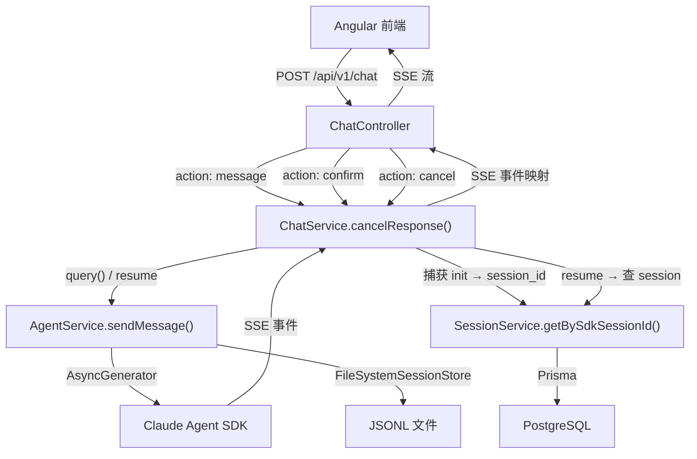

## Context

### 当前状态

Oceanus 聊天系统的会话模型存在两条主线：

1. **Session 数据库记录**（PostgreSQL）— 存储会话元数据（标题、项目关联、时间戳）
2. **SDK 会话文件**（JSONL）— 存储 Claude Agent SDK 的完整对话历史（`data/sessions/{projectId}/{sdkSessionId}.jsonl`）

当前的问题是这两者**脱节**：

- `session.sdkSessionId` 写死了 `'1'`，从未捕获 SDK 返回的真实 `session_id`
- 前端发送消息使用 `POST /sessions/:id/chat` + `GET /sessions/:id/events`（SSE）两步走
- 后端使用 `continue: true` 让 SDK 自动盲找最近会话
- 页面加载时立即创建空 Session 记录，导致大量无用数据
- 删除 Session 时 JSONL 文件未清理

### 约束条件

- 使用 `@anthropic-ai/claude-agent-sdk@^0.3.218`
- SessionStore 使用 `FileSystemSessionStore`（JSONL 存储）
- 前端 Angular 21 + PrimeNG + Tailwind
- 后端 NestJS + Prisma 6 + PostgreSQL
- 用户认证通过 JWT Guard
- Langfuse 可观测性已集成

## Goals / Non-Goals

**Goals:**
- 使用 SDK `system/init` 事件中的真实 `session_id` 作为唯一标识
- 后续消息使用 `resume: sessionId` 替代 `continue: true`
- 懒创建 Session 记录——首条消息后才入库
- 统一单端点 `POST /api/v1/chat`，通过 `action` 区分操作，所有响应为 SSE 流
- 删除旧的三段式 API（`/sessions/:id/chat` + `/sessions/:id/events` + `/sessions/:id/agent/confirm`）
- 删除 Session 时级联清理 JSONL 文件
- 并发消息：中断前一轮流，处理新消息
- 提供会话历史加载接口 `GET /sessions/:sdkSessionId/messages`

**Non-Goals:**
- forkSession 分支能力（第一版不做）
- 自动淘汰历史会话（第一版仅手动删除）
- WebSocket 替代 SSE
- 消息记录存储到 PostgreSQL（保持 JSONL 存储）
- 前端 UI 重构（只改发送流程）
- 用户多轮 tool_options 的复杂状态机（第一版只做单次确认）

## 架构设计

### 模块交互



### 数据流

#### action: message（首条）

```
前端 → POST /api/v1/chat { action: "message", content: "你好", projectId: 1 }
                                                              ↓
后端 → AgentService.sendMessage() → SDK.query({ prompt: "你好", ... })
                                                              ↓
SDK → 首事件: { type: "system", subtype: "init", session_id: "abc-123" }
                                                              ↓
后端 → 捕获 session_id → SessionService.create(projectId=1, sdkSessionId="abc-123")
                                                              ↓
后端的 SSE 流:  { type: "session_created", data: { sdkSessionId: "abc-123" } }
              → { type: "message_start", data: { content: "..." } }
              → { type: "message_delta", data: { content: "..." } }
              → ...（SDK 回复内容）
              → { type: "message_complete", data: {} }
              → { type: "stream_complete", data: {} }
                                                              ↓
前端收到 session_created → 保存 sdkSessionId 到本地存储
```

#### action: message（续传）

```
前端 → POST /api/v1/chat { action: "message", content: "接着说", sessionId: "abc-123" }
                                                              ↓
后端 → SessionService.getBySdkSessionId("abc-123") → 验证存在
     → AgentService.sendMessage() → SDK.query({ resume: "abc-123", prompt: "接着说", ... })
                                                              ↓
后端 → SSE 流:  { type: "message_start", data: {} }
              → { type: "message_delta", data: { content: "..." } }
              → ...（SDK 回复）
              → { type: "tool_options", data: { options: ["确认", "修改"] } }
              → { type: "stream_complete", data: {} }
```

#### action: confirm（工具确认）

```
前端 → POST /api/v1/chat { action: "confirm", sessionId: "abc-123", confirmOption: "确认" }
                                                              ↓
后端 → SessionService.getBySdkSessionId("abc-123") → 验证存在
     → SDK.query({ resume: "abc-123", prompt: "确认", ... })
                                                              ↓
后端 → SSE 流:  { type: "confirm_accepted", data: {} }
              → { type: "message_delta", data: { content: "好的，继续..." } }
              → ...（SDK 后续推理）
              → { type: "message_complete", data: {} }
              → { type: "stream_complete", data: {} }
```

## Decisions

### D1: 单端点 POST /api/v1/chat + action 分发

**决策**: 所有会话操作合并到一个端点，通过 `action` 字段分发。

| action | 请求体必填字段 | 响应格式 | 说明 |
|--------|--------------|----------|------|
| `message` | `content`, `(projectId\|sessionId)` | SSE 流 | 发送消息，无 sessionId=首条，有 sessionId=续传 |
| `confirm` | `sessionId`, `confirmOption` | SSE 流 | 确认选择，复用用户消息格式通过 resume 喂给 SDK |
| `cancel` | `sessionId` | SSE 流或 JSON | 预留：中断当前流 |

**理由**：当前三段式 API（先连 SSE → 再 POST Chat → 再 POST Confirm）增加了前端复杂度和连接管理负担。单端点 + action 去掉了 SSE 连接前置条件，前端不再需要管理 Subject 映射。

### D2: 使用 SDK session_id 替代自生成 uuid

**决策**: Session 表删除 `uuid` 字段，`sdkSessionId` 改为 `@unique` 非空。服务不再生成任何自增 UUID。

**理由**：
- SDK 的 `system/init` 事件在首次 `query()` 时保证返回唯一 `session_id`
- 无额外 UUID 生成开销，无需保证跨系统唯一性
- Langfuse trace ID 也使用此 `sdkSessionId`，可观测性链路一致

**Schema 变更**:

```prisma
model Session {
  id            Int      @id @default(autoincrement())
  sdkSessionId  String   @unique @map("sdk_session_id")
  title         String   @default("新会话")
  status        String   @default("active")
  filePath      String?
  lastMessageAt DateTime?
  createdAt     DateTime @default(now())
  updatedAt     DateTime @updatedAt
  projectId     Int
  project       Project  @relation(fields: [projectId], references: [id], onDelete: Cascade)
  assets        Asset[]
  @@map("sessions")
}
```

### D3: 懒创建 Session 记录

**决策**: Session 数据库记录只在 SDK 返回 `system/init` 事件后才创建。

**理由**：
- 避免一打开页面就创建空会话，减少脏数据
- 用户可能打开页面但不说话，这些记录无意义
- 确保数据库中的每条记录都有关联的真实 SDK 会话

### D4: resume: sessionId 替代 continue: true

**决策**: 续传时显式传递 SDK 真实 session_id，放弃 `continue: true` 的自动检测机制。

```typescript
// 首条
query({ prompt, options: { ... } })

// 续传
query({ resume: sdkSessionId, prompt, options: { ... } })
```

**理由**：`continue: true` 是路径/时间盲找，在有多个会话时可能找错。显式 `resume` 完全可控。

### D5: Confirm = resume 一条用户消息

**决策**: `action: confirm` 的后端实现就是调用 `SDK.query({ resume: sessionId, prompt: confirmOption })`，把用户选择的选项作为一条新消息喂给 SDK，SDK 自然会在已有上下文中继续推理。

**理由**：不需要维护工具选择状态的中间内存结构。SDK 的 resume 机制天然支持这种模式，时序上最简洁。

### D6: SSE 响应格式统一，action 不区分

**决策**: 所有 action 的 HTTP 响应都是 `Content-Type: text/event-stream`。前端使用同一套 SSE reader 消费。

**理由**：减少前端条件判断；confirm 的后续 SDK 回复也需要流式推送；`confirm_accepted` 事件作为首事件让前端知道确认已处理。

### D7: SSE 流在 tool_options 时关闭，confirm 另起新流

**决策**: 每次 `action: message` 或 `action: confirm` 的响应是一个独立 SSE 流。当 SDK 遇到需要用户选择时，SSE 流中发出 `tool_options` 事件后正常关闭。用户选择后通过新的 `action: confirm` 请求开启新 SSE 流。

**理由**：
- 避免 SSE 连接在用户思考时空挂
- 前后端状态管理简单（每个流有明确的开始和结束）
- 符合 REST 直觉——请求→响应

### D8: 并发消息处理——中断旧流

**决策**: 如果同一 `sessionId` 已有活跃的 SSE 流，新的 `action: message` 自动调用 `query.interrupt()` 中断旧流，然后处理新消息。

**理由**：SDK 支持中断当前查询。前端虽然会 disable 发送按钮，但后端兜底处理更健壮。

### D9: JSONL 路径按约定计算，不依赖 DB 字段

**决策**: 删除 Session 时，JSONL 文件路径按 `data/sessions/{projectId}/{sdkSessionId}.jsonl` 计算，而非依赖 DB 中的 `filePath` 字段。

**理由**：`filePath` 可能因人工修改或其他原因不准确。按约定计算是唯一可靠的方式。

## API Contract

### POST /api/v1/chat

**Request**:

```typescript
interface ChatMessageRequest {
  action: 'message';
  content: string;          // 消息内容
  projectId?: number;       // 新会话必填，续传可选
  sessionId?: string;       // SDK session_id，不传=首条
}

interface ChatConfirmRequest {
  action: 'confirm';
  sessionId: string;        // 必须
  confirmOption: string;    // 用户选择的选项
}

interface ChatCancelRequest {
  action: 'cancel';
  sessionId: string;        // 必须
}
```

**Response（统一 SSE 流）**:

```
event: session_created    // action:message 首条时才出现
data: {"type":"session_created","data":{"sdkSessionId":"abc-123"}}

event: confirm_accepted   // action:confirm 首事件
data: {"type":"confirm_accepted","data":{}}

event: message_start
data: {"type":"message_start","data":{"content":"..."}}

event: message_delta
data: {"type":"message_delta","data":{"content":"..."}}

event: tool_in_progress
data: {"type":"tool_in_progress","data":{"status":"正在调用工具: 读取文件..."}}

event: tool_complete
data: {"type":"tool_complete","data":{}}

event: tool_options
data: {"type":"tool_options","data":{"options":["确认","修改方案"],"text":"..."}}

event: title_updated
data: {"type":"title_updated","data":{"sessionId":"abc-123","title":"..."}}

event: message_complete
data: {"type":"message_complete","data":{}}

event: stream_complete
data: {"type":"stream_complete","data":{}}

event: error
data: {"type":"error","data":{"message":"..."}}
```

**Error Response（非 SSE）**:

```typescript
// 400 - 请求参数错误
{ statusCode: 400, message: "content is required for action: message" }

// 401 - 未认证
{ statusCode: 401, message: "Unauthorized" }

// 404 - sessionId 不存在
{ statusCode: 404, message: "会话不存在" }
```

### 保留的业务接口

| 方法 | 路由 | 说明 |
|------|------|------|
| GET | `/projects/:projectId/sessions` | 项目会话列表 |
| GET | `/sessions/:sdkSessionId` | 会话详情（含项目信息） |
| GET | `/sessions/:sdkSessionId/messages` | 会话历史消息（JSON） |
| DELETE | `/sessions/:sdkSessionId` | 删除会话（+ JSONL 清理） |

## 文件变更清单

### 新建文件

| 文件 | 说明 |
|------|------|
| `server/src/chat/dto/chat-request.dto.ts` | `POST /api/v1/chat` 请求体 DTO |
| `server/src/chat/dto/chat-response.ts` | SSE 事件接口补充（session_created, confirm_accepted） |

### 修改文件

| 文件 | 变更内容 |
|------|---------|
| `server/src/chat/chat.controller.ts` | **重写**：删除三段式旧接口，新增 `POST /api/v1/chat` action 分发；返回 SSE 流；不再依赖 Subject 映射 |
| `server/src/chat/chat.service.ts` | **重写**：移除 sessionId (int) 参数，改用 sdkSessionId (string)；捕获 init event → 懒创建 session；resume 替代 continue；中断旧流处理；confirm 映射为 resume |
| `server/src/agent/agent.service.ts` | 移除 `continue: true`；`sendMessage()` 改为接受 `{ sessionId, content }` 而非 `{ sessionUuid, continueSession }`；hooks 使用 `sdkSessionId` 作为 Langfuse trace ID |
| `server/src/agent/agent.controller.ts` | **删除**：`POST sessions/:id/agent/confirm` 和 `POST sessions/:id/agent/cancel` 移到 ChatController |
| `server/src/session/session.service.ts` | `delete()` 改为按 `projectId/sdkSessionId` 计算 JSONL 路径；删除方法改为按 `sdkSessionId` 删除 |
| `server/src/session/session.controller.ts` | 接口路径从 `:id` (int) 改为 `:sdkSessionId` (string)；保持其他业务接口 |
| `server/src/agent/types/sse-events.ts` | 新增 `session_created`、`confirm_accepted` 事件类型 |
| `server/package.json` | 可能无变更 |

### 删除文件

| 文件 | 说明 |
|------|------|
| 无 | 旧文件内容整合到新接口，无整文件删除 |

## Post-Implementation Fixes

### F1: 前端 isStreaming 竞态条件修复（2026-07-24）

**问题发现**：会话连续性修复部署后，发现前端存在竞态条件——首条消息发送后用户消息在 UI 中闪现后消失。

**根因分析**：

```
用户点击发送
  → send() 添加用户消息到 messages[]
  → SSE 流启动
  → 后端懒创建 session → SSE session_created 事件
  → 前端 sessionCreated.emit(sdkSessionId)
  → 父组件设置 sessionId 信号
  → effect() 检测到 sessionId 变化 → 调用 loadHistory()
  → loadHistory() 执行 this.messages.set([]) ❌ 清空了用户消息
  → loadHistory() 从 SDK 加载历史（此时刚创建的会话无历史）
  → 用户看到消息闪烁消失
```

**修复方案**：将 `this.isStreaming.set(true)` 从 SSE `message_start` 事件处理中提前到 `send()` 和 `retry()` 方法的**最开头**——在调用 SSE API 之前。

effect() 中已有守卫条件：
```typescript
if (this.isStreaming()) {
  // 流式传输中不重载历史
  return;
}
```

提前设置 `isStreaming=true` 使得 `session_created` → `sessionId` 信号传播时，effect 中的守卫生效，跳过 `loadHistory()`，保护内存中的用户消息。

**同时修复的方法**：`send()` 和 `retry()`。

### F2: 发送/中断按钮合并（2026-07-24）

**改进**：将独立的"中断生成"按钮（原位于输入区上方）合并到发送按钮位置。流式中显示深灰色方块中断按钮，非流式中显示渐变色纸飞机发送按钮。使用 Angular `@if/@else` 控制流实现状态切换。

**理由**：
- 减少 UI 元素数量，简化布局
- 用户视线不需要在输入框上方和右侧之间来回移动
- 按钮位置固定，减少误操作

## Risks / Trade-offs

| 风险 | 影响 | 缓解措施 |
|------|------|---------|
| 系统/init 事件中 session_id 为 SDK 内部格式，未来可能变化 | 功能破坏 | 使用 SDK 导出的类型 `SDKSystemMessage` 解析，编译期约束 |
| resume 之前的 SDK query 实例需要完全结束才能 resume | 时序竞态 | 先 interrupt() 旧流，await 完成后，再发起 resume |
| SSE 连接断开后用户看不到 tool_options | 用户无反馈 | 前端在消息发送后保持 SSE reader 打开，断连时提示用户重试 |
| Langfuse SessionStart hook 在首条消息时尚未获得 session_id | 首条 trace 不完整 | SessionStart hook 中生成临时 trace ID，init 后 updateTraceId 或重建 trace |
| 文件系统 SessionStore 不跨实例 | 多实例部署时 JSONL 不一致 | 第一版假设单实例；后续可替换为 Redis SessionStore |
| 用户短时间内发多条消息（网络抖动） | 中断链式处理 | `interrupt()` + `await` 保证串行处理 |

## Open Questions

- [ ] **Langfuse SessionStart hook 时序**：首条消息创建 trace 时还没有 sdkSessionId。可以先创建一个临时 trace，捕获 init 后再更新 trace ID，还是等 init 后再创建 trace？后者会丢失 SessionStart hook 的观测数据。
- [ ] **前端 sdkSessionId 存储策略**：localStorage？IndexedDB？内存（刷新丢失）？
- [ ] **前端 tool_options 显示逻辑**：当 SSE 流中收到 `tool_options` 后，前端 show 选项按钮 → 用户选择 → POST `action: confirm` → 新 SSE 流。但如何让用户知道流已经结束可以选择了？（方案：`stream_complete` 事件后前端启用/显示确认 UI）
