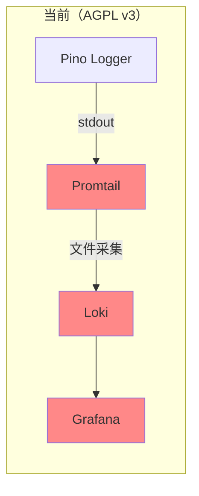
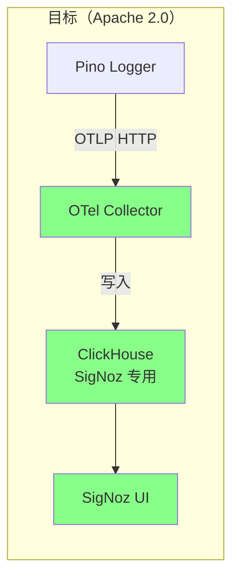
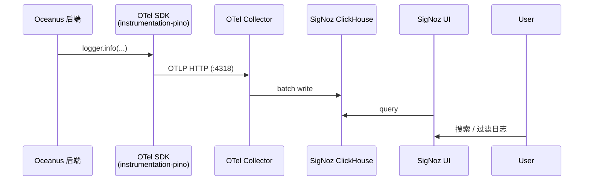

## Context

Oceanus 当前日志链路为 `Pino → stdout → Promtail → Loki → Grafana`，其中 Grafana、Loki、Promtail 均使用 AGPL v3 许可证。AGPL v3 是强 Copyleft 许可证，在商业化分发或嵌入场景下存在合规风险。

本设计将 AGPL v3 组件替换为 **SigNoz**（Apache 2.0），同时将日志采集方式从「文件 tail」升级为 **OpenTelemetry Pino instrumentation**，实现日志-链路自动关联。

### 当前状态



### 目标状态



## Goals / Non-Goals

**Goals:**

- 消除 Grafana / Loki / Promtail 的 AGPL v3 许可风险
- 引入 SigNoz（Apache 2.0）提供日志搜索和可视化能力
- 日志采集改为 OTel Pino instrumentation，自动关联 trace_id
- 所有组件统一到项目主 docker-compose.yml 管理

**Non-Goals:**

- 不替换 Langfuse（保留做 LLM 专属观测）
- 不改动现有 `logger.info/warn/error` 调用代码
- 不做告警规则迁移（MVP 阶段不涉及）
- 不迁移 Loki 历史日志
- 不引入除 SigNoz 之外的新可观测性平台
- 不启用 SigNoz 的 APM 全量追踪（本阶段仅使用日志能力；APM 视为后续独立变更）

## Decisions

### D1: 日志接入 — OTel Pino instrumentation

| 选择                                  | 理由                                                                        |
| ------------------------------------- | --------------------------------------------------------------------------- |
| `@opentelemetry/instrumentation-pino` | 零侵入，不改现有 logger 调用；自动注入 trace_id/span_id；不依赖容器文件系统 |

### D2: 部署方式 — 整合到主 compose

将 SigNoz 的三组件（SigNoz、OTel Collector、ClickHouse、ZooKeeper）直接加入项目的 `docker-compose.yml`，而非独立维护 compose 文件。

### D3: ClickHouse — 独立部署，不与 Langfuse 共用

SigNoz 自带 ClickHouse 实例，与 Langfuse 的 ClickHouse 完全隔离。理由：可观测性数据的读写模式（高写入、低更新）与业务分析数据不同，混用可能互相干扰。

### D4: SigNoz profile — 无 profile，始终启动

SigNoz 默认随基础容器启动（`docker compose up -d`），开发时和运行时均可访问日志。

### D5: OTel Collector 配置 — 复用官方配置

直接从 SigNoz 官方 repo 复制 `deploy/docker/clickhouse-setup/otel-collector-config.yaml`，不做精简或定制。

## Architecture

### 容器变更

| 操作     | 容器                    | 说明                                            |
| -------- | ----------------------- | ----------------------------------------------- |
| **移除** | `grafana`               | 替换为 SigNoz UI                                |
| **移除** | `loki`                  | 日志存储由 SigNoz ClickHouse 接管               |
| **移除** | `promtail`              | 日志采集由 OTel instrumentation 替代            |
| **新增** | `signoz`                | 单二进制：UI + API + Alertmanager               |
| **新增** | `signoz-otel-collector` | 接收 OTLP 数据，写入 ClickHouse                 |
| **新增** | `signoz-clickhouse`     | 可观测性数据存储，独立于 Langfuse 的 ClickHouse |
| **新增** | `signoz-zookeeper`      | ClickHouse 集群协调                             |

### 日志数据流



### 新增依赖（npm）

```json
{
  "@opentelemetry/sdk-node": "^0.208.0",
  "@opentelemetry/exporter-logs-otlp-http": "^0.208.0",
  "@opentelemetry/instrumentation-pino": "^0.55.0"
}
```

### 初始化代码

在 `main.ts` 或独立文件 `logging-otel.ts` 中，在应用加载最前面初始化：

```typescript
// 必须在所有 import 之前加载
import './logging-otel';
```

`logging-otel.ts`：

```typescript
const { NodeSDK } = require('@opentelemetry/sdk-node');
const { OTLPLogExporter } = require('@opentelemetry/exporter-logs-otlp-http');
const { PinoInstrumentation } = require('@opentelemetry/instrumentation-pino');
const { BatchLogRecordProcessor } = require('@opentelemetry/sdk-logs');

const sdk = new NodeSDK({
  logRecordProcessor: new BatchLogRecordProcessor(new OTLPLogExporter({ url: 'http://otel-collector:4318/v1/logs' })),
  instrumentations: [new PinoInstrumentation({})],
});

sdk.start();
```

## Risks / Trade-offs

| 风险                                                                                                                  | 缓解措施                                                           |
| --------------------------------------------------------------------------------------------------------------------- | ------------------------------------------------------------------ |
| OTel Collector 不可达导致日志丢失                                                                                     | OTel SDK 内置 sending_queue + retry；SDK 启动失败不阻塞应用        |
| 新增容器增加资源开销                                                                                                  | SigNoz + OTel Collector + ZooKeeper 闲置约 1.6GB RAM，在可接受范围 |
| 开发人员需适应新日志工具                                                                                              | SigNoz UI 操作路径与 Grafana Explore 相似，迁移成本低              |
| SigNoz 版本升级影响                                                                                                   | 使用固定镜像标签，不追 latest；通过 SemVer 控制升级节奏            |
| **OTel 启动顺序敏感**：`logging-otel.ts` 需在应用入口最前加载，重构或迁移 ESM 时易被破坏                              | 在 `main.ts` 入口添加醒目注释，CI 增加 lint 规则检查 import 顺序   |
| **ClickHouse 实例膨胀**：已有 Langfuse 用 ClickHouse，再加 SigNoz 独立 ClickHouse + ZooKeeper，开发机空闲内存约 2.5GB | 开发环境可考虑仅启动必要组件；生产环境按需分配资源                 |

## Migration Plan

1. **部署 SigNoz**：将新增容器加入 `docker-compose.yml`，启动后验证 UI 可达
2. **接入 OTel**：安装 npm 依赖，在 `main.ts` 中添加 OTel 初始化
3. **验证**：运行后端，在 SigNoz UI 确认日志写入
4. **移除旧组件**：确认新链路稳定后，从 `docker-compose.yml` 中删除 Grafana / Loki / Promtail
5. **清理数据卷**：`docker volume rm oceanus_loki_data oceanus_grafana_data`
6. **更新文档**：同步 overview.md、端口表
